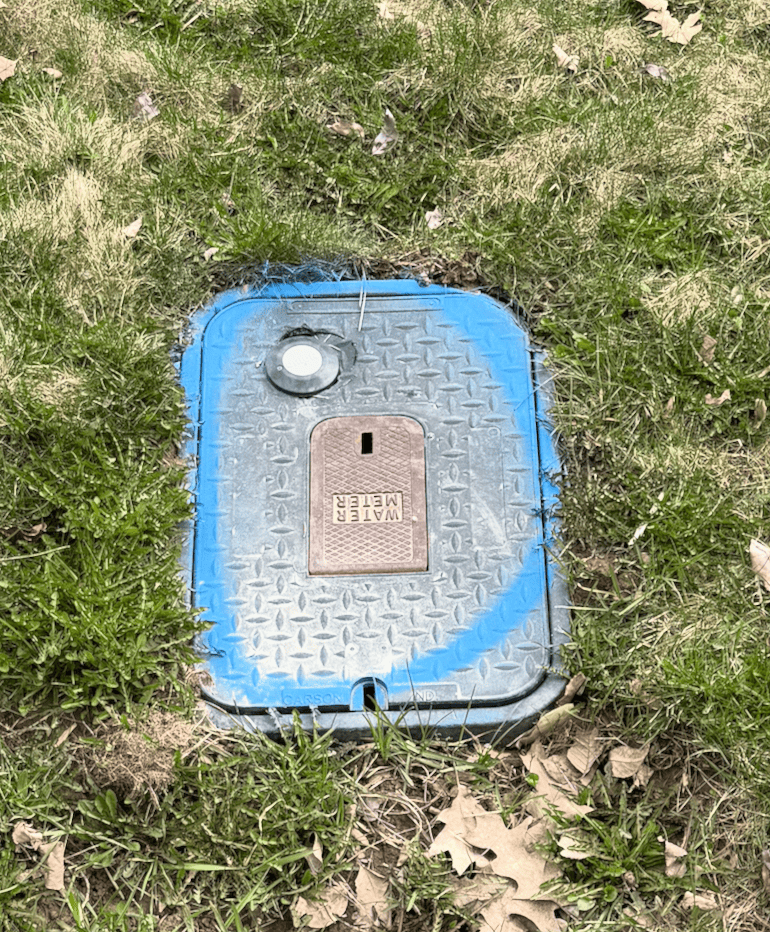
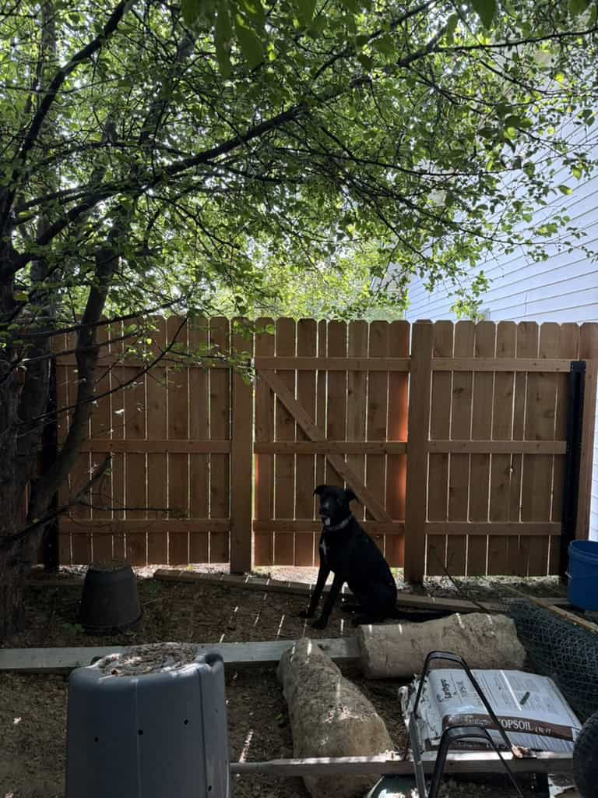

# Cedar Gate Build

> **Source:** [b3n.org](https://b3n.org/cedar-gate-build/)  
> **Date:** October 25, 2025  
> **Author:** Benjamin Bryan  
> **Tag:** `homelab`

---

I was sitting in the living room, working on the computer. I heard a dog barking out front that sounded just like Blaze. But I knew it wasn’t Blaze because he was in the backyard with Kris. Then I heard a woman out front who sounded just like Kris. But I knew it wasn’t Kris, because she was out back with Blaze. A few moments later Kris came in the front door holding Blaze by the collar.

It was at that exact moment I realized fixing the gate was a higher priority than whatever I was doing on the computer.

The problem is frost heave 🔻

Water freezes underground and expands as it turns into ice and pushes the posts up. This over time loosens the gate so it doesn’t always stay latched. Then our dogs escape. We have had a lot of thaw/freeze cycles this year. 2025 is the worst winter I’ve ever seen for frost-heave. It is time to build a new gate.

I *could* replace what I have–wood posts in concrete. But my goal is to build a frost-heave resistant gate. A lot of people say wood posts in concrete is best. But I think concrete isn’t that heavy compared to the volume it takes, so it’s easy for ice to push up. I think my gate failed at thirty years old which is ridiculous. I want the new gate to outlast me. So, I built a gate on steel posts using a design from [SWI Fence](https://www.swifence.com) out of Wyoming. It uses driven postmaster steel posts instead of wood posts in concrete. My hypothesis is a steel post is going to weigh more than concrete in terms of lbs per square inch. Steel should be smooth and have a low cross-section so the ice will slip right past it during frost-heave. This is all in theory… I’ll have to wait thirty-one years to find out.

🪏 The first thing I did was I called 811 before I dug. The city, electric & gas company, and three telecom companies came out. They sprayed a few lines where the utilities were. I’m glad the city marked the water meter location. I might have driven a post right through it.

A good post driver for steel posts is the [Titan PGD3200XPM](https://b3n.org/cedar-gate-build/). But I did not buy that one because it’s expensive. So I bought a cheaper [Titan PGD3875](https://b3n.org/cedar-gate-build/) which is almost a good steel post driver. It didn’t work at all. The steel posts were too wide for the collar by a fraction of an inch (despite the specifications–I think postmaster/lifetime increased the width). But at least I had fun driving small steel posts in the ground unrelated to this project! But if you have a [34 pound manual pole pounder](https://b3n.org/cedar-gate-build/) and a teenage son like Eli to help, it’s a lot cheaper, and works almost as well as a Titan PGD3200XPM, while building character.

Troutdale, Oregon. [Where FedEx packages go to die.](https://www.reddit.com/r/FedEx/comments/pouigm/ah_troutdale_or_where_fedex_packages_go_to_die/)

I couldn’t find anyone local selling Postmaster posts–and it was only economical to ship in large quantities. So I ordered Lifetime steel posts. Unfortunately they were sent via FedEx. Whenever something comes FedEx I hope that it doesn’t get routed through Troutdale. Sure enough, 2 of the 8 posts got routed through Troutdale. They are still stuck there to this very day. Good thing I only need 4 to do a gate on one side of the house. So I started on the side with the latching issue.

After pulling up the old posts using a Farm Jack. I followed SWI Fence’s Cedar Gate design in this video:

We drove 4 steel posts into the ground using the manual post driver. Then built the fence and gate in-place and cut it loose using a reciprocating saw. We did move the gate forward a few feet because there were big holes where the old gate used to be.

List of tools and supplies (from Amazon, Home Depot, and Lowes):

- [Craftsman V20 Power Tool Set](https://b3n.org/cedar-gate-build/) (Reciprocating Saw, Circular Saw, Impact Driver, and Drill)

- [Craftsman v20 Compound Miter Saw](https://b3n.org/cedar-gate-build/) (cutting 2x4s and trimming pickets)

- [Craftsman Impact Bits](https://b3n.org/cedar-gate-build/) (to drive screws)

- [Craftsman Level Beam](https://b3n.org/cedar-gate-build/) (making sure posts and pickets are level)

- [Craftsman Measuring Tape](https://b3n.org/cedar-gate-build/) (measure things)

- [Grip Rite 1 5/8&#8243; Stainless Screws](https://www.homedepot.com/p/Grip-Rite-8-x-1-5-8-in-305-Stainless-Steel-Star-Drive-Bugle-Head-Coarse-Thread-Deck-Screws-5-lb-Box-MAXS1588DS3055/319052006) (stainless steel won’t stain the cedar)

- [Grip Rite 2 1/2&#8243; Stainless Screws](https://www.homedepot.com/p/Grip-Rite-10-x-2-1-2-in-305-Stainless-Steel-Star-Drive-Bugle-Head-Coarse-Thread-Exterior-Deck-Screws-5-lb-PER-Box-MAXS21210DS3055/319052009) 

- [Everbilt Gate Latch & Hinge Kit](https://www.homedepot.com/p/Everbilt-Black-Post-Latch-Gate-Set-24417/327600104) (heaviest affordable hinge/latch I could find at a good price)

- [Craftsman Carpenter Square](https://b3n.org/cedar-gate-build/) (angling the cross-brace)

- [Aqara Matter Sensor](https://b3n.org/cedar-gate-build/) (to notify me if gate is left open)

- [6&#8242; Cedar Dog Ear Fence Pickets](https://www.homedepot.com/p/Alta-Forest-Products-5-8-in-x-5-1-2-in-x-6-ft-American-Western-Red-Cedar-Dog-Ear-Fence-Picket-63023/205757688) (Home Depot had a pile of these outside)

- [9&#8242; Postmaster or Lifetime Steel Posts](https://www.lowes.com/pd/Lifetime-Steel-Post-9-ft-H-x-4-in-W-Powder-coated-Steel-Post-and-Rail-Yard-Line-Fence-Post/5015197825) (drove about 4 ft into the ground, well below the frost line)

- [34 pound Manual Post Pounder](https://b3n.org/cedar-gate-build/) (don’t get the light ones)

- [2x4s](https://www.homedepot.com/p/2-in-x-4-in-x-10-ft-Premium-S4S-Cedar-Dimensional-Lumber-281800/316239300)

Craftsman and DeWalt power tools are both made by Stanley Black & Decker. I standardized on red tools because they’re a lot cheaper than yellow and almost as good (sometimes identical other than color).

I didn’t have a nail gun, so we secured everything using stainless steel screws with the impact driver. This is probably better than nails anyway.

It turned out pretty good.

I added a Matter sensor so we’ll know when the gate is left open. I’ve been trying to standardize on Matter devices, since Matter is fairly universal (you can use it with almost any platform: Google, Apple, Amazon, Home Assistant, etc.) it means you can switch your Hub ecosystem down the road without changing out all your devices. And Thread is battery efficient compared to WiFi (you can get Matter over Thread or Matter over WiFi devices).

I covered the steel posts with 4 extra pickets. In the picture above I had only gotten to covering the 2 middle posts. You can see what the uncovered steel posts look like on either side.

And now Blaze can’t escape.

*Ephesians 2:10 ESV –*
*For we are his workmanship, created in Christ Jesus for good works, which God prepared beforehand, that we should walk in them. *

The post [Cedar Gate Build](https://b3n.org/cedar-gate-build/) appeared first on [b3n.org](https://b3n.org).

---

*Originally published at: [https://b3n.org/cedar-gate-build/](https://b3n.org/cedar-gate-build/)*