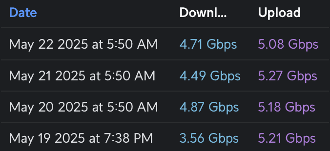
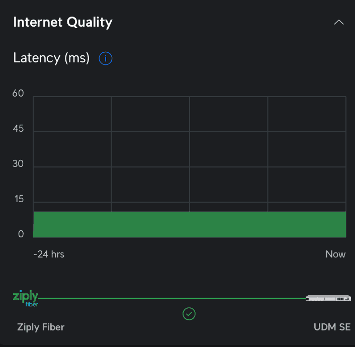
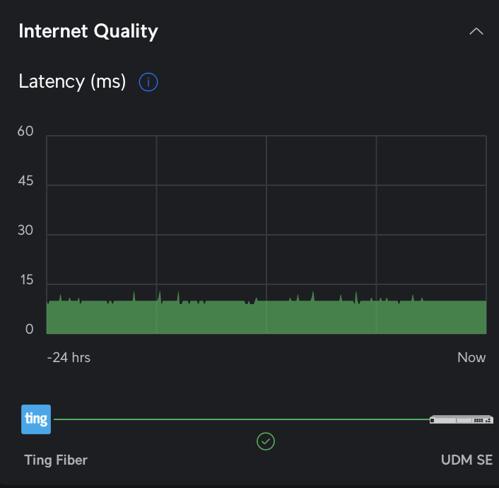
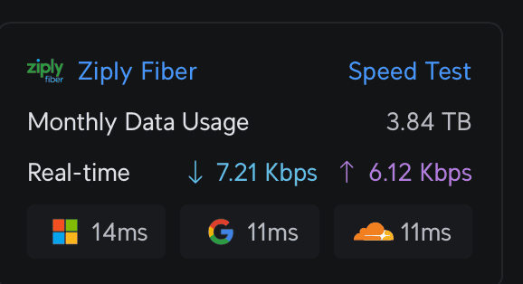
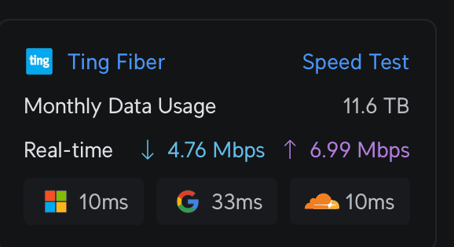
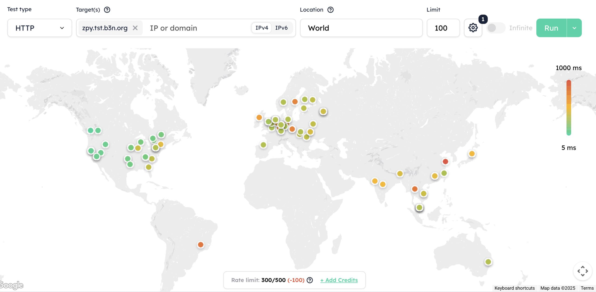
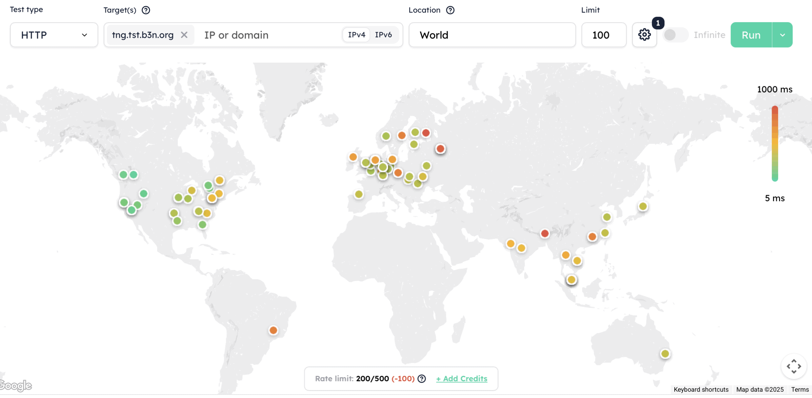

# Ziply 5Gbps Fiber in Sandpoint Idaho

> **Source:** [b3n.org](https://b3n.org/ziply-5gbps-fiber-in-sandpoint-idaho/)  
> **Date:** May 24, 2025  
> **Author:** Benjamin Bryan  
> **Tag:** `homelab`

---

After years of watching Ziply install Fiber all over North Idaho and being on the waiting list, [Ziply Fiber](https://refer.ziplyfiber.com/benjaminb-3189) (referral link) called. Fiber is available at my house. I already have 1Gbps symmetrical with Ting, but Ziply offers faster, cheaper, and a larger variety of plans. In Sandpoint they offer 100 Mbps, 300 Mbps, 1 Gbps, 2 Gbps, 5 Gbps, 10 Gbps, and 50 Gbps–the plans range from $20 to $900/month. Needless to say I got the 50…. just kidding. *But I did think about it.*

All plans are symmetrical with no data caps.

I decided to get 5Gbps ($80) because it’s cheaper than Ting ($89) and probably pretty close to what the [UDM SE](https://b3n.org/ziply-5gbps-fiber-in-sandpoint-idaho/) firewall/router can handle with IPS (Intrusion Prevention System) turned on. Ziply’s Nutritional label says it is 5568 Mbps down and 5567 Mbps up (I have no idea why those are the numbers). Here’s the results from the UDM Pro’s automatic speed tests…

From the VMs on my Proxmox server, I couldn’t get [SpeedTest](https://www.speedtest.net/) to saturate 5Gbps (using the CLI version), but I was able to do it with iperf3.

Getting Ziply installed was a bit chaotic–I had the install date moved up, a no-show on the new date, the next day Ziply sent me an email telling me they’d need to move the date out because they hadn’t run fiber from the street yet… minutes later someone called to tell me they were at my house right now, I was about to drive home, but I found out they got my address mixed up–they were installing it for someone else.

Finally, the dogs alerted me to a visitor. Then the doorbell rang. It was a guy wearing a Ziply Fiber hat. But it turned out to be a sales guy trying to sell Ziply Fiber. 🤷‍♂️ Sorry dogs. False alarm.

The day before my install date, I got an email saying they couldn’t get a hold of me–but I had no missed calls. Who knows when the installer will come?

*Scout & Blaze waiting for the Ziply installer to show up day after day…*

(now, I’m not sure if this is Ziply’s problem, lots of people are overworked so it’s just how things work with most contractors in North Idaho…I have the same sort of scheduling issue when trying to get any work done on the house).

When the installer, John, did come (amazingly, on the install date!) it went smoothly–he said I was the first 5 Gigabit customer he had setup. At first he thought he couldn’t do the install because there wasn’t enough fiber from the street to get to my house–but I told him I wanted it in the garage (where the server rack is), and that’s right where the fiber came in anyway.

The Nokia ONT (Optical Network terminal) he installed works for 5Gbps plans and below–fiber comes in, and RJ45 port goes to your router and negotiates at 1, 2.5, (I’m assuming it can do 5 but didn’t try it), and 10 gigabit.

He got the Ziply side up and I knew how to take it from there.

I already had Ting on port 9 (the 2.5 GbE port), so I put Ziply on Port 10 (10GbE SFP+ port). John said he couldn’t run Fiber from the ONT device into the SFP+ port of the router (I think that’s a possibility if you get the more expensive 10 or 50Gbps plan). Ziply runs fiber from the street to the ONT device, then converts that to 10Gbps ethernet. The UDM SE’s fastest ethernet port is 2.5 gigabit, so I had to get a [10Gtek SFP+ to RJ45 Transceiver](https://b3n.org/ziply-5gbps-fiber-in-sandpoint-idaho/) (Amazon) to use the SFP+ port.

Since the UDM SE can do dual-WAN, I thought I’d do some side-by-side comparisons of Ziply (5Gbps) and Ting (1Gbps). This is also very unscientific. I only had one house to test this from so your results may vary. This is not quite apples-to-apples from a speed perspective, but from a cost perspective but they are about the same price. Ziply 5Gbps is $80 12/months (but first month is free) then goes to $105) and Ting is $89/month–so over 2-years they come out even.

*Ziply Latency at 11ms, very consistent*

*Ting Latency from 10-24ms (a bit of jitter which may impact VOIP calls)*

The UDM SE continuously tracks latency to Microsoft, Google, and Cloudflare. Ziply is a very consistent (little to no jitter) 11ms to Google and Cloudflare and 14-16 to Microsoft. Ting is around 9-11ms to Cloudflare and Google (a bit more jitter) and fairly high latency to Google at 30-35ms. I watched both through various network loads from just a few Kbps to several hundred Mbps and they stayed pretty consistent.

### Global Ping ICMP Latency

I’ve you’ve never tried [Globalping](https://globalping.io/), it’s a way to benchmark your network using probes all over the world. It’s one of my favorite tools to test TTFB and load times in different regions for my blog. You can do ping, http, https, http/2, mtr, traceroute, DNS. You can also target certain regions, countries, states, or cities. For this first round I used Globalping’s http/2 test, this requires negotiating an SSL connection, and downloading a test page so it tests latency and upload speeds all at once. West coast was more or less the same, but we start to see faster routes with Ziply to the midwest and eastern United States. I would expect this since Ziply has their own 400Gbps link between Seattle and Chicago. Ziply was able to stay mostly under (and usually well under) 200ms while Ting was in the 400-600 range for eastern US. This is for a full GET request to a static page.

I should note that I repeated all these tests several times to make sure the results weren’t just an anomaly.

#### Globalping US http/2 test

(In all these screenshots, Ziply is the first image, Ting the second).

International is more or less a wash… Ting appears to have a slightly faster route to Asia while Ziply routes are better to Europe.

And for a latency (Ping) test we see a very slight advantage to Ziply the further East we get…

Now, for the most part latency won’t impact you. I suppose FPS (First Person Shooter) gamers might care, and it’s always good to shave a few milliseconds off of VOIP calls–if you’re using [Mumble](https://www.mumble.info/) or FaceTime this will help a lot. If you’re using MS Teams there’s so much of a delay you won’t notice the gains. But if you’re browsing the web most content should be coming from a CDN which would have a local POP (Point of Presence), or if you’re hosting a webserver (like I am), you’d be pushing that content out across the world using a [CDN like Cloudflare](https://www.cloudflare.com/application-services/products/automatic-platform-optimization/) anyway–so latency from Western to Eastern US, and even globally shouldn’t be much of an issue.

I did not include a screenshot for a worldwide latency ping test because the two were so close I couldn’t discern a difference between them.

For the plans, I think Ziply is a better value than Ting, the 1Gbps Ziply plan is $50 (initially) while the same from Ting is $89, but that said Ting is fantastic. They came in and replaced Northland Cable and Frontier DSL who had both done very little innovation in Sandpoint… but then Ting stopped improving (I’m guessing when Tucows sold them off). That said, Ting Fiber also offers decent bundling allowing you to get their Verizon Wireless MVNO ([Ting Mobile](https://tingmobile.com/plans)) plan with unlimited talk/text/data for $10/month). If you’ve got a family and everyone’s a heavy data user–it’s hard to pass that up.

### Dual WAN Options in the UDM SE

You can set one WAN as the primary and the other as backup using **Failover Only** (incoming connections will still work on both even in Failover mode) or you can **Load Balance** and even pick a percentage of how you want to utilize each ISP (e.g. 15% to Ting and 85% to Ziply Fiber to essentially get 6Gbps). On your outbound routing if you want certain traffic to only use one ISP that can be accomplished with policy based routing on various parameters such as the source VLAN, device, IP range, destination website, destination country, etc.

### IPv6

One thing that Ting has been lacking is IPv6. Well, Ziply doesn’t have it either… this actually does matter to me because when I deploy an AWS server I have to assign it an IPv4 (which costs extra), they give you IPv6 for free) just to ssh into it (I know I could setup tunnels or a VPN …but this is just simpler). But it looks like [Ziply may start rolling out IPv6](https://www.reddit.com/r/ZiplyFiber/comments/1k6h3x4/when_are_all_customers_getting_ipv6/) (Reddit) where I haven’t seen any indication Ting hasn’t started on this yet (except for static IP customers in select areas).

### Reliability

I have no idea how reliable Ziply Fiber will be–I’ll try to remember to update this section in a year. I’m hoping it will be as robust as Ting. [So far in the 5 years we’ve had Ting Fiber](https://b3n.org/ting-fiber-gigabit-internet/) I can recall one outage that was fixed pretty quickly after someone cut the line during construction.

### On the Necessity of 5Gbps

Is 5Gbps faster than 1Gbps? Do I notice any difference? None whatsoever.

I honestly can’t tell the difference between 5Gbps on Ziply Fiber vs 1Gbps on Ting. I’m pretty certain I could go down to 300Mbps and not notice anything–I’ve looked at the bandwidth utilization in worse case scenarios …I’m on a Teams video call at work, Kris is on a video call with family, and a YouTube video is streaming… and I’m downloading some ISOs–I rarely see it spike even to 300Mbps and usually it stays well below 100Mbps. When you’re on gigabit, the bottleneck is almost always on the other side. …I think 100Mbps would be fine 99% of the time, but the 300Mbps plan is the sweet spot of price/noticeable performance and plenty of headroom.

Now, I’m also limited by wireless. I have a a [U7 Pro](https://b3n.org/ziply-5gbps-fiber-in-sandpoint-idaho/) (Amazon) access point than could theoretically saturate 5Gbps–but the uplink port is only 2.5GbE… and the PoE ports on my UDM SE are limited to 1GB… so other than my Proxmox VMs which are hooked up to the router using 10GbE fiber… nothing is going to push 5Gbps.

The only area I’ve see an improvement so far is cloud backup speeds to/from AWS S3.

### Next

I’ve had a few ideas I’ve wanted to try where 1Gbps may not cut it, and a few others where dual-WAN would make things more reliable–With Ziply at 5Gbps I may drop to the cheapest Ting plan and use it as a backup. Or once the promotion ends I may drop Ziply to the 1Gbps plan. Having the option of 50 opens up some scenarios I’ll have to think about.

The post [Ziply 5Gbps Fiber in Sandpoint Idaho](https://b3n.org/ziply-5gbps-fiber-in-sandpoint-idaho/) appeared first on [b3n.org](https://b3n.org).

---

*Originally published at: [https://b3n.org/ziply-5gbps-fiber-in-sandpoint-idaho/](https://b3n.org/ziply-5gbps-fiber-in-sandpoint-idaho/)*