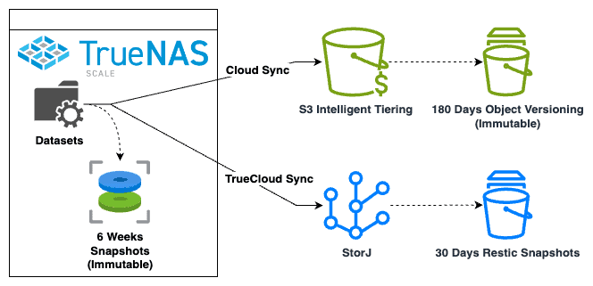

# TrueNAS Backup Strategy

> **Source:** [b3n.org](https://b3n.org/truenas-backup-strategy/)  
> **Date:** March 22, 2025  
> **Author:** Benjamin Bryan  
> **Tag:** `homelab`

---

I spent some time over Christmas break simplifying and reducing the cost of our cloud backups. I wrote about the [7 Backup Principals](https://b3n.org/macos-backup-strategy/) on the MacBook Backup Strategy post and the same applies here.

My TrueNAS server consists of primarily SMB shares–videos, documents, files, old computer archives, and a webdav share which I use for [DEVONthink](https://www.devontechnologies.com) (DT).

### The rule of 2…

3-2-1 is popular, 3 copies of your data, 2 different types of storage, and 1 copy offsite. This is a good practice. I think what exactly 2 is refers to ambiguous to a lot of people, so here’s how I implement it in the cloud era.

#### Two Backup Technologies

TrueNAS Scale has several ways to synchronize data to the cloud. With any backup, I think it’s wise to use two distinct technologies. There are so many scenarios where backups can become corrupted, or you find out the backup program excluded a certain folder.

I once saw an Rsync update introduce a bug which caused files to be moved instead of copied to the target! I was working for a customer of a SaaS provider that updated to this version of rsync… and all of our data (and that of all their other customers!) disappeared. They were able to restore service after a week–but this made me realize you don’t want to have some diversification in technologies.

#### Two Offsite Destinations

It’s also a good idea to backup data to at least two distinct offsite destinations. Last year Google accidentally [deleted the cloud account of a Pension fund](https://arstechnica.com/gadgets/2024/05/google-cloud-accidentally-nukes-customer-account-causes-two-weeks-of-downtime/) (Ars) and in another case [Scaleway lost object storage](https://www.reddit.com/r/DataHoarder/comments/1bznhhe/scaleway_s3_glacier_lost_my_files_please_check/) (Reddit). Even [AWS S3 has lost data](https://www.quora.com/Has-Amazon-S3-ever-lost-data-permanently) (Quora).

You may think it’s unlikely that your house would burn down and the cloud provider lose data at the same time. Perhaps it is unlikely–but if you’ve ever looked at a string of random numbers or dice rolls you know that improbable events **do occur**.

#### Two Solutions

For TrueNAS backup solutions–I use 2.

- **TrueCloud Sync (Restic).** This is new to TrueNAS, but is powered by Restic which has been around awhile, and only works with a StorJ target. 

- **Cloud Sync (Rclone).** This supports backing up to various cloud providers (such as S3, B2, etc.). You can think of it as the rsync equivalent but supporting object storage.

There are two other backup methods worth considering that I don’t currently use:

- **Rsync (Rsync).** This supports synchronizing files to an Rsync server. Rsync has been around while and is probably one of the most reliable and tested file synchronization programs.

- **Replication Tasks (ZFS Replication).** Can backup both ZVOL (block storage and datasets). If you are using ZVOL block storage (iSCSI or Virtual Machines on TrueNAS) replication tasks are the best way to back them up. I don’t currently use block storage so I’m not concerned about this, but if I did, I’d use ZFS replication. 

### Cloud Sync to AWS S3 Intelligent Tiering

Cloud Sync is a robust synchronization option. It is based on [Rclone](https://rclone.org) which has been around awhile and is the de-facto standard for object storage synchronization. Rclone was never meant to be a backup tool, but you can combine Rclone’s sync with S3 versioning to make a backup solution.

Since all Cloud Sync does is copy/sync files, this method is dead-simple–there is very little that can go wrong and no database to corrupt.

I backup to AWS S3 – Intelligent Tiering class. On the TrueNAS side simply set the storage class to “Intelligent Tiering”. On AWS – when creating the bucket I enabled versioning. And I setup an Intelligent Tiering Archive configuration so that after 90 days objects are moved to the Archive Access Tier, and after 180 days they move to Deep Archive. I also setup a Lifecycle Policy to remove non-current versions after 180 days.

With intelligent tiering, while initially expensive at $23/GB, objects that don’t change eventually go down to the $0.00099/GB rate when they lifecycle to the S3 Deep Archive tier. Most of the data on our TrueNAS unit doesn’t change frequently so is charged the Glacier Deep Archive cheaper rate.

Object storage transaction costs can get expensive (both in dollars and time) when you have lots of small files, so try to reduce the number of files. Compress your archive data into zip files to reduce the number of objects.

#### A few more thoughts & advantages of AWS:

A lot of people try to backup to the nearest AWS region–I decided to backup to a region far away in the Eastern US–just on the off-chance there’s a large geographic disaster. 

Also, my hats off to AWS on performance–I have also used BackBlaze B2, StorJ, and others–and AWS outperforms all of them–it can nearly max out my gigabit connection. If you want fast backups use AWS (I am guessing GCP and Azure would offer the same performance).

Also, if you have a lot of data and slow internet, one option to upload or restore faster is using AWS Snowball (they will send you physical storage) to seed your backup or restore. It’s probably not needed for most people with modern internet speeds–but it’s a nice option to have if your internet is slow (or you are trying to restore without internet).

Cost is a main complaint of AWS, and I partially agree, but it depends on the scenario. I think for most situations if you’re using intelligent tiering and enabling lifecycle into the S3 Deep Archive storage class, unless all your data is hot, the cost should end up cheaper than most other options over the long-run. You may have a high restore cost in the year of disaster–but with years of lower costs on the Deep Archive tier–you probably will still come out ahead. That said, if most of your data is frequently changing StorJ and B2 are likely going to be cheaper.

### TrueCloud Sync to StorJ

The secondary backup I use is TrueCloud. TrueCloud ([Restic](https://restic.net)) is fairly new to TrueNAS, but the underlying technology, Restic has been around awhile. One problem with Cloud Sync/Rclone cloud backups is the per object overhead which can drive up storage and transaction costs. Restic reduces per object costs by chunking small files together. I think Restic is an excellent tool to backup a lot of small files. It also handles versioning. It however, does not handle object-lock so it’s probably not as robust against some threats. TrueCloud Sync will backup your .zfs snapshot folders by default–so I suggest adding an exclude for “.zfs”.

On Advanced Remote Options -> Transfer Setting, set it to “Fast Storage”. This changes the pack-size from 16MB to 58MB. This is important because StorJ charges a per segment fee of $0.0000088, so the closer you can get to the maximum segment size of 64MB the better. I originally thought 58MB was a bit low–but there is quite a bit of play (even a few of the restic packs ended up above 64MB with that setting), so 58MB seems to be a sweet spot in that most of your segments will end up under 64MB with a few exceptions.

If you’re familiar with Restic, you know that you can point multiple clients at the same Restic repository. Don’t do that. You do not want to do this on TrueNAS because the GUI has no way to filter by client. Instead, backup each TrueNAS server, and even each TrueCloud backup job to its own repository (which is determined by the remote folder in the TrueNAS GUI).

TrueNAS will only allow you to back up to StorJ, and only to StorJ buckets created through TrueNAS or created via the [iX Systems link from here](https://www.truenas.com/ix-storj/) (TrueNAS). This is annoying since you have to give the TrueNAS API key wide access. But you can mitigate this by creating a dedicated StorJ Project for TrueNAS backups. Or generate a new key for TrueNAS with limited permissions after initial bucket creation.

iX Systems offers a starter annual 5TB plan which can bring the cost down a bit for that first 5 TBs.

### Cloud Providers

I always backup to two cloud providers, primarily to: AWS S3, and StorJ. My overall tech strategy for cloud is AWS first. I don’t think it matters which one–Azure and Google are also good with similar pricing to AWS. BackBlaze B2 is another great option and cheaper if you have a lot of changing data. AWS S3 is the most widely used storage solution and the only one comprehensive enough that all of my backup software works with it (there is value in having all your backups in one place). It has been around the longest so I’m confident most of the bugs and edge cases have been worked out. I use StorJ as the second mainly because I have a lot of tokens from [running a StorJ node](https://b3n.org/storj-rent-your-nas-storage/), I like the idea of decentralized storage, and it’s the only provider that TrueNAS supports with TrueCloud Sync. Also, in both cases I can prepay. I think this is important to do for cloud backups so that if there is some unanticipated event occurs you have plenty of time before the account goes dormant. I probably have 5-years worth of StorJ tokens, and I can pre-pay AWS S3 several years out.

### Backup Frequency

You can backup as often as every minute–if you’re willing to pay those transaction costs. I generally classify my information into “data” (almost everything current) and “archive” (I archive old projects and files about once a year) so for data I back it up daily and for archives I back them up weekly. I’m not concerned about losing archived files before the weekly backup runs again because I’m always moving files from “data” to “archive” so it would take awhile for those files to age out of the “data” backups.

### Encryption and Key Management

For encryption it’s easy to have two layers–one is the cloud provider’s default managed encryption keys using AWS KMS and StorJ Encryption Keys. And the other is TrueNAS can encrypt the filenames and files before they are uploaded. Key management and distribution is essential–you don’t want to have your house burn down with the only copy of your encryption keys! You’ll want to backup your cloud credentials/keys (if applicable) and TrueNAS encryption keys and store those in a couple of offsite locations.

### TrueNAS Backups

I do think TrueNAS is missing a decent backup solution for ZVOLs (Block Storage) which would cover VMs and iSCSI drives–you can backup to another TrueNAS server using zfs sync; and of course you can script something yourself, but it would be nice if TrueNAS had a GUI solution to backup ZVOLs to object storage. 

Overall, I think TrueNAS offers excellent backup capabilities for a NAS. You have a number of robust solutions to select from rsync, rclone, restic, and zfs replication. This is all packaged into a GUI/dashboard and alerting system so you can get a notification whenever backups fail. It’s also reliable–I’ve been running backups like this for a long time and only recall a couple of times that the backup failed when the internet went out (but it picked up the next day).

The post [TrueNAS Backup Strategy](https://b3n.org/truenas-backup-strategy/) appeared first on [b3n.org](https://b3n.org).

---

*Originally published at: [https://b3n.org/truenas-backup-strategy/](https://b3n.org/truenas-backup-strategy/)*