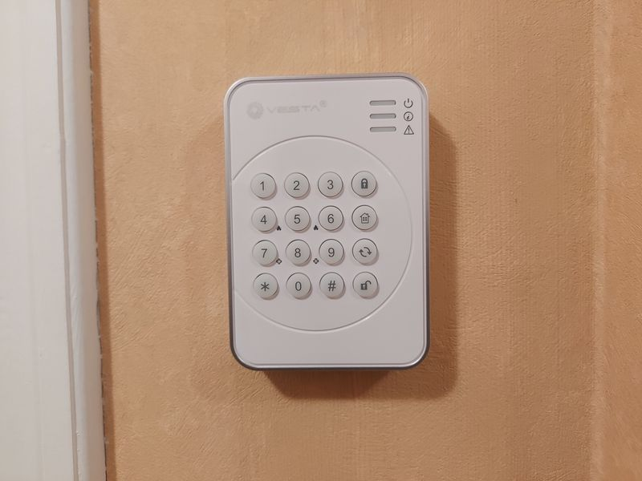
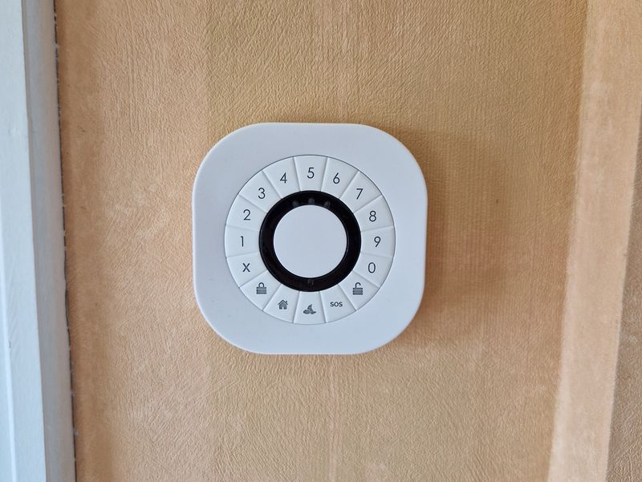

# New keypad for my RPi DIY security alarm

> **Source:** [Cavelab Blog](https://blog.cavelab.dev/2026/01/rpi-alarm-keypads/)  
> **Date:** January 1, 2026  
> **Tag:** `homelab`

---

This post is part of a [series](#series).
 

The keypad, or alarm panel, is an important part of a security alarm system. When I first got started building mine — I settled for a cheap and simple Zigbee keypad.


I&rsquo;ve since replaced it with a better, and more advanced device. Let&rsquo;s have a look…


 This post describes the alarm panel logic as implemented at the time of writing. I am actively developing, so the implementation may change — check [the repository](https://github.com/thomasjsn/rpi-alarm) for the latest version.
Code blocks have been simplified for clarity, while code links reference a specific commit and show the complete implementation.


 
 
 Table of contents
 
 
 
 

 
- [Introduction](#introduction)
 
 [Alarm Panel class](#alarm-panel-class)
 
- [Receiving actions](#receiving-actions)
 
- [Changing state](#changing-state)
 

 
 
- [The keypads](#the-keypads)
 

 [Old keypad](#old-keypad)
 
- [New keypad](#new-keypad)
 
- [Emergency from keypad](#emergency-from-keypad)
 
- [Home Assistant](#home-assistant)
 

 
 
- [Wrapping it up](#wrapping-it-up)
 


### Introduction [

](#introduction)


To provide some context; we first need to examine the alarm panel implementation. Let&rsquo;s have a look at the Raspberry Pi Python script that is my security alarm system.


#### Alarm Panel class [

](#alarm-panel-class)


[`AlarmPanel`](https://github.com/thomasjsn/rpi-alarm/blob/327d77208bc690d6b2dfea36c5d35c6d17c6d3a9/alarm.py#L219-L251) is a class — and all panel, hardware and software, are objects of this class:


```
`class AlarmPanel:
 def __init__(self, topic: str, fields: dict[str, str], actions: dict[AlarmPanelAction, str],
 label: str, set_states: dict[AlarmState, str] = None, timeout: int = 0):
 self.topic = topic
 self.fields = fields
 self.actions = actions
 self.label = label
 self.set_states = set_states or {}
 self.timeout = timeout
 self.timestamp = time.time()
 self.linkquality = []

 def __str__(self):
 return self.label

 def __repr__(self):
 return f&#34;p:{self.label}&#34;

 def set(self, alarm_state: AlarmState):
 if alarm_state not in self.set_states:
 return

 data = {&#34;arm_mode&#34;: {&#34;mode&#34;: self.set_states[alarm_state]}}
 mqtt_client.publish(f&#34;{self.topic}/set&#34;, json.dumps(data), retain=False)

 def validate(self, transaction: str, alarm_action: AlarmPanelAction):
 if transaction is None or alarm_action not in self.actions:
 return

 data = {&#34;arm_mode&#34;: {&#34;transaction&#34;: int(transaction), &#34;mode&#34;: self.actions[alarm_action]}}
 mqtt_client.publish(f&#34;{self.topic}/set&#34;, json.dumps(data), retain=False)
`
```


It contains two methods: `set` and `validate`.


`set` changes the mode, or state, of a panel. Valid states are defined in the alarm panel object.


`validate` confirms the latest panel action back to the panel. To support this; the panel must send a transaction number together with the action. This number is returned to the panel, along with a confirmation, or denial, of the requested action.


If the following action is received from the panel:


```
`{
 &#34;action&#34;: &#34;arm_all_zones&#34;,
 &#34;action_code&#34;: &#34;123&#34;,
 &#34;action_zone&#34;: 23,
 &#34;action_transaction&#34;: 99
}
`
```


A confirming response would be:


```
`{
 &#34;arm_mode&#34;: {
 &#34;transaction&#34;: 99,
 &#34;mode&#34;: &#34;arm_all_zones&#34;
 }
}
`
```


#### Receiving actions [

](#receiving-actions)


When an MQTT message is received, [the following code](https://github.com/thomasjsn/rpi-alarm/blob/327d77208bc690d6b2dfea36c5d35c6d17c6d3a9/alarm.py#L1211-L1275) checks if it is from an alarm panel:


```
`for key, panel in alarm_panels.items():
 if msg.topic == panel.topic and panel.fields[&#34;action&#34;] in y:
 action = y[panel.fields[&#34;action&#34;]]
 code = y.get(panel.fields[&#34;code&#34;])
 code_str = str(code).lower()
 action_transaction = y.get(&#34;action_transaction&#34;)

 if code_str in codes:
 user = codes[code_str]
 logging.info(&#34;Panel action, %s: %s by %s (%s)&#34;, panel, action, user, action_transaction)

 if action == panel.actions[AlarmPanelAction.Disarm]:
 if state.system == &#34;disarmed&#34;:
 panel.validate(action_transaction, AlarmPanelAction.AlreadyDisarmed)
 else:
 panel.validate(action_transaction, AlarmPanelAction.Disarm)
 threading.Thread(target=disarmed, args=(user,)).start()

 elif action == panel.actions[AlarmPanelAction.ArmAway]:
 panel.validate(action_transaction, AlarmPanelAction.ArmAway)
 threading.Thread(target=arming, args=(user,)).start()

 elif action == panel.actions[AlarmPanelAction.ArmHome]:
 if any([o.get() for o in home_zones]):
 panel.validate(action_transaction, AlarmPanelAction.NotReady)
 else:
 panel.validate(action_transaction, AlarmPanelAction.ArmHome)
 threading.Thread(target=armed_home, args=(user,)).start()

 else:
 logging.warning(&#34;Unknown action: %s, from alarm panel: %s&#34;, action, panel)

 elif code is not None:
 state.code_attempts += 1
 logging.warning(&#34;Invalid code: %s, attempt: %d&#34;, code, state.code_attempts)
 panel.validate(action_transaction, AlarmPanelAction.InvalidCode)
`
```


 To get the Zigbee messages from the keypads — into my alarm system; I&rsquo;m using [Zigbee2MQTT](https://www.zigbee2mqtt.io/).


If the MQTT message topic matches the topic of an alarm panel and contains an action; the code is matches against configured users. All users must have unique codes, as they are used to identify the user.


An invalid code will deny the panel action and return `InvalidCode`. Multiple failed codes will trigger a fault.


Trying to disarm when the state is already disarmed will also deny the panel action and return `AlreadyDisarmed`.


Same with trying to arm home while *home zones* are active — deny action and return `NotReady`. For *arm away* the logic is different; the system will enter arming mode, and evaluate the zone status once the exit delay has passed.


#### Changing state [

](#changing-state)


A successful *disarm*, *arm away*, or *arm home* action will send a confirmation back to the panel and initiate the requested system action.


Each system state change will trigger [the following code](https://github.com/thomasjsn/rpi-alarm/blob/327d77208bc690d6b2dfea36c5d35c6d17c6d3a9/alarm.py#L727-L728), sending state change messages to all alarm panels that supports it:


```
`for panel in [v for k, v in alarm_panels.items() if v.set_states]:
 panel.set(AlarmState(alarm_state))
`
```


### The keypads [

](#the-keypads)


Now we are getting to the main topic of this post — the keypads themselves.


#### Old keypad [

](#old-keypad)


 [
 
 




 
 ](https://blog.cavelab.dev/2026/01/rpi-alarm-keypads/20211118_201539.jpg)Old keypad — Climax KP-23EL-ZBS-ACE


- Type: [Climax KP-23EL-ZBS-ACE](https://www.zigbee2mqtt.io/devices/KP-23EL-ZBS-ACE.html)

- Exposes: `battery_low`, `tamper`, `action`, `action_code`

- Actions: `emergency`, `panic`, `disarm`, `arm_all_zones`, `arm_day_zones`


Alarm panel definition (no longer in the code base):


```
` &#34;climax&#34;: AlarmPanel(
 topic=&#34;zigbee2mqtt/Alarm panel&#34;,
 fields={&#34;action&#34;: &#34;action&#34;, &#34;code&#34;: &#34;action_code&#34;},
 actions={
 AlarmPanelAction.Disarm: &#34;disarm&#34;,
 AlarmPanelAction.ArmAway: &#34;arm_all_zones&#34;,
 AlarmPanelAction.ArmHome: &#34;arm_day_zones&#34;
 },
 label=&#34;Climax&#34;
 )
`
```


The sound signals produced by the keypad are:


- long buzzer signal, arm

- two short buffer signals, disarm

- three short buzzer signals, arm home


The panel does not know if the action has been confirmed or denied, and thus provides no feedback of this. The sounds heard in the background is the response of the new keypad, and my mobile phone receiving notifications.


Video demonstration of the old keypad


#### New keypad [

](#new-keypad)


 [
 
 




 
 ](https://blog.cavelab.dev/2026/01/rpi-alarm-keypads/20230422_114251.jpg)New keypad — Develco KEYZB-110


- Type: [Develco KEYZB-110](https://www.zigbee2mqtt.io/devices/KEYZB-110.htm)

- Exposes: `battery_low`, `tamper`, `action_code`, `action_transaction`, `action_zone`, `battery`, `voltage`, `action`

- Actions: `disarm`, `arm_day_zones`, `arm_night_zones`, `arm_all_zones`, `emergency`

- Modes (set states): `disarm`, `arm_day_zones`, `arm_night_zones`, `arm_all_zones`, `exit_delay`, `entry_delay`, `not_ready`, `in_alarm`, `arming_stay`, `arming_night`, `arming_away`, `invalid_code`, `not_ready`, `already_disarmed`


 The specs above is a mix of the Zigbee2MQTT device documentation and my own experience. I have two panels, and have not gotten tamper to work on any of them.


[Alarm panel definition](https://github.com/thomasjsn/rpi-alarm/blob/327d77208bc690d6b2dfea36c5d35c6d17c6d3a9/alarm.py#L548-L569):


```
`&#34;develco&#34;: AlarmPanel(
 topic=&#34;zigbee2mqtt/Panel entrance&#34;,
 fields={&#34;action&#34;: &#34;action&#34;, &#34;code&#34;: &#34;action_code&#34;},
 actions={
 AlarmPanelAction.Disarm: &#34;disarm&#34;,
 AlarmPanelAction.ArmAway: &#34;arm_all_zones&#34;,
 AlarmPanelAction.ArmHome: &#34;arm_day_zones&#34;,
 AlarmPanelAction.InvalidCode: &#34;invalid_code&#34;,
 AlarmPanelAction.NotReady: &#34;not_ready&#34;,
 AlarmPanelAction.AlreadyDisarmed: &#34;not_ready&#34;
 },
 label=&#34;Entrance alarm panel&#34;,
 set_states={
 AlarmState.Disarmed: &#34;disarm&#34;,
 AlarmState.ArmedHome: &#34;arm_day_zones&#34;,
 AlarmState.ArmedAway: &#34;arm_all_zones&#34;,
 AlarmState.Triggered: &#34;in_alarm&#34;,
 AlarmState.Pending: &#34;entry_delay&#34;,
 AlarmState.Arming: &#34;exit_delay&#34;
 }
)
`
```


In contrast to the old keypad — we can observe that changes in the alarm state affects the panel:


- red LED; armed, or arming

- green LED; disarmed

- yellow LED; invalid


This provides a much better user experience, and communicates clearly to the user what is happening and changes in the alarm state.


The notification sounds in the background is my mobile phone receiving push notifications on changing alarm state, or wrong PIN entered.


When using RFID; a hex identifier, unique to the RFID chip, in the format if `+00000000` is returned as the action code.


Video demonstration of the new keypad


#### Emergency from keypad [

](#emergency-from-keypad)


These keypads often have an emergency, or panic, input. It is handled like a regular sensor by the system, [the following sensor definition](https://github.com/thomasjsn/rpi-alarm/blob/327d77208bc690d6b2dfea36c5d35c6d17c6d3a9/alarm.py#L478-L486) listens for an emergency action from the panel:


```
`&#34;emergency1&#34;: Sensor(
 key=&#34;emergency1&#34;,
 topic=&#34;zigbee2mqtt/Panel entrance&#34;,
 field=&#34;action&#34;,
 value=SensorValue.Emergency,
 label=&#34;Emergency button entrance&#34;,
 dev_class=DevClass.Generic,
 arm_modes=[ArmMode.Direct]
)
`
```


Notice that `ArmMode.Direct` is listed as the arm mode; meaning the alarm will be triggered by this sensor regardless of the armed state of the system.


#### Home Assistant [

](#home-assistant)


I wrote earlier that software alarm panels are also objects of the `AlarmPanel` class — Home Assistant is one such software panel, and has [the following definition](https://github.com/thomasjsn/rpi-alarm/blob/327d77208bc690d6b2dfea36c5d35c6d17c6d3a9/alarm.py#L538-L547):


```
`&#34;home_assistant&#34;: AlarmPanel(
 topic=&#34;home/rpi_alarm/set&#34;,
 fields={&#34;action&#34;: &#34;action&#34;, &#34;code&#34;: &#34;code&#34;},
 actions={
 AlarmPanelAction.Disarm: &#34;DISARM&#34;,
 AlarmPanelAction.ArmAway: &#34;ARM_AWAY&#34;,
 AlarmPanelAction.ArmHome: &#34;ARM_HOME&#34;
 },
 label=&#34;Home Assistant&#34;
)
`
```


This communicates with the Home Assistant [MQTT Alarm control](https://www.home-assistant.io/integrations/alarm_control_panel.mqtt/) panel integration.


### Wrapping it up [

](#wrapping-it-up)


It&rsquo;s hard to define what is sufficient, and what is too deep when it comes to these kinds of posts. Which is probably the main reason for my procrastination in writing them.


The alarm logic is pretty complex, and consists of many pieces — some independent and some relying on others. The trick is finding the right balance; splitting it up into logical pieces, which can be communicated and understood.
> 
> 

The best is the mortal enemy of the good — [Wikipedia](https://en.wikipedia.org/wiki/Perfect_is_the_enemy_of_good)
> 


This post has been in my drafts folder for almost two years… Finally publishing it is very rewarding, but at the same time there is this sense of *never going deep enough*.


I do hope this is useful to anyone, if anything is missing or unclear; let me know.


&#x1f596;

---

*Originally published at: [https://blog.cavelab.dev/2026/01/rpi-alarm-keypads/](https://blog.cavelab.dev/2026/01/rpi-alarm-keypads/)*