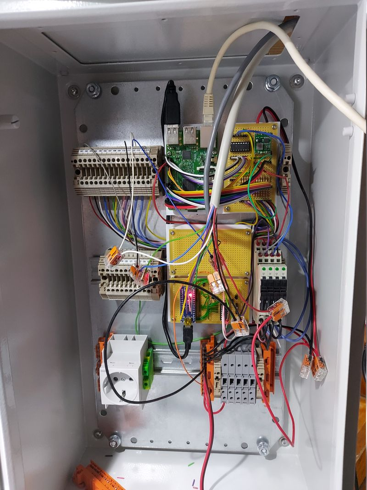
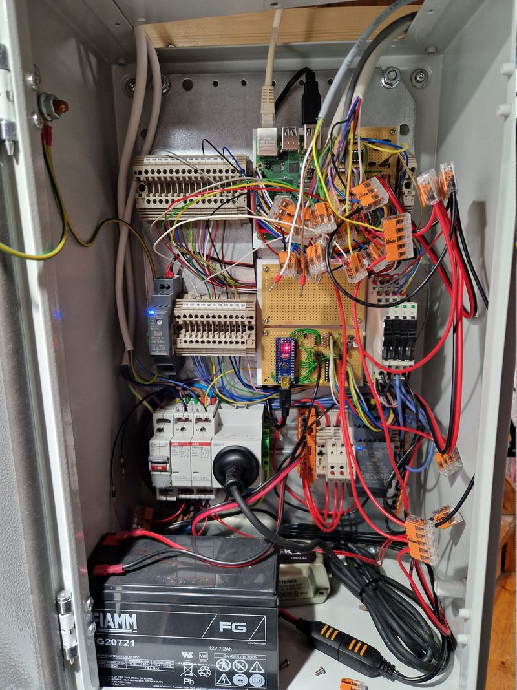

# A short update on my Raspberry Pi security alarm project

> **Source:** [Cavelab Blog](https://blog.cavelab.dev/2025/12/rpi-diy-alarm-update/)  
> **Date:** December 16, 2025  
> **Tag:** `homelab`

---

This post is part of a [series](#series).
 

*Quick recap: I&rsquo;m building a DIY security alarm using a Raspberry Pi, hardwired PIR sensors, and MQTT integration with Home Assistant.*

Hello again — it seems to be close to a year since I last managed to get some words published on this blog. And almost three years since I last wrote about my Raspberry Pi security alarm project &#x1f62e;

But the project is still alive and well. We use it every night and whenever we are away, and it just works &#x1f603; Development usually happens in bulk, with very little happening in between.

Since the last post, the system has progressed **a lot**:

 
 
 [
 
 

 
 ](https://blog.cavelab.dev/2025/12/rpi-diy-alarm-update/20220111_133413.jpg)Inside alarm cabinet 2022

 
 [
 
 

 
 ](https://blog.cavelab.dev/2025/12/rpi-diy-alarm-update/20250218_233331.jpg)Inside alarm cabinet 2025

There are so many things to explain that I don&rsquo;t know where to start… That is probably the main reason I find it hard to document this project — where do I begin?

Writing long, detailed blog posts is extremely time consuming — and finding that time is hard. So my plan is to write shorter posts, tackling one topic at a time.

Here are some topics that I am planning to cover in future blog posts:

- New Zigbee keypads

- What does the Arduino microcontroller do?

- Replaced Aqara with Hue Zigbee motion sensors

- The electronics; inputs, outputs, and schematics

- Water alarm implementation

- Battery, power, and charging

- Thinking about fire alarms

- CLI and scheduled tests

This is just the first post in my attempt to break the writer&rsquo;s block.

&#x1f596;

---

*Originally published at: [https://blog.cavelab.dev/2025/12/rpi-diy-alarm-update/](https://blog.cavelab.dev/2025/12/rpi-diy-alarm-update/)*