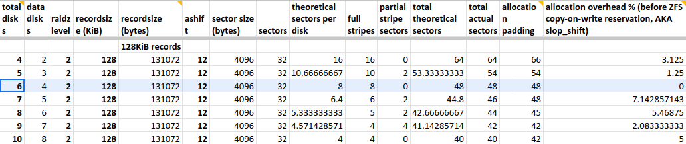
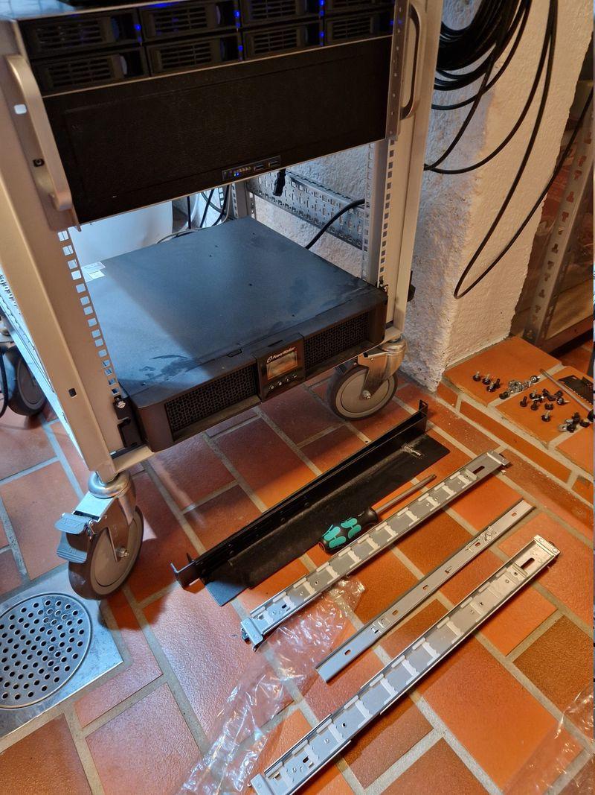
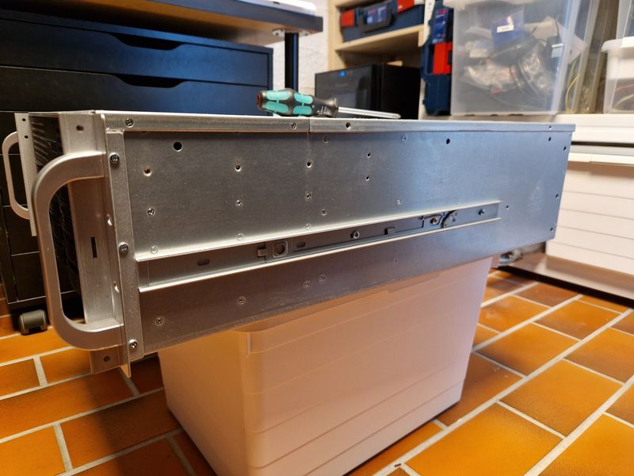
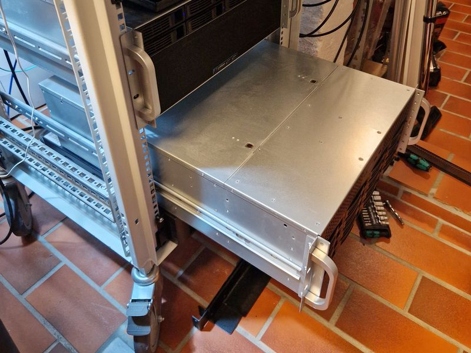
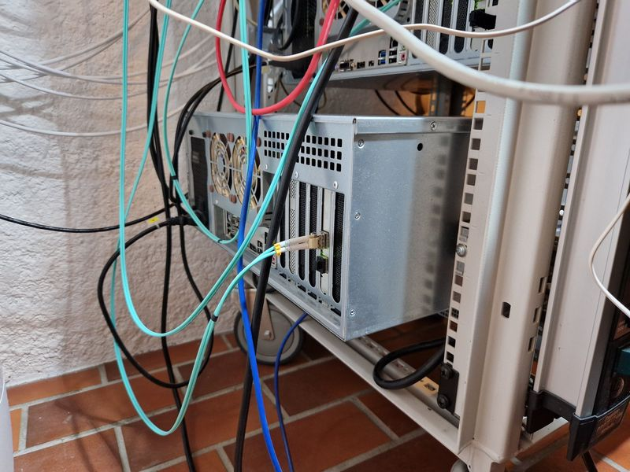
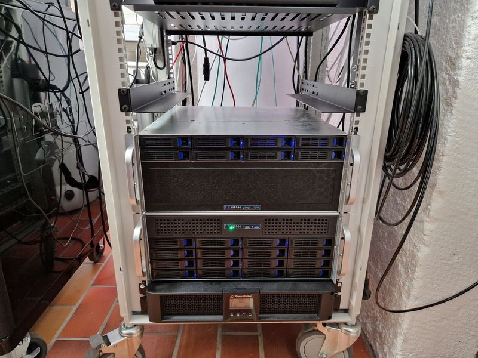

# Zeta is back!

> **Source:** [Cavelab Blog](https://blog.cavelab.dev/2025/01/zeta-is-back/)  
> **Date:** January 29, 2025  
> **Tag:** `homelab`

---

In the fall of 2022 I [turned off Zeta](https://blog.cavelab.dev/2022/10/reducing-energy-usage/#homelab), [my file server](https://blog.cavelab.dev/computers/zeta/), due to the extreme price of electricity. I migrated all the data to a 3x18 TB raidz1 pool on [Alpha](https://blog.cavelab.dev/computers/alpha/) instead.


But last year I brought it back — and used the opportunity to add some more memory, and rebuild the main storage pool &#x1f913;

 
 
 Table of contents
 
 
 
 

 
- [More memory](#more-memory)
 
- [ZFS pools](#zfs-pools)
 
 [Main pool](#main-pool)
 
- [Backup pool](#backup-pool)
 

 
 
- [Rack rails](#rack-rails)
 
- [Wrapping it up](#wrapping-it-up)
 


### More memory [

](#more-memory)


When I shut it down; Zeta had 24 GB memory; 2x4 GB + 2x8 GB. Since you can never have too much RAM with ZFS — I replaced all four sticks with 2x32 GB, giving it 64 GB. Which is the maximum that the Intel Pentium G4560 processor can handle.


Since Zeta is a pure file server, it doesn&rsquo;t consume much memory — apart from ZFS. So; to put it to good use, I increased `zfs_arc_max` to 60 GB.
> 
> 

ZFS uses *50 %* of the host memory for the Adaptive Replacement Cache (ARC) by default. For new installations starting with Proxmox VE 8.1, the ARC usage limit will be set to *10 %* of the installed physical memory, clamped to a maximum of 16 GiB. This value is written to `/etc/modprobe.d/zfs.conf`.
> 

— [Proxmox Wiki](https://pve.proxmox.com/wiki/ZFS_on_Linux#sysadmin_zfs_limit_memory_usage)
> 


To make it permanent, I added an option in `/etc/modprobe.d/zfs.conf`:


```
`$ echo $((60 * 2**30))
64424509440

$ sudo vim /etc/modprobe.d/zfs.conf
options zfs zfs_arc_max=64424509440
`
```


To verify the change after a reboot — we can look at `/proc/spl/kstat/zfs/arcstats`:


```
`$ cat /proc/spl/kstat/zfs/arcstats | egrep &#34;^c\s|^c_max\s|^size\s&#34;
c 4 60069475600
c_max 4 64424509440
size 4 60069024704
`
```
> 
> 

> 
- `c` is the target size of the ARC in bytes
> 
- `c_max` is the maximum size of the ARC in bytes
> 
- `size` is the current size of the ARC in bytes
> 

> 

— [https://superuser.com/a/1137417](https://superuser.com/a/1137417)
> 


Looks good! `c_max` is equal to the `zfs_arc_max` we set. And ~55 GB is already in use &#x1f44d;


### ZFS pools [

](#zfs-pools)


Before turning Zeta off; I wasn&rsquo;t happy with the ZFS pool layout. But with no practical way to migrate the data, there wasn&rsquo;t much I could do about it.


But now, having migrated all the data, it was time to change things up! &#x1f918;


#### Main pool [

](#main-pool)


Zeta originally had 16 disks, two vdevs striped into one large pool: 8x4 TB and 8x8 TB. Giving me a total of 72 TB usable space. 16 disks is a lot of disks — and the main reason the server was idling at 135 W.


I sold the 8x4 TB disks, and set up a new temporary pool with 8x8 TB disks in raidz2. Then moved all the data from Alpha — into this temporary pool.


This freed up the 3x18 TB disks in Alpha — which I used, together with 3 new IronWolf Pro 16 TB disks, to set up a 6 disk raidz2 pool. Before finally moving the data off the temporary pool onto it&rsquo;s final location &#x1f642;

 
 Zeta migrating data between ZFS pools


Before, with 16 disks, 4 and 8 TB in two vdevs; I had 72 TB usable space.


Now, with 6 disks, 16 and 18 TB in a single raidz2; I have 64 TB usable space. That is 10 disks fewer, but only a reduction of 8 TB usable space. That is pretty damn good &#x1f642;


```
` pool: tank0
 state: ONLINE
 scan: scrub repaired 0B in 08:57:50 with 0 errors on Sun Jan 12 09:21:53 2025
config:

 NAME STATE READ WRITE CKSUM
 tank0 ONLINE 0 0 0
 raidz2-0 ONLINE 0 0 0
 ata-TOSHIBA_MG09ACA18TE_xxxxxxxxxxxx ONLINE 0 0 0
 ata-TOSHIBA_MG09ACA18TE_xxxxxxxxxxxx ONLINE 0 0 0
 ata-TOSHIBA_MG09ACA18TE_xxxxxxxxxxxx ONLINE 0 0 0
 ata-ST16000NE000-2RW103_xxxxxxxx ONLINE 0 0 0
 ata-ST16000NE000-2RW103_xxxxxxxx ONLINE 0 0 0
 ata-ST16000NE000-2RW103_xxxxxxxx ONLINE 0 0 0

errors: No known data errors
`
```


 Why 6 disks and not 8? I thought a lot about this before setting up the pool:


- Two more disks would have cost significantly more, and used more power

- I don&rsquo;t really need that much space, I only had 36 TB on Alpha

- 6 disks in raidz2 means 4 data disks, resulting in less allocation overhead according to [this spreadsheet](https://docs.google.com/spreadsheets/d/1pdu_X2tR4ztF6_HLtJ-Dc4ZcwUdt6fkCjpnXxAEFlyA/edit?usp=sharing) &#x1f447;


 [
 
 




 
 ](images/cavelab-03-img01.png)


##### Pool settings [

](#pool-settings)


My new main pool, `tank0` was created with `ashift=12` (4KiB block size) and the following settings:

 
 
 Name
 `atime`
 `recordsize`
 `compression`
 `xattr`
 `sync`
 
 
 
 
 tank0
 off
 128K
 lz4
 sa
 standard
 
 
 tank0/media
 off
 1M
 lz4
 sa
 disabled
 
 
 tank0/vault
 off
 128K
 lz4
 sa
 standard
 
 

> 
> 

> 
- `atime=off`: Do not update atime on file read
> 
- `recordsize=128K`: Standard usage (mixture of file sizes)
> 
- `recordsize=1M`: Recommended for large files
> 
- `compression=lz4` : Set compression to use the lz4 algorithm (default)
> 
- `xattr=sa`: Store Linux attributes in inodes rather than files in hidden folders
> 

> 

— [ZFS Tuning Recommendations](https://www.high-availability.com/docs/ZFS-Tuning-Guide/#recommended-settings)
> 


`sync` is disabled on the media dataset to increase the write performance. The dataset doesn&rsquo;t contain any unique data, but I haven&rsquo;t had any problem — yet &#x1f91e;


#### Backup pool [

](#backup-pool)


With the data migrated off the 8x8 TB temporary pool, I removed six disks, and added two 128 GB SSDs and a 32 GB Intel Optane NVMe.


I made a 8 TB mirrored pool, with the SSDs as a mirrored special device, and the Intel Optane as SLOG. I&rsquo;m using this as a datastore for Proxmox backup, and backups in general (like ZFS snapshots using send/receive).


```
` pool: backup0
 state: ONLINE
 scan: scrub repaired 0B in 01:08:14 with 0 errors on Sun Jan 12 01:32:16 2025
config:

 NAME STATE READ WRITE CKSUM
 backup0 ONLINE 0 0 0
 mirror-0 ONLINE 0 0 0
 ata-TOSHIBA_HDWG180_xxxxxxxxxxxx ONLINE 0 0 0
 ata-TOSHIBA_HDWG480_xxxxxxxxxxxx ONLINE 0 0 0
 special
 mirror-1 ONLINE 0 0 0
 ata-SAMSUNG_SSD_830_Series_xxxxxxxxxxxxxx ONLINE 0 0 0
 ata-SAMSUNG_MZ7TD128HAFV-000L1_xxxxxxxxxxxxxx ONLINE 0 0 0
 logs
 nvme-INTEL_MEMPEK1J032GA_xxxxxxxxxxxxxxxx ONLINE 0 0 0

errors: No known data errors
`
```


 I&rsquo;m not sure how useful the SLOG is with the workloads seen on this pool, Proxmox backup and ZFS send/receive, more testing is required.
Based on the results; I might reassign the Intel Optane as SLOG on the main pool instead &#x1f914;


### Rack rails [

](#rack-rails)


As part of my project to [rearrange the rack](https://blog.cavelab.dev/2024/12/homelab-projects/#rearranging-the-rack), I mounted proper rack rails and removed the shelf that Zeta has been resting on for the last five years.


This allowed me to move it down one rack unit (U), freeing up some precious rack space.

 [
 


 




 
 ](https://blog.cavelab.dev/2025/01/zeta-is-back/20241226_144558.jpg)Zeta and rack shelf removed

The server case is [Inter-Tech 4U-4416](https://blog.cavelab.dev/2019/11/inter-tech-4u-4416/), and the rails:
> 
> 

IPC 2U TELESCOPIC SLIDES 455MM (88887221)
> 

Telescopic Slides with variable installation depth of 500 to 800mm and max. load capacity 30kgs.
> 


 
 
 [
 
 




 
 ](https://blog.cavelab.dev/2025/01/zeta-is-back/20241226_144604.jpg)Rack rails on Zeta server case

 
 [
 
 




 
 ](https://blog.cavelab.dev/2025/01/zeta-is-back/20241226_145956.jpg)Zeta on rails — sticking out in front of rack


My server rack is 600x600 mm, and the server case is 688 mm deep… So the case sticks out about 9 cm behind the rack. Not really a problem — and the rails, with the variable depth, fit just fine &#x1f642;


 
 
 [
 
 




 
 ](https://blog.cavelab.dev/2025/01/zeta-is-back/20241226_150329.jpg)Zeta server case is too long for the rack

 
 [
 
 




 
 ](https://blog.cavelab.dev/2025/01/zeta-is-back/20250127_220039.jpg)UPS, Zeta and Alpha, with no space in between


With Zeta moved down, followed by Alpha, the bottom 10 U are now completely filled — with no wasted space &#x1f603;


The shelf was mounted above Alpha — to be used for my [new Z440 server](https://blog.cavelab.dev/2024/12/homelab-projects/#new-hp-z440-server). That server doesn&rsquo;t have a rack mountable case, so no rack rails unfortunately.


### Wrapping it up [

](#wrapping-it-up)


I am very happy with the new ZFS pool layouts. Zeta is quieter, uses less power (although I haven&rsquo;t measured how much), and has lots of storage capacity.


I still have six disk bays available, making it easier when a disk needs replacement — or if I want another pool in the future. I also have 6x8 TB disks to use for something fun.


The freed up rack unit means more room for other stuff &#x1f973;


&#x1f596;

---

*Originally published at: [https://blog.cavelab.dev/2025/01/zeta-is-back/](https://blog.cavelab.dev/2025/01/zeta-is-back/)*