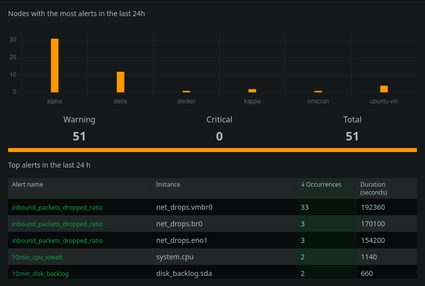
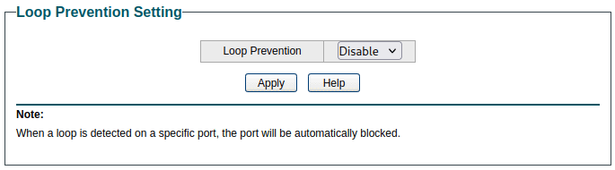
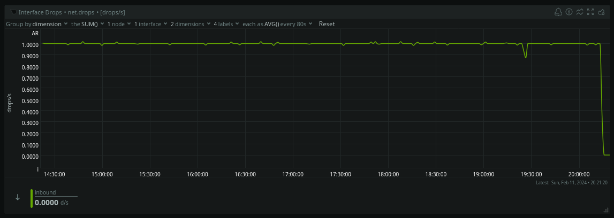

# Netdata warnings — tracking down dropped packets

> **Source:** [Cavelab Blog](https://blog.cavelab.dev/2025/01/netdata-warnings/)  
> **Date:** January 27, 2025  
> **Tag:** `homelab`

---

When I was trying out [Netdata](https://www.netdata.cloud/) last year — I noticed I had lots of `inbound_packets_dropped_ratio` warnings, on multiple nodes.


Time to investigate &#x1f447;

 [
 


 




 
 ](images/cavelab-04-img01.png)Screenshot of Netdata — nodes with alerts last 24h

I did a `tcpdump` capture on one of the nodes reporting dropped packets:


```
`sudo tcpdump -i vmbr0 -w trace.pcap
`
```


The capture was stored as a `pcap` file, which I then analyzed in Wireshark.


```
`50 0.204016 TPLink_4f:26:5f Broadcast Realtek 60 
123 1.201995 TPLink_4f:26:5f Broadcast Realtek 60 
272 2.202889 TPLink_4f:26:5f Broadcast Realtek 60 
350 3.203498 TPLink_4f:26:5f Broadcast Realtek 60 
467 4.206708 TPLink_4f:26:5f Broadcast Realtek 60 
575 5.204777 TPLink_4f:26:5f Broadcast Realtek 60 
673 6.205612 TPLink_4f:26:5f Broadcast Realtek 60 
796 7.206345 TPLink_4f:26:5f Broadcast Realtek 60 
889 8.209804 TPLink_4f:26:5f Broadcast Realtek 60 
1004 9.207812 TPLink_4f:26:5f Broadcast Realtek 60 
1107 10.208800 TPLink_4f:26:5f Broadcast Realtek 60 
1188 11.209873 TPLink_4f:26:5f Broadcast Realtek 60 
1353 12.213628 TPLink_4f:26:5f Broadcast Realtek 60 
1425 13.211084 TPLink_4f:26:5f Broadcast Realtek 60 
1512 14.211925 TPLink_4f:26:5f Broadcast Realtek 60 
1616 15.212710 TPLink_4f:26:5f Broadcast Realtek 60 
1747 16.216115 TPLink_4f:26:5f Broadcast Realtek 60 
1881 17.214192 TPLink_4f:26:5f Broadcast Realtek 60 
1966 18.215312 TPLink_4f:26:5f Broadcast Realtek 60 
2092 19.215959 TPLink_4f:26:5f Broadcast Realtek 60 
2230 20.219056 TPLink_4f:26:5f Broadcast Realtek 60
`
```


I found something interesting; every second the TP-Link router in my garage was sending out broadcast traffic. Why?


Looking at the frame in Wireshark didn&rsquo;t reveal much:


```
`Frame 50: 60 bytes on wire (480 bits), 60 bytes captured (480 bits)
Ethernet II, Src: TPLink_4f:26:5f (34:60:f9:4f:26:5f), Dst: Broadcast (ff:ff:ff:ff:ff:ff)
Realtek Layer 2 Protocols
`
```


But a quick internet search lead me to an issue posted on the Netdata repository:
> 
> 

I found the RRCP broadcasts from both TP-link TL-SG105e and Netgear GS908e were stopped by disabling &ldquo;loop prevention&rdquo; on the switch.
> — [jw-g19](https://github.com/netdata/netdata/issues/5158#issuecomment-668453370)
> 


 The **Realtek Remote Control Protocol** (RRCP), developed by Realtek, is an application layer protocol, running directly over Ethernet frames. — [Wikipedia](https://en.wikipedia.org/wiki/Realtek_Remote_Control_Protocol)


I tried disabling &ldquo;loop prevention&rdquo; in my TP-Link switch:

 [
 


 




 
 ](images/cavelab-04-img02.png)Screenshot of loop prevention setting in TP-link swtich

And voilà — the steady 1 drop/s went away:

 [
 


 




 
 ](images/cavelab-04-img03.png)Screenshot of Netdata — interface drops graph

One frame per second dropped isn&rsquo;t the end of the world — but I&rsquo;d rather avoid it if possible. Finding small issues like this isn&rsquo;t possible without some kind of monitoring.


I still have some dropped packets, due to improper VLAN filtering — I need to get on that, soon™.


I used Netdata for almost one year, but recently dropped it for [Checkmk](https://checkmk.com/). That is a topic for another blog post &#x1f642;


&#x1f596;

---

*Originally published at: [https://blog.cavelab.dev/2025/01/netdata-warnings/](https://blog.cavelab.dev/2025/01/netdata-warnings/)*