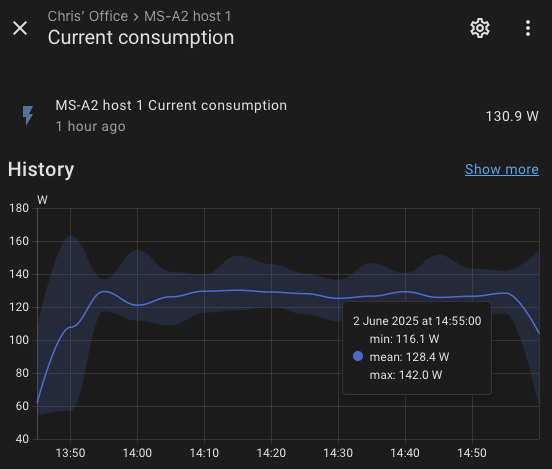

# ESXi on Minisforum MS-A2

> **Source:** [Chrisdooks.com](https://chrisdooks.com/2025/06/02/esxi-on-minisforum-ms-a2/)  
> **Date:** June 2, 2025  
> **Author:** chris  
> **Tag:** `vmware`

---

My homelab currently comprises of 3x Intel NUC Extremes (11th gen, 1x i9, 2x i7) along with 2x Xeon workstation based hosts. Whilst I like the NUCs, I’ve been wanting to replace the Xeon workstations. They started off in a Dell SFF workstation, but due to heat management issues I removed the CPUs and I’ve rehoused them into Silverstone Fara R1 cases. They perform well, however they’re large, and take up a lot of space. I’ve spent months and months musing over what to replace them with, and I nearly ordered an AMD EPYC CPU and a bunch of RAM from eBay with the intent of buying a 2U case to house it in. Then I saw rather a lot of chatter about the Minisforum MS-A2. I knew of the MS-01, however I didn’t feel that the CPU in it gave enough grunt for VCF deployments, plus I wanted to avoid the whole P/E core situation, so I discounted it. The MS-A2 however ticks a lot of boxes – it’s a small, 16C/32t box with very decent hardware:

- AMD Ryzen

 9 9955HX,16C/32T

- Dual DDR5-5600Mhz, up to 96GB

- M.2 PCIe 4.0 SSD slot*3 | Support U.2 NVMe/M.2 22110

- Dual 10Gbps SFP+ Lan & 2.5G RJ45 Lan Ports | WIFI 6E & BT 5.3

Note: only one of the two 2.5 GbE interfaces works in ESXi

- Built-in PCle x16 Slot

Reports indicate it will run with 128GB of RAM, however 64GB SODIMM’s are extremely expensive compared to 48GB (in the UK), so I went with the 96GB option. I went ahead and ordered a pair and I wanted to see how they were for vSphere homelab purposes, with the intent to ultimately run nested VCF using William Lam’s amazing PowerCLI script for the deployment.

First off, ESXi installed without an issue, although you will get a TPM 2 alarm since the on board TPM chip does not support FIFO which is required for ESXi. Best to disable the trusted platform to avoid this alarm.

 
 

 
 

You can see I’ve enabled NVMe memory tiering, using an Samsung PM981 Enterprise drive as the tiering disk for this. As expected, the Realtek 2.5 GbE interface is not picked up, however the Intel 2.5 GbE interface is, as are the two 10 GbE SFP+ interfaces.

 
 

 
 

I’ve populated the PCI port with a 25 GbE NIC which is why you can see 5 interfaces in total.

Overall, it’s running well, and whilst I haven’t done any benchmarking the VMs I have tested so far do perform very well.

Power consumption wise, bearing in mind I am using a 25 GbE dual port NIC, I am seeing around 55-65W with the host on and ESXi in maintenance mode. vSAN is enabled on the host, and in addition with the PCI NIC power consumption is likely to be higher due to the NIC and vSAN services. Also, 3x NVMe are on each host (boot, cache, vSAN). When I run up a VCF Management domain with 4x nested hosts, the VC, single NSX, Edges, SDDC Manager, LCM etc, it’s showing around 130W per host and I saw 140W peak. I’ll run this again without the PCI NIC at some point. Here’s a graph overview:

 
 

 
 

Update 03/06/25 – removing the 25 GbE card, power consumption dropped by roughly 10W overall.

Not the longest post but I know what there are people out there interested in the MS-A2 and whether ESXi works on them. The short answer is yes, it works well so far. I’m going to do a longer blog post with the deployment of VCF on them, that will be published in due course. Spoiler – nested ESXi does work, albeit with some caveats which I will also cover.

So far, I’m very pleased. The power consumption is small for what they are, and the fan noise while audible when running under load is not annoying like it can be with other hardware which has small fans.

---

*Originally published at: [https://chrisdooks.com/2025/06/02/esxi-on-minisforum-ms-a2/](https://chrisdooks.com/2025/06/02/esxi-on-minisforum-ms-a2/)*