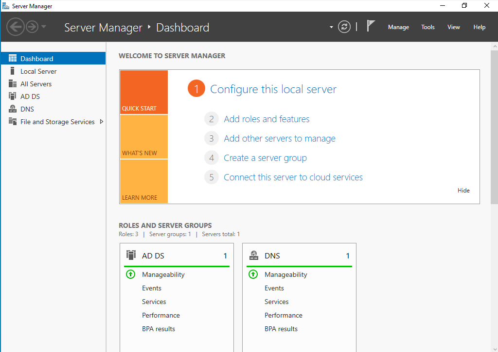
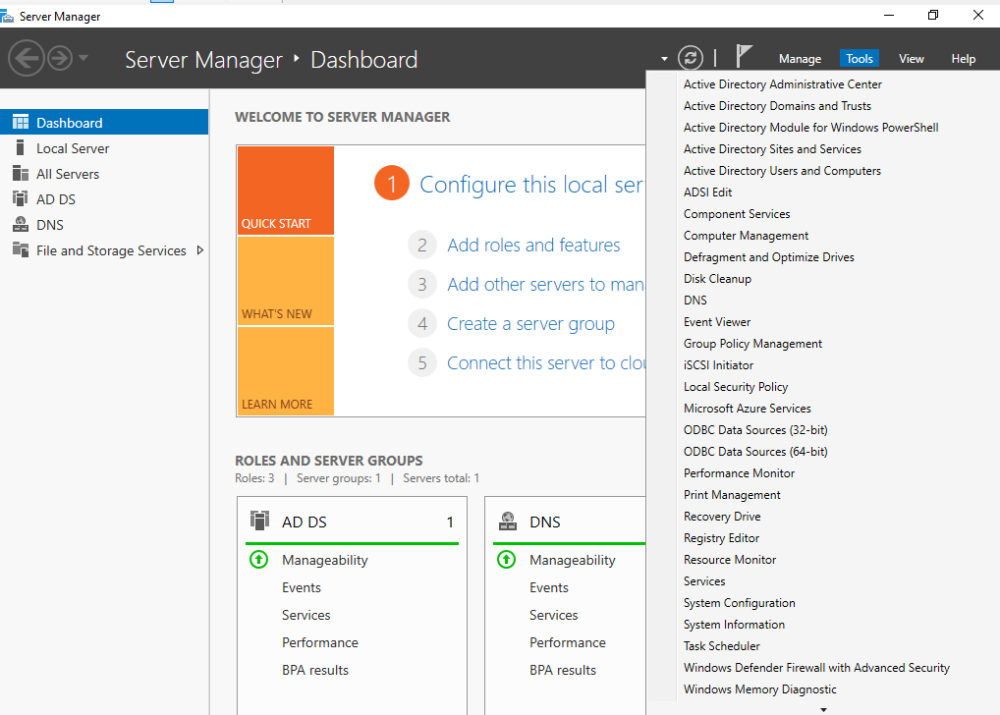
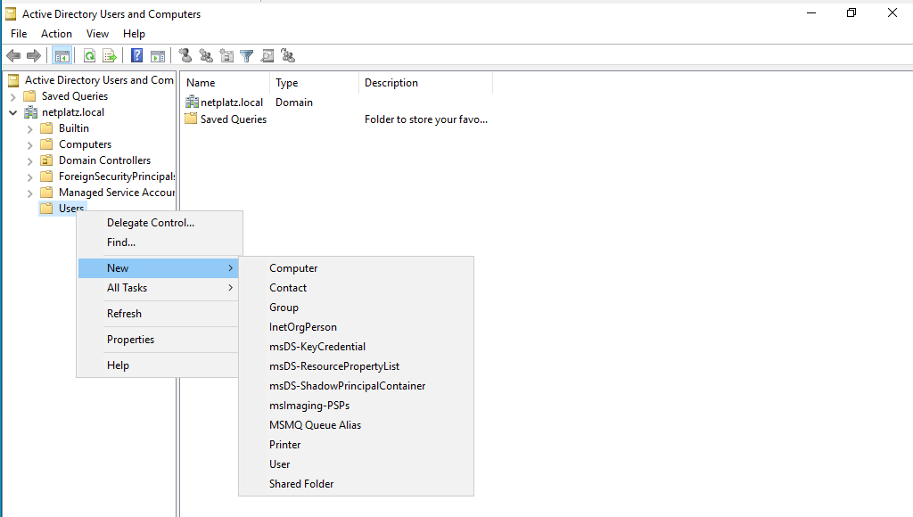
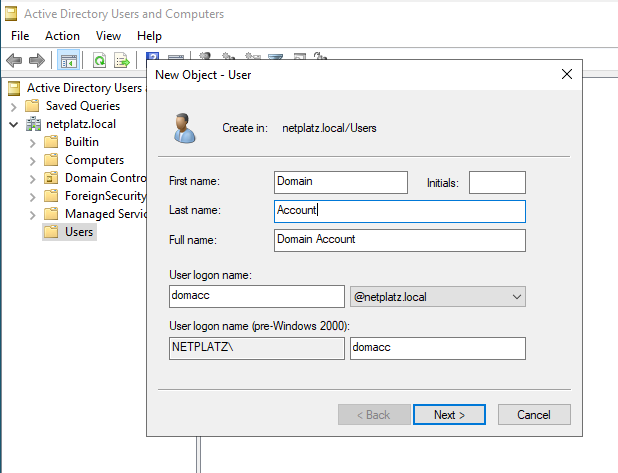
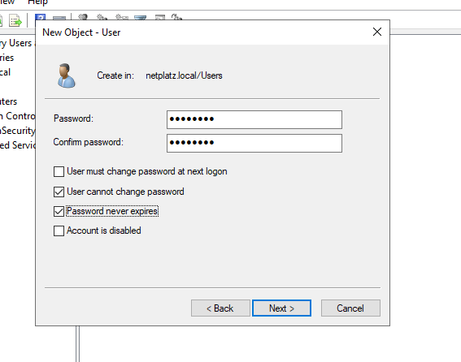
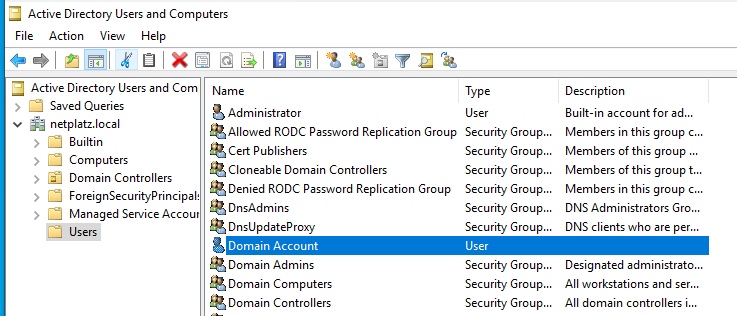
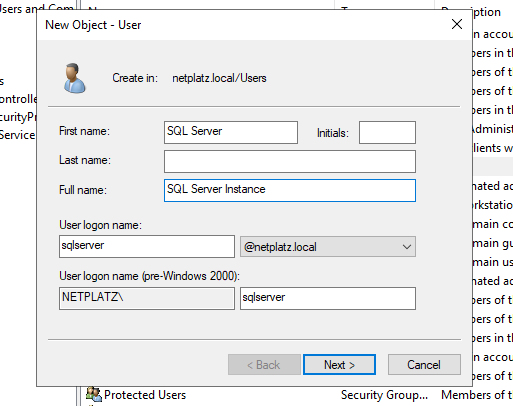
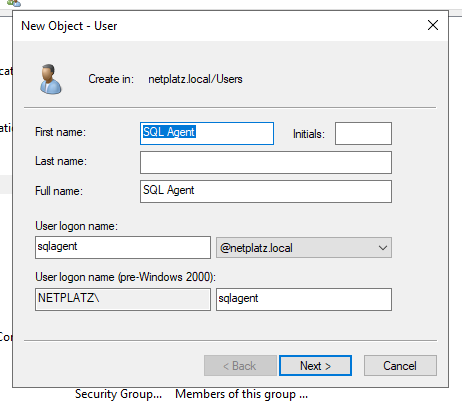
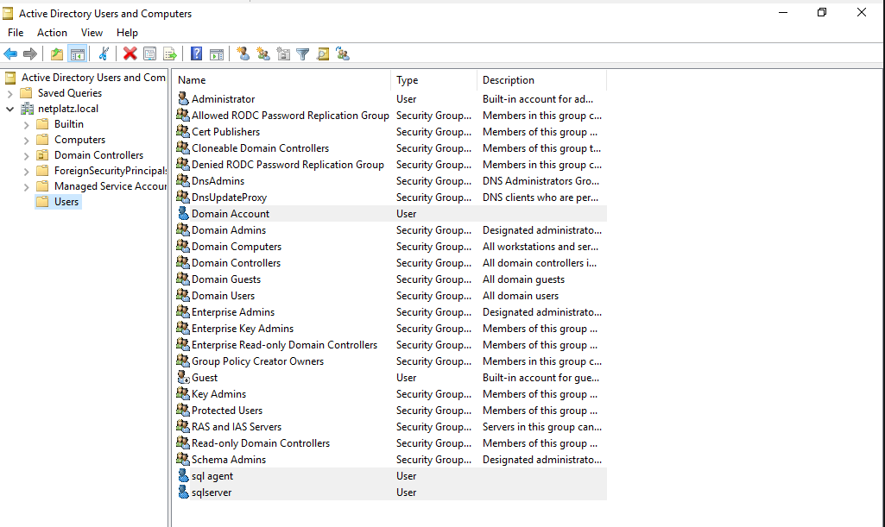

# HomeLab: Creating a domain account and users.

> **Source:** [DBplatz Blog](https://blog.dbplatz.com/homelab-creating-a-domain-account-and-users/)  
> **Date:** January 4, 2022  
> **Author:** DBplatz Support  
> **Tag:** `homelab`

---

In a previous article we saw [how to create a domain controller](https://blog.dbplatz.com/homelab-creating-a-domain-controller/), now let&apos;s create domain users.

Let&apos;s click on Start and then **Server Manager**.

Go to **Tools **and then to **Active Directory Users and Computers**.

Click on the **domain **(netplatz) and then go to **users **and right-click **User**.

Provide the details and a logon name and click next.

Provide a secure password 

and once you click next the domain user will be created.

So, since the target is to use these users for [SQL Server](https://www.microsoft.com/en-GB/sql-server/sql-server-downloads), lets create a couple more.

One for the instance,

and another one for the agent.

And as shown below, all users were created successfully.

---

*Originally published at: [https://blog.dbplatz.com/homelab-creating-a-domain-account-and-users/](https://blog.dbplatz.com/homelab-creating-a-domain-account-and-users/)*