# VMware Log Disk Exhaustion alert and how to remediate

> **Source:** [Domalab](https://domalab.com/2022/04/15/vmware-log-disk-exhaustion/)  
> **Date:** April 15, 2022  
> **Author:** Michele Domanico  
> **Tag:** `vmware`

---

The VMware vCenter Server Appliance or VCSA for short is by far the easiest method to manage the vSphere environment, including hybrid solutions spanning traditional on-premises, container ready and public cloud deployments. Everything under the same roof (or [Software Defined Data Center](https://www.vmware.com/uk/solutions/software-defined-datacenter.html), better!). With so much going on and different tasks and activities it is important to carefully plan the size of the VCSA appliance from the start. Of course it is possible to fix it later. In the meantime logs can fill up the storage dedicated to the logs. If extending the disk is not an option, possibly the best and quickest one is to remove unwanted stale logs taking valuable space. On a default VCSA deployment the disk for storing logs is automatically set to 10 GB and a warning usually triggers an alert when reaching or going over 75%. Inevitably this brings the VMware Log Disk Exhaustion alert. Now while it does not require immediate action, it is definitely a good idea to take action while there is still a 10%-15% free space on the log disk.

The procedure to identify and remove the logs is pretty simple and straightforward. It requires SSH access to the VCSA appliance and a few command to list the log size and location to ultimately remove them. It goes without saying before deleting any file, even old logs, it is always a good idea to [take a backup](https://domalab.com/vmware-vcsa-backup-synology-ftps/) or eventually a snapshot and have that peace of mind.

The entire process is very quick as run by command line. There are 3 main locations where the logs can accumulate in larger sizes:

- /storage/log/vmware/sso/tomcat/

- /storage/log/vmware/eam/web/

- /storage/log/vmware/lookupsvc/tomcat/ (vCenter 7.0 only)

This article refers to the steps on vCenter 7.0 release.

### VMware Log Disk Exhaustion remediation

When old logs are exceeding the default size threshold on the VCSA appliance this triggers the VMware Log Disk Exhaustion. This can easily be seen on the Summary page for the SDDC environment.

[

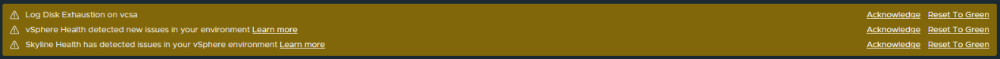

](https://domalab.com/?attachment_id=15450)

When logging to the vCenter Server Management Appliance, in the Monitor > Disks section it also shows the consumed disk space per volume. Default thresholds can be modified, ideally shouldn’t be changed to be too close to the maximum size.

Next step is to run a SSH session to the VMware VCSA appliance and login to the BASH Shell with the command shell. The default login shell is called appliancesh and can be changed a more traditional one BASH Shell.

[

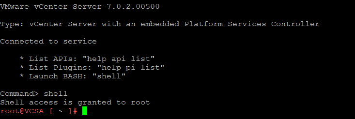

](https://domalab.com/?attachment_id=15452)

At this point with a simple “df -h” it returns the statistics about the total, consumed and available size on each storage volume or disk as these appear in the VCSA Management appliance. Clearly the “/storage/log” is exceeding the default threshold hence the VMware Log Disk Exhaustion trigger alert.

[

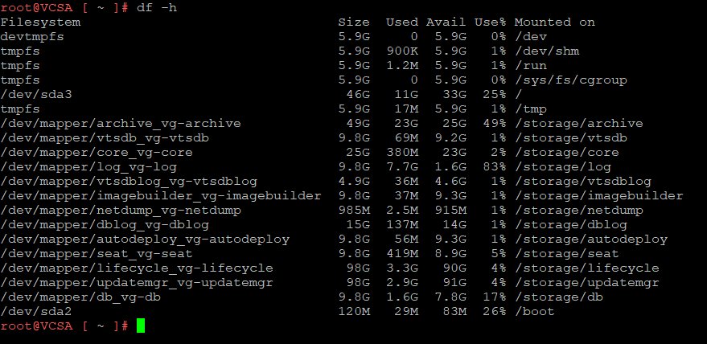

](https://domalab.com/?attachment_id=15453)

Another useful command also allows to detect multiple storage disks over a certain threshold, for example 78%.

[

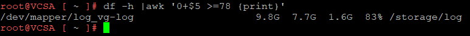

](https://domalab.com/?attachment_id=15454)

As indicated above there are 3 main paths accumulating a large amount of logs. The first one is “/storage/log/vmware/sso/tomcat”. In this path it is possible to search for all catalina*log file and remove them with a simple command.

[

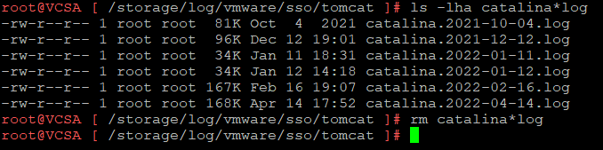

](https://domalab.com/?attachment_id=15455)

Similarly, same exercise can be done for “/storage/log/vmware/eam/web”. And again remove catalina*log files.

[

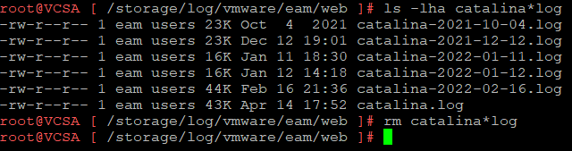

](https://domalab.com/?attachment_id=15456)

Equally for “/storage/log/vmware/lookupsvc/tomcat” can repeat the same process.

[

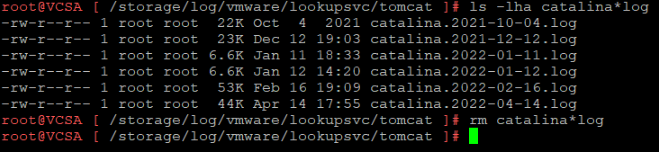

](https://domalab.com/?attachment_id=15457)

So far only a few files and small ones have been removed. Within same locations there are plenty of other files that can be removed. These can be identified as “localhost_access*” in “/storage/log/vmware/sso/tomcat”.

[

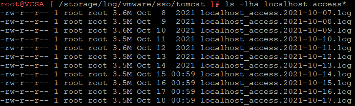

](https://domalab.com/?attachment_id=15458)

Equally in “/storage/log/vmware/eam/web”.

[

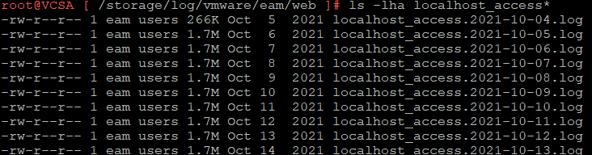

](https://domalab.com/?attachment_id=15459)

And also in “/storage/log/vmware/lookupsvc/tomcat”.

[

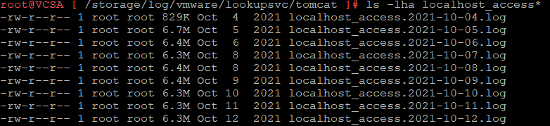

](https://domalab.com/?attachment_id=15460)

Now for each one of these paths is possible to remove the unneeded files with a simple “rm localhost_access* from “/storage/log/vmware/sso/tomcat”.

Same for “/storage/log/vmware/eam/web”

And a final one on “/storage/log/vmware/lookupsvc/tomcat”.

Now running the same command as before on the root level it is possible to check the reduced size. This will also reflects in the VCSA Management console after an inventory update or restart of the VCSA if preferred. In this case the space used went from 83% down to 62%.

[

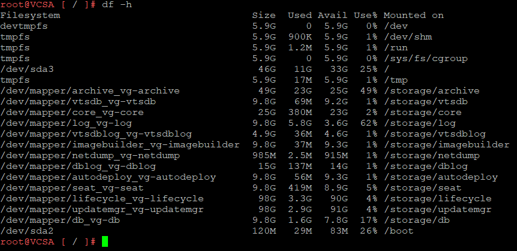

](https://domalab.com/?attachment_id=15464)

Additionally, it is possible to list and remove the sps-access*log files from the “/storage/log/vmware/vmware-sps” path.

[

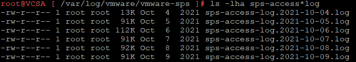

](https://domalab.com/?attachment_id=15465)

The command will be executed in a similar fashion.

But what if more log files should be deleted to reclaim even more space? Within the same “/storage/log” it is possible to quickly identify also the paths using more space and order them by size. In this example it shows the biggest 30 folders. Next it is just a matter of identifying the log files again and removing them with a simple command. As always having a backup or even a snapshot before it is always a great option for the peace of mind when not comfortable with the command line.

[

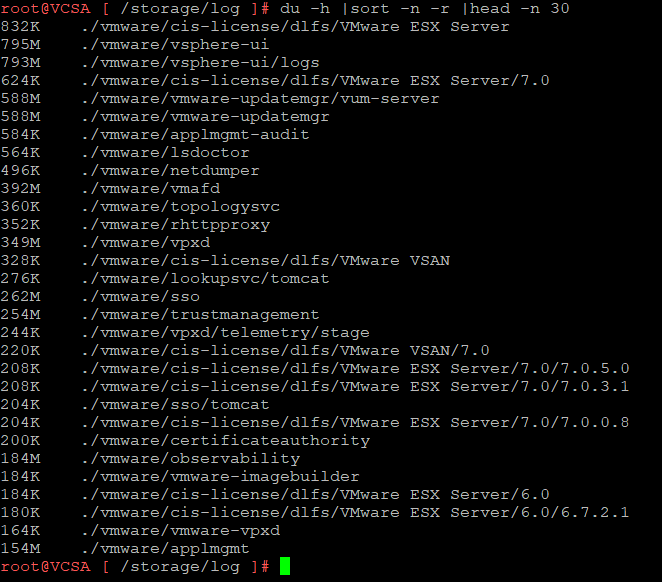

](https://domalab.com/?attachment_id=15467)

---

*Originally published at: [https://domalab.com/2022/04/15/vmware-log-disk-exhaustion/](https://domalab.com/2022/04/15/vmware-log-disk-exhaustion/)*