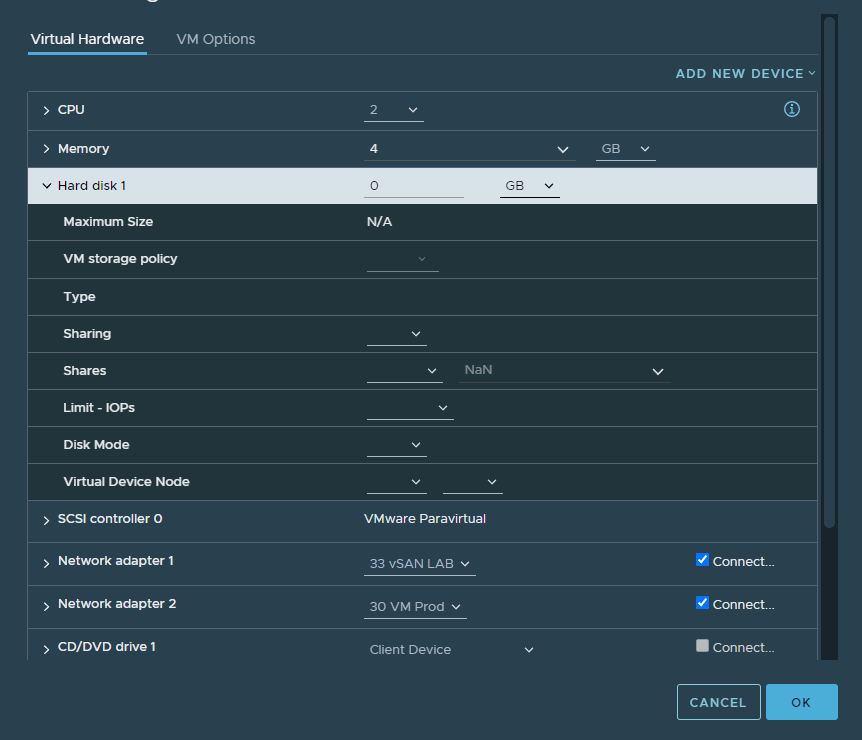
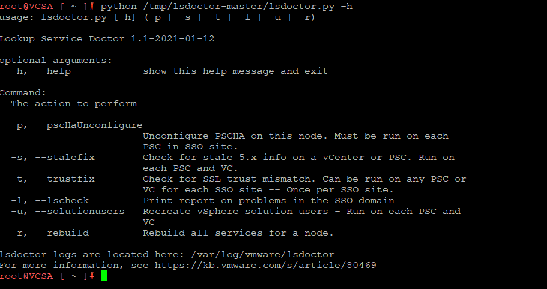
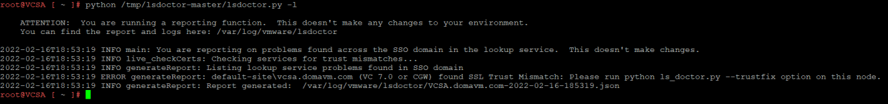
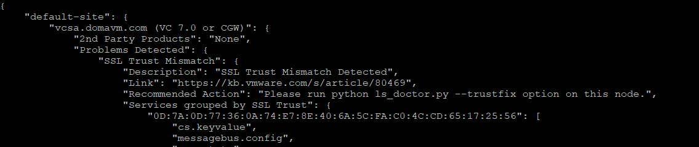
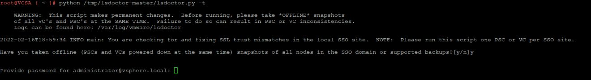
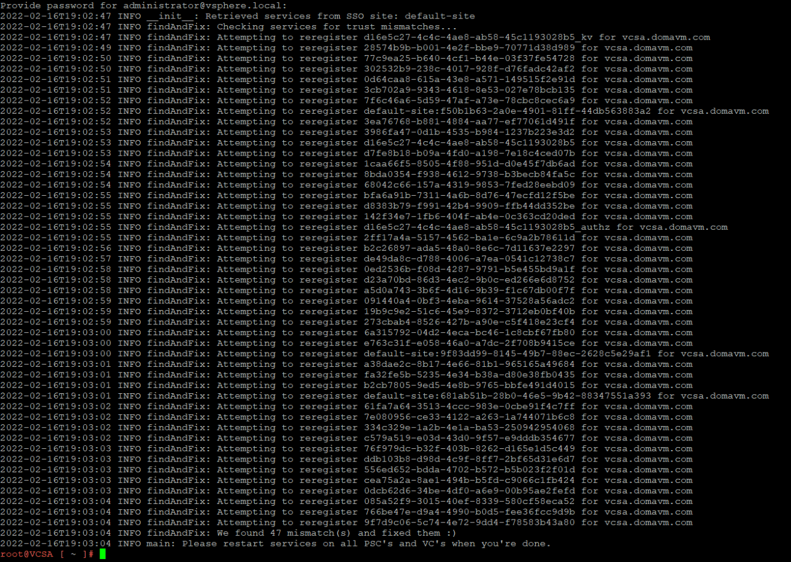
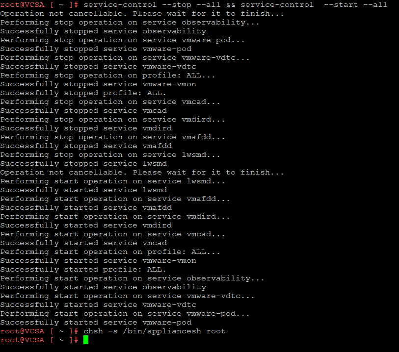
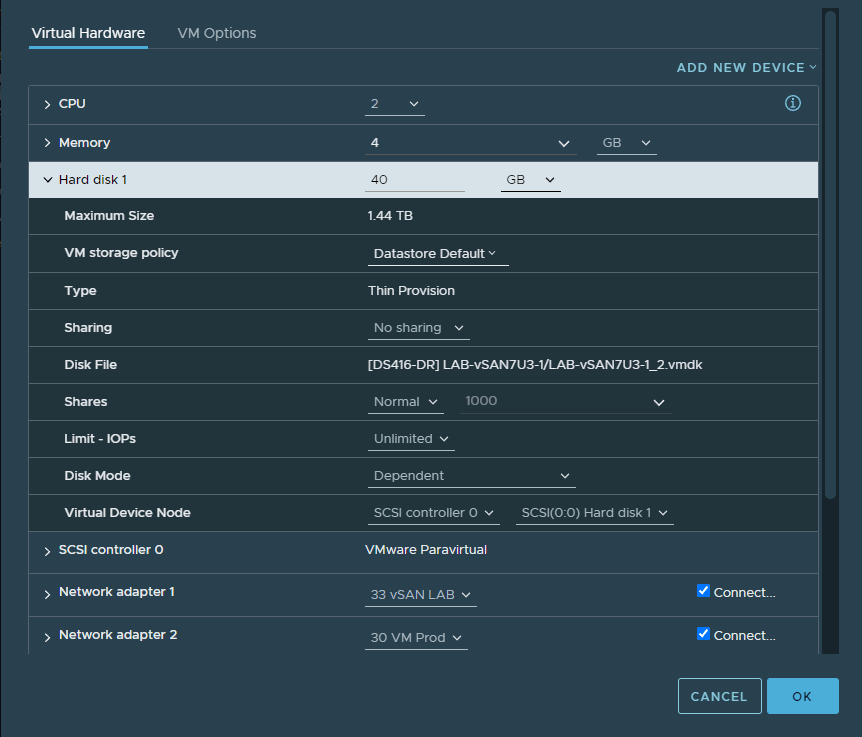

# VCSA SSL mismatch and cannot edit VM properties

> **Source:** [Domalab](https://domalab.com/2022/02/24/vcsa-ssl-mismatch/)  
> **Date:** February 24, 2022  
> **Author:** Michele Domanico  
> **Tag:** `vmware`

---

VMware VCSA SSL mismatch and editing VM properties, what’s the connection?

Playing with a [homelab](https://domalab.com/build-homelab-setup-idea/) is where it is possible to come across different issues that can happen in production environments too. In this particular instance upgrading and reusing (read playing!) with different releases has shown a symptom never seen before. Everything in the VMware VCSA works absolutely fine including the tasks of creating, moving and deleting VMs. But not editing! To be more specific there was this strange behavior where it is possible to create a VM and select specific property values. Once the VM configuration is saved, it is not possible to view / edit the existing values (in this case for the Virtual Disks).

The post below shows a quick sample of VM properties not in a editable state and how to fix this with the help of a script to run on the VMware vCenter appliance and solve the VCSA SSL mismatch. This script is available for download from the official [VMware KB article](https://kb.vmware.com/s/article/80469) which includes also additional instructions for other use cases. For this scenario the script is executed to run the “trustfix” option which detects and solves the VCSA SSL mismatch with the current names and modules registered in the vSphere domain.

As a word of caution, it is recommended to take a [backup of the VMware VCSA](https://domalab.com/vmware-vcsa-backup-synology-ftps/) before making any changes. Additionally, taking a snapshot helps too for quick recoveries to a previous state.

### Fix VMware VCSA SSL mismatch

Should the vCenter show inconsistent information or prevent some VM properties to be edited, it could be related to a VCSA SSL mismatch with certificates. Either not trusted or maybe not registered against different modules in the vSphere environment. For example this can happen during certificate replacements. When this occurs, it might be possible to create a VM and save its configuration. Later some of the properties might not be shown or available for editing. Like in the screenshot below the Virtual Disk properties are unavailable for editing.

When this issue occurs, the best option is to download on VMware VCSA appliance the lsdoctor.py script. The script can be uploaded using utilities like WinSCP and why not even the Veeam console for a [secure and fast file copy](https://domalab.com/copy-files-veeam-console/). The option that will be used in this case is “-t or –trustfix”. What this option does is to fix the vSphere SSO and check for any potential VCSA SSL mismatch with registered certificates. Before running the trustfix option it is necessary to generate a report with SSL mismatch findings. And this is where the “-l or –lscheck” option comes into play.

Once the script has completed (the actual execution time is very short), it generates a report in **/var/log/vmware/lsdoctor** directory. Each report has a specific timestamp making them easy to use and consume. Hence first step is to run and generate a report with a “-l” option. It is important to specify the python binary (installed by default) on the VMware VCSA. Actually more than one version of python are already installed and available on the VMware VCSA appliance.

Next step is to investigate the generated log. It comes in a JSON format and easy to read with builtin text tools like “cat” or “more” for reading convenience.

In this example the log shows multiple VCSA SSL mismatch with certificates (actually 47, I use the homelab a lot!) and also the recommended step.

Of course it is possible to fix all entries in the log in one go and simply by rerunning the script with the “-t” option this time. It goes without saying, having a working backup or snapshot before proceeding it is more than common sense!

Once accepted the previous step the script kicks in and runs in no time. This one found and solved 47 VCSA SSL mismatch certificates in one go.

Now that all SSL certificates in the vSphere SSO are working it is a matter of restarting the VCSA appliance or just the services. It might actually work faster due to RAM memory allocation on the VMware Host where the VCSA appliance is running. This is accomplished with a single line:

“service-control –stop –all && service-control –start –all”

A few minutes later and checking back on the VM properties, now all of them are available and editable.

Depending on which method has been used to copy the script on the VMware VCSA appliance, it is important to revert the bash shell options to their default (bash shell vs appliancesh) and help hardening security while accessing the VCSA appliance. More on this in a dedicated article.

---

*Originally published at: [https://domalab.com/2022/02/24/vcsa-ssl-mismatch/](https://domalab.com/2022/02/24/vcsa-ssl-mismatch/)*