# Choosing a Generator - Magnum MLT3060K Light Tower & Generator

> **Source:** [NetworkProfile.org](https://blog.networkprofile.org/mlt3060k-part1/)  
> **Date:** July 4, 2025  
> **Author:** spookyghost  
> **Tag:** `networking`

---

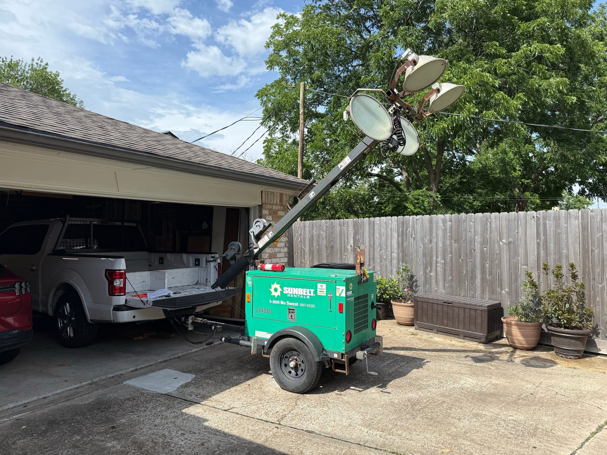

This post is about my new to me 2015 Magnum/Generac MLT3060K Light Tower & Generator and how I came to the conclusion to buy it. Its has an 1800RPM Liquid Cooled, Diesel, 1.0L 3 Cylinder engine running at 1800RPM and a 6kw Generator end with a massive 30 gallon fuel tank, capable of running at **full load** for over 60 hours without refueling built into a convenient trailer, with super bright lights that can extend 30 feet up in the air. I got this unit used for $1200 with just over 5000 hours on the meter. Its generally known that these can often go 20,000 hours before a major service. Its Prime rated, and suitable for continuous operation. 

Be warned, this is kind of a long post!

### Why did I buy a light tower?

2 is 1 and 1 is none!

If you read my other posts you know I love Generators, equipment, and other cool things in general, and having an extensive home network and Homelab means I want to keep everything powered on no matter what. Our entire lives revolve around electricity, and a lot of my house relies on automation in Home Assistant, and a lot of my security systems requires power. I live on the Gulf Coast of the USA meaning hurricane and strong storms are a threat to our local power grid. I have a 27kw Liquid cooled 1800rpm Natural Gas generator you can read about in my other posts, but what happens if that breaks, or the natural gas goes out? You can have the best generator in the world, but one small part breaking or the fuel supply going offline, and you&apos;re out of business.

Until now my only backup to that unit was a small Tri-Fuel Champion generator. That generator has been good, and worked every time I loaned it out during storms, however its not very tough. Its not something you&apos;d be confident to run for 1 or 2 weeks non stop, in the brutal Houston heat. Unless you run it on natural gas, you&apos;d be filling up the tank 3 or 4 times per day. You&apos;d also need to shut it down and change the oil every 50 hours! That is just not what I&apos;d want to be doing after a hurricane or during any inclement weather. It also means I need to plan to shut down my entire network setup, unless I can get the oil change done in less than 10 mins (UPS Runtime limitations) 

 

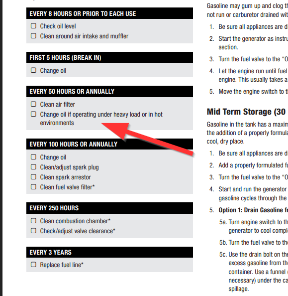

The other problem is that unless you put a lot of effort into building a generator shed, you can&apos;t really leave it in a position to be ready to run. I&apos;d need to rush out and remove it from my garage and set it up for use, and find a cover for the power outlets

This Light Tower is VERY tough and prime rated. It has extremely long run times, over 60 hours per tank. Refueling is very easy and not nearly as dangerous and you can go up to 1000 hours between oil changes. That&apos;s 41 days of non-stop operation... There is no carb to get gummed up, parts are readily available, diesel is easy to store and I can easily move it to another location because its a trailer. Its also able to be just left out in the weather, as its already in a weatherproof enclosure. Despite the size of this unit, it actually uses significantly LESS fuel than the Champion 100520 I have. Even with the increased price of Diesel, it costs much less to run per day. At current prices, and the same estimate load, it would cost me $45 per day to run on my portable generator in gas, while living life normally. With the light tower, it would cost just $30. For reference, my natural gas unit runs me around $12 a day (Confirmed by 2 recent disasters where we ran over 8 days in total on generator)

Another reason is that one of our long term life plans is to buy a large plot of land in the middle of nowhere. This would be fantastic for charging up solar batteries, and lighting up the area if needed, and it can be towed there.

### Why a light tower over a regular generator?

These light towers can be be had for a very low price because there is so many of them out there, and it seems not a lot of people have really caught on that they are FANTASTIC portable generators. They are also easily moved without any special equipment. I did look at several other options, however they were either well outside of my price range for a backup to a backup, or they were near impossible to move without a forklift (Which, I don&apos;t have!) 

The downside to these units is that they are reported to have very poor power quality. More on that later.

### What else did I look at?

Before we go over the light tower, lets look at what other options I considered. 

I did a lot of research and created a spreadsheet with everything I wanted out of a generator and came to a few different options. My general requirements were that i should be capable of running for extended periods of time, have a large fuel tank, have electric start and auto choke (Or, no choke) and be somewhat portable.

Ideally I wanted something liquid cooled at 1800RPM.

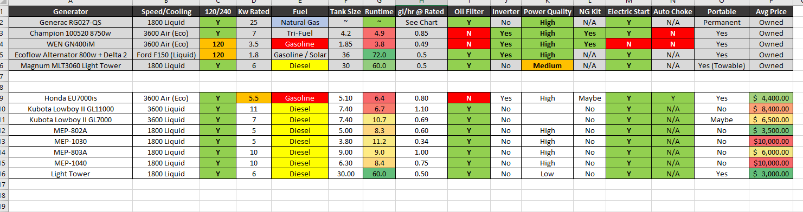

Here is the options I looked at, and why I didn&apos;t end up with either and other general thoughts

#### Honda EU7000is

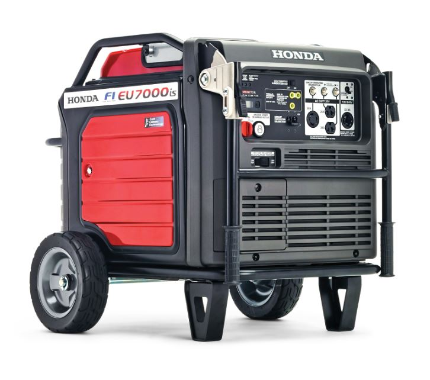

This is the easy option. They are very portable, quiet, run on gasoline which I already store, they are Fuel Injected, so no carb to get gummed up, great power quality. They are generally regarded to be quality units, but the elephant in the room is that Honda wants $4500 for one of these... for a 5.5kw generator. Which is more reliable, 1 Honda EU7000is or 5 x Cheap generators? I just think they are crazy for wanting that much for these. You still have the problem of very short service intervals, can&apos;t store it outside, not very tough at all, and parts are very expensive. Everything is hard to work on because its all tightly packed behind covers, no natural gas options since its fuel injected. I just don&apos;t think I would gain a whole lot over my Champion generator, it certainly wouldn&apos;t be 5x better!

#### Military Surplus MEP-802A

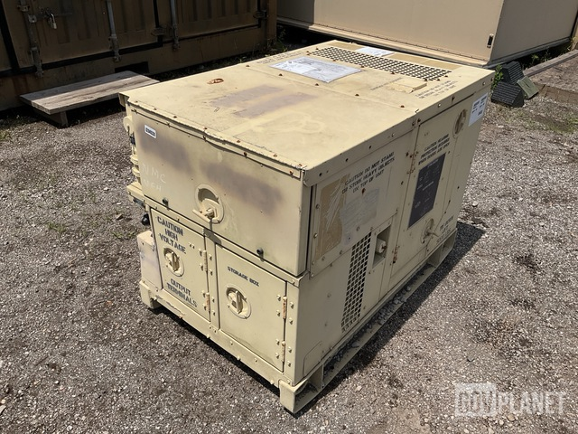

These are very cool units. They are as tough as you can get, 1800RPM liquid cooled Diesel, and just have so much cool factor. The problem with these are they are getting quite old now. A lot of these units are as old as I am, and spare parts are getting harder and harder to come by, and most are not produced anymore. There is pretty much no civilian supply chains for spare parts other than a lot of enthusiasts out there supporting them.

I would probably deal with that and get one just because they are cool, but transporting these and moving them around your property is a BIG challenge unless you have the equipment to do so. Purchasing one is also tough as you either pay an extreme amount of money on the used market unless you come across a deal, or buy one at auction which is just a real pain.

They are also very large for a 5kw genset, even if you can go to 120% load, and as with a lot of military stuff, they are 24v, meaning 2 batteries to maintain. 

#### Military Surplus MEP-803A

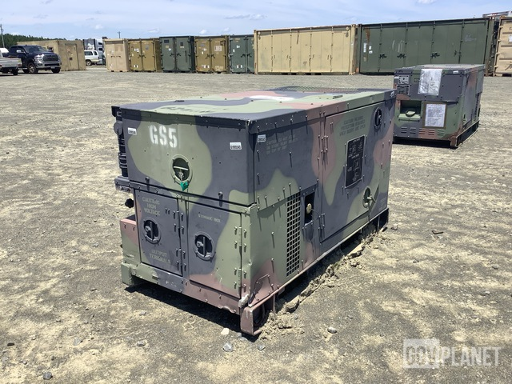

The bigger brother to the 802a, these are rated at 10kw. All of the same problems apply to this unit as above, but they are even larger. The other problem is that Diesel engines will wet stack (*Wet stacking in diesel engines refers to the condition where unburned fuel and carbon deposits accumulate in the exhaust system, leading to a thick, dark liquid dripping from the exhaust stacks. This typically occurs when the engine is operated at light loads or below its designated operating temperature for extended period*s)

The load on my house is usually 3-4kw, and only goes up near 10kw very very briefly, so I would be concerned running one of these at low load for that long, but I&apos;m unsure if that&apos;s a real concern or not.

#### Military Surplus MEP-1030

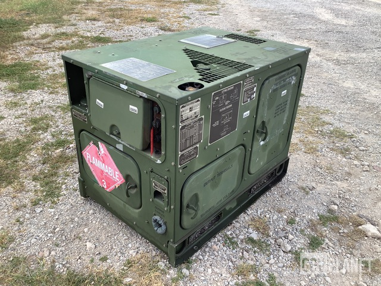

This is the new, smaller, quieter, more fuel efficient version of the MEP-802A. All the same problems apply with parts being slightly easier to come by, however they have too much technology. There is a fancy LCD screen on the controller which is VERY expensive to replace if it goes wrong. Also still too heavy, etc.

They are also VERY expensive on the used market right now, and get scooped up quickly at auction.

#### Military Surplus MEP-1040

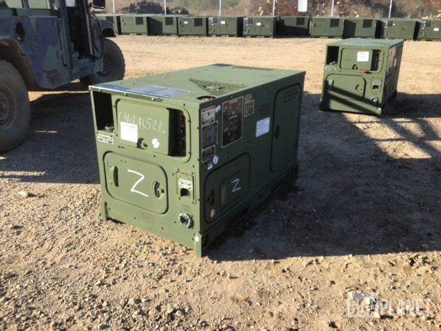

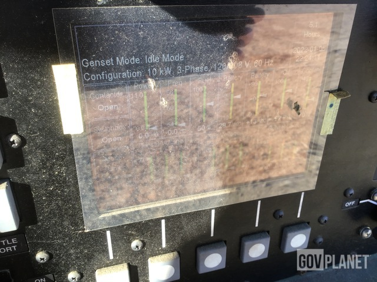

This is the big brother of the MEP-1030. Again all the same problems, too big, too heavy, too expensive.

#### Kubota Lowboy II GL11000

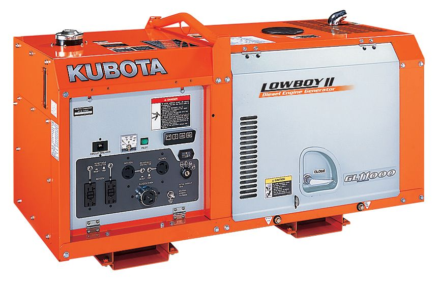

These are very cool units, they are compact Diesel gensets that are liquid cooled, however they do run at 3600RPM instead of 1800RPM due to their compact size. This means they are a bit louder and have shorter service intervals than an 1800RPM unit. They are extremely tough, however they are very expensive. New they go for $8000 at the time of this post, and they really hold their value, so you probably won&apos;t score a good deal on a used one unless you really look hard. 

These are also very hard to move without equipment, they are HEAVY. While I would love one of these, its simply too heavy. Wet stacking is not a concern due to the higher operating temps they run at. 

#### Kubota Lowboy II GL7000

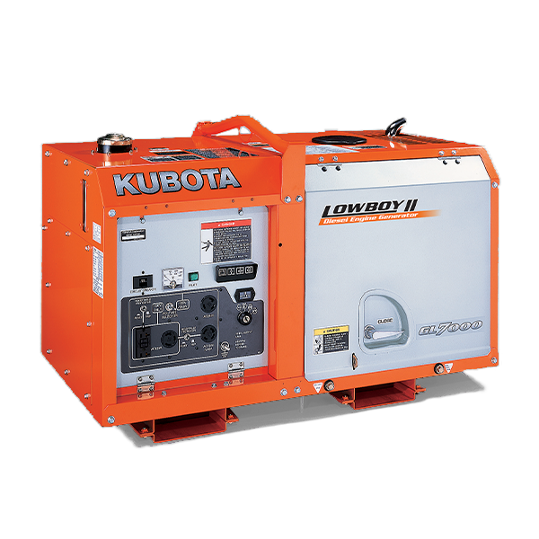

This is the smaller brother to the above GL11000, but instead of putting out 11kw, they put out just 7kw. Almost identical units, its just a little shorter. They are still incredibly expensive at over $6500 new, and hold their value very well.

I actually found a great deal on one of these broken for just $250. For $250, you buy it. If you see one of these listed for under $1000, just buy it no matter the condition. You WILL get your money back one way or another.

It was used in the gulf coast on some kind of oil drilling ship, so it looked very rough

As you can see from the specs, it weighs 262kg wet, which is 577lb. We slid the unit into my truck from a raised pallet, but once I got it home I realized it was going to be a challenge to get out. 

With some spare wood, I started constructing a gantry of sorts

First I attached the 2x4 you can see, and then attached the 2x10(or 12? I don&apos;t remember) to that as the main beam.

Then I added vertical sections, as there is no way my ceiling would take the load

I&apos;m actually quite proud of this structure, since I have no idea what I&apos;m doing. I made sure that no load would be placed of the ceiling joists and they would just be used to stop the structure from tipping over.

I got myself a hoist from Harbor Freight, along with some shackles

And I didn&apos;t drop it on the floor!

I then got a cheap 1000lb capacity cart from Harbor Freight to put it on

The tires kept going flat, and it was very clear this cart cannot withstand 1000lb. This 577lb generator was well above the limit of what it can handle

I got it to a place I could keep it and work on it, and started looking into it

The main problem was that all the oil was in the bottom of the enclosure... and the engine stop was wired so it couldn&apos;t function and the engine would keep running.

Taking off the oil filter, its clear it was run with no oil in it

These have quite a poor design in that there is an oil drain hose pre-attached to a valve. If the hose comes loose, you lose all your oil!

Clearly this is what happened, and someone wired the engine shut off so it couldn&apos;t shut down, meaning the low oil pressure switch could not shut down the engine. The engine was completely locked up.

In the end I was sad it didn&apos;t work, and I decided to sell it on instead of fixing it, as even used engines for these cost thousands of dollars, and the rest of the machine was an unknown. I just don&apos;t have the space to leave something like this in pieces while I figure out how to rebuild an engine, if that is even possible. I listed it for sale with the cart in non working condition, and got $850 for it for someone who had a unit with a good engine but broken generator end. So I came out ahead and got to play around with one. I got a lot of replies at the $850 price point and I do wonder if I should have listed it for $1000 instead.

These are SUPER TOUGH and very cool, but just not portable. This experience really made me want to get a Diesel generator even more, they are all so much more tough than my cheap Champion

Back to the light tower!

### First Run & Initial Plans

As soon as I got my Light Tower, I fired it up and made a note of everything I needed to fix, and made a plan for modifications which we will go over later. It survived the 60 mile journey home with no problem and got a good pressure wash from the torrential rain.

The previous owner had done some modifications like voltage/current/frequency meters and added a short whip to a NEMA 6-50R you can see coming out of the bottom of the control panel.

Here is the massive fuel tank

The 6kw generator end

The old owner documented his maintenance and only put 100 hours on it, and before that Sunbelt seemed to take good care of it, at least from what I can tell on the last sticker. If my math is correct, it looks like they were changing the oil evert 300 hours, which is great since Kubota now say this engine can go 1000 hours between changes.

The generator fired right up and is very quiet, the camera really enhances the sound. This is much quieter and a much nicer sound than a regular portable generator.

He even included spare filters and all of the paperwork on the unit

Apart from cosmetic issues, the only real problem I spotted is a small coolant leak around the coolant drain petcock. The coolant tank was full and I checked the radiator which was also full, so not a huge concern for now

Right away I started removing the sunbelt stickers, which is quite a task. The paint around the stickers has faded and oxidized, and the paint is in good condition under the stickers

### 

I had thought about removing the lights, however after playing with it, I realized it would be crazy to remove. Its a super strong, retractible steel tower. I could do all sorts of cool projects with this like install antennas for Amateur Radio, GMRS, Meshtastic etc and stand them up temporarily with ease. 

Now I need to do some testing before I figure out the final plan for this unit. The main issue with these units are the reported poor power quality they produce. The voltage is capacitor regulated and there is no AVR, so the voltage can be quite low at idle, and slowly increase as the load, or engine speed increase. Turning on the ballasts for the 4 x 1000w A metal-halide lamps also increases the voltage substantially, to almost 140v per leg which is obviously a problem for some devices.

However there is not much real information on these, just a lot of opinions on forums and opinions on video, with no real data. All of the opinions are also on used units of varying quality, and who knows if they have anything wrong? 

A video I saw early on with an almost identical unit is this video from DavidPoz who I subscribe to on YouTube, he mentions the power quality is poor and would not suggest connecting it to your house, but he doesn&apos;t really say why 

On the flip side, there are videos out there of units that are using the exact same Pancake 6kw generator end to power their house with no problem

So its clear to me I need to do some tests, however I have a plan either way.

If the power quality is bad, I plan to eventually get a Chargeverter like DavidPoz did, and build a battery system on the front of the unit, and install a larger inverter, maybe 12kw. Then I can power larger devices that the generator supports for short periods of time, and the battery can make up the difference.

If the power quality is good, then I don&apos;t need to do much, and I can hold off on my battery project until the future

To do the power tests, I need to make a few changes electrically. I need to add at least one L14-30R outlet so I can use my generator inlet on my house. This will give me the 120/240v out that I need

I replaced the L6-30R on the front with an L14-30R, however you cannot close the door with that plug in use, so I also added a short amount of 10/4 SO cord and a high quality L14-30R, so I can use it plugged into the house with the door closed.

When I opened up the control panel, I found some sketchy wiring, and just some generally poor connections. I used my cheap Ferrule kit to make some really nice connections. These are much better for screwing down onto than bare stranded wire[

Ferrule Crimping Tool Kit with 2000PCS Wire Connectors, Preciva AWG23-7 Self-adjustable Ratchet Wire Crimping Tool Kit Crimper Plier Set - Amazon.com

Ferrule Crimping Tool Kit with 2000PCS Wire Connectors, Preciva AWG23-7 Self-adjustable Ratchet Wire Crimping Tool Kit Crimper Plier Set - Amazon.com

](https://www.amazon.com/dp/B0B3N24C7Q?ref_=ppx_hzsearch_conn_dt_b_fed_asin_title_1&th=1&ref=blog.networkprofile.org)

I added my whip onto the 240v outlet with crimped connectors

Now I have some outlets, its time to do some testing

### Power Tests

There are a few things I want to test before plugging into the house

First, my UPS&apos;s need to play well with this unit, if they don&apos;t its a non starter. 

Second, a good test is if it can charge up an Ecoflow battery. From what I&apos;ve read, they are VERY picky with the power input, so if an Ecoflow likes it, its probably pretty good. An Ecoflow is also something I would be utilizing during a disaster, so I&apos;d like for it to be able to charge it

Third, I need to test if lights flicker. If all my LED lights are flickering on this generator, it would be a major downer, and I probably wouldn&apos;t use it.

Once those 3 things are determined, I can plug it into my house and test all my other devices like my Fridge, Freezer, Mini Splits etc. I do not plan to try run my main AC with this unit, as 6kw just isn&apos;t enough for the AC plus the rest of my devices and the headroom I want.

First, I went ahead and plugged in a Line Interactive UPS in my garage. And no problem! In this video you can see the voltage is reading quite low, just 108v. It picks up in voltage with higher load, and this UPS is drawing just 100w. Once you get 500-800w you start seeing 120v (However, more on this later!)

Its worth noting that my UPS is in "Reduced" sensitivity, of the 3 Normal/Reduced/Low settings. If I change it to Normal, it does kick back and forth between battery and generator power while the load is low, and stabilizes when there is more load on the generator 

Charging an Ecoflow Delta 2, with no other loads plugged in, it sees the 120v and kicks on the charging circuit, but then drops out, and tries again, similar to what the UPS was doing on "Normal" mode. However, if I plug in a resistive load such as a heat gun, it will charge without issue at full power. This seems to be common with Ecoflow&apos;s and non inverter generators. Something about applying a bit of load to the generator gets the power quality in line

With the Ecoflow charging at 1200w, the voltage is right at 120v

I also tested my Ecoflow River 2 Pro, which charged well

But if on its own, it also wanted the heat gun treatment

The next test was the Double Conversion UPS in my house. I knew it would be fine because the line interactive was fine, but we still have to test. Sure enough, works fine

Whats even better, is that the 800-1000w base load of this UPS is enough to get the generator power quality in line like the heat gun was doing. So once this UPS is plugged in, everything else works as expected, like the Ecoflow. For me this is great, because this load will ALWAYS be on if powering my house

I also tested a cheap LED light, and there was no flickering

Now I wanted to test a bunch if lights that I have in my house

- CDL CDLPS190R13 LED Can Light -&#xA0;**PASS&#xA0;**- Sold at Home Depot under "Commercial Electric Brand" , zero flicker, correct brightness (Light tested in video above)
- Feit Electric LED CEOM100/SCCT/4 "100w" LED Bulb -&#xA0;**PASS&#xA0;**- Sold at Costco, zero flicker, correct brightness

- HALO Canless LED HLB6099FS1EMWR, SLDSL6069S1EMWR, HLA406FL9FS1EMWR -&#xA0;**PASS**&#xA0;- Sold at Home Depot, zero flicker, correct brightness

GTC LED L8ECOA19927 -&#xA0;**FAIL&#xA0;**- Flickers - Very, very cheap, very very old LED Light bulb from Grocery store HEB

So all but the cheapest LED bulbs passed the test, perfect. 

With that done we can test plugging in the house. But first we need to fix the bonded neutral situation. You only want your neutral bonded in one place, and its of courses bonded in my main panel. So really we want to turn this generator into a floating neutral when plugged into the house. Do this this I installed a switch between the bonding wire

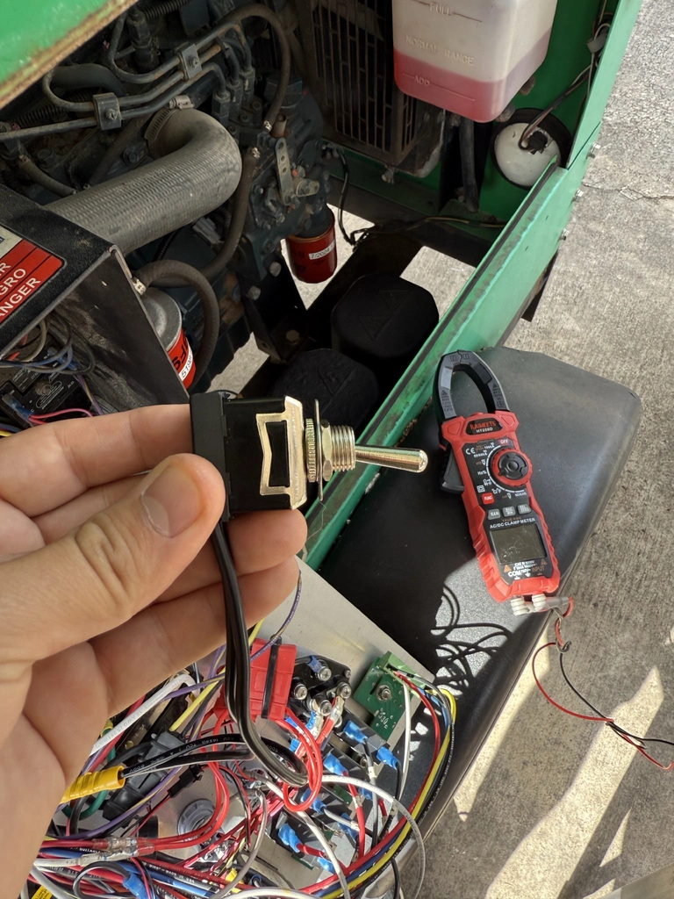

The switch is to the right of the 120v outlet

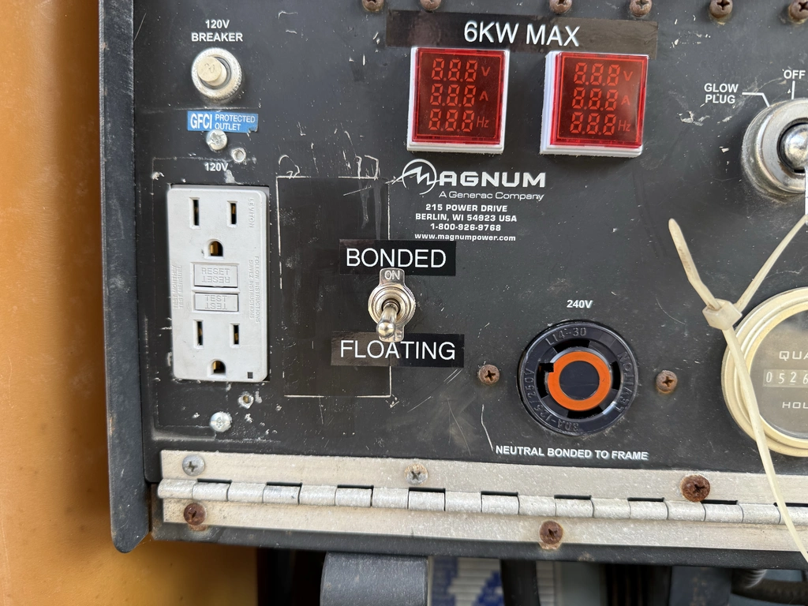

I do the same on all my portable generators (Look on the left)

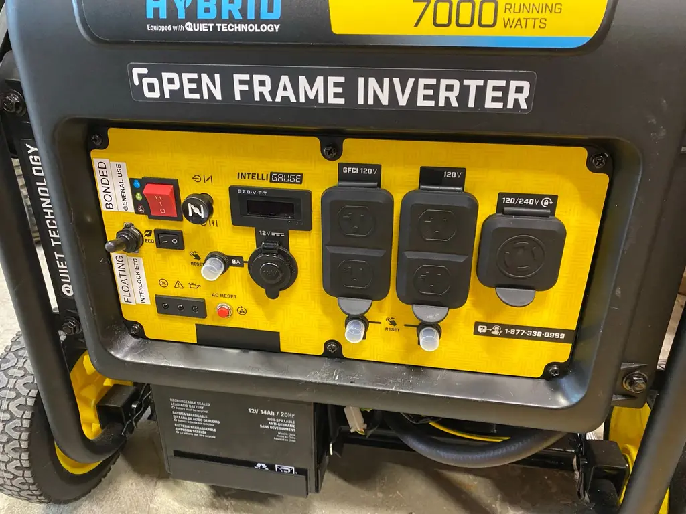

So I powered it up, let it warm up for 10 mins and plugged in the house. Everything worked fine!

I turned on every device I would during the course of a normal day and it worked fine. The only exception is 1 lamp with one of those old bulbs that flicker, which I just replaced, and 1 very old (30 years at least) ceiling fan made a slight hum while spinning. I sat in my office with the mini split cracked up, and everything worked as it should

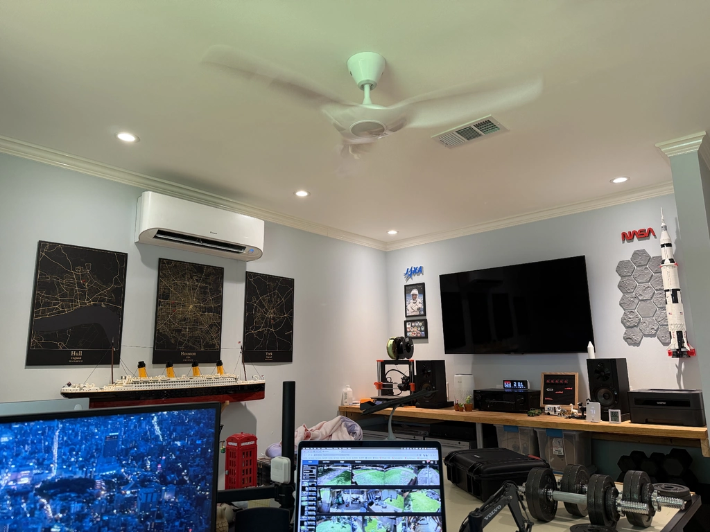

At this point, I am calling this a win. During a disaster I could easily get by like this, living life as normal. I just need to watch my power to make sure I don&apos;t go over 6kw by doing something like turning the Microwave AND air fryer on at the same time, which happen to both be on the same leg of service.

Since I have some pretty good power monitoring, we can check what the voltage and frequency did during that test

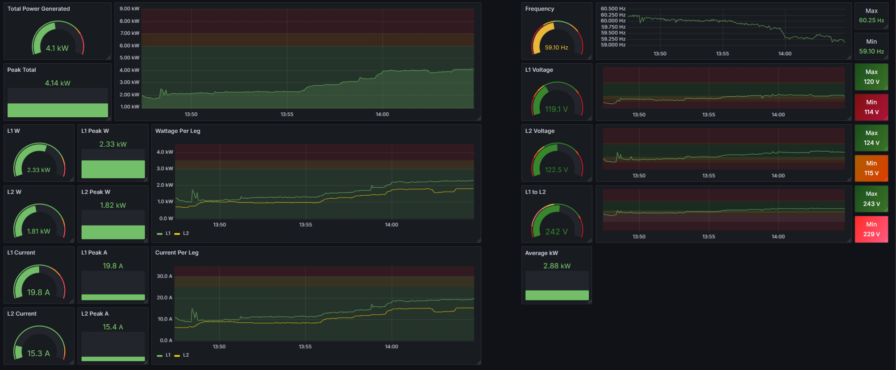

As we can see, the voltage started off low and increased with load to within a very acceptable range, but the frequency did drop off with load a little bit, despite being in range. I will speed this up slightly so its more like 60hz at expected load.

To do this, you back off the lock nut and advance the bolt on the far left, while loosening up the log on the other end of the throttle. It takes VERY VERY small adjustments

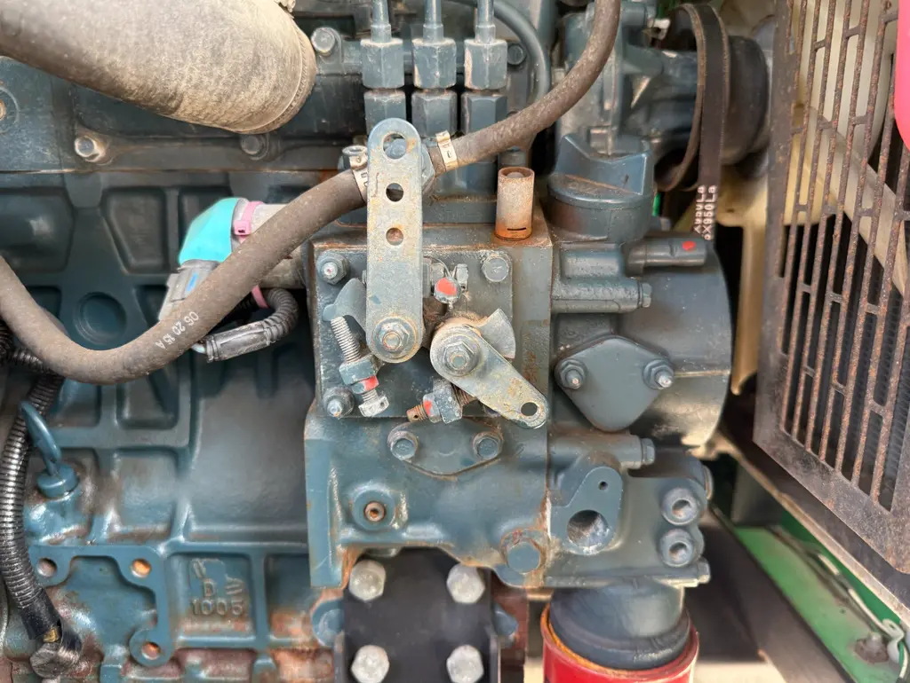

Now we know the generator works fine, we can get to fixing all the little things. 

I worked on this kind of out of order, so don&apos;t complain when you see something from the future in the back of an image!

First, I pre-emptily replaced the voltage regulation capacitor. This gave me a chance to test out my new Milwaukee M12 magnetic light, which is great

Be careful handling capacitors, you can get a nasty shock if you don&apos;t discharge them first shorting out the contacts with an insulated screwdriver

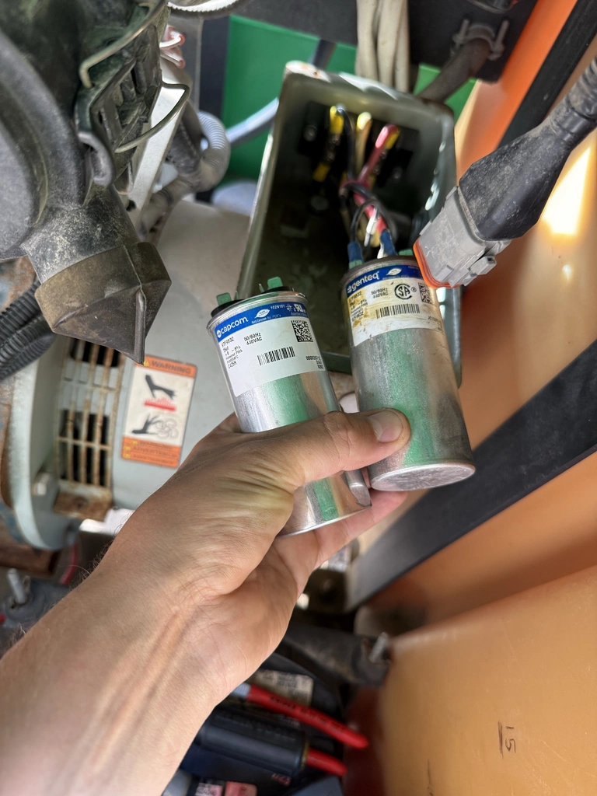

The cover was a little rusty so I hit it with some paint and added labels of what I did

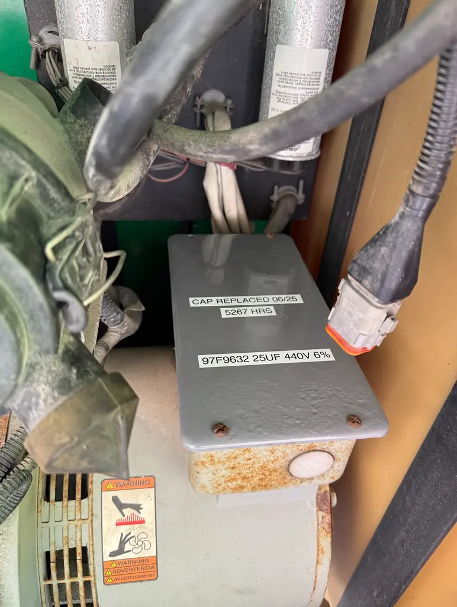

With that replaced, I noticed the voltage would no no longer start at 105v like it did before, but be right at 120v from the get-go. I should have done this before my power test! But don&apos;t worry, soon enough I&apos;ll do another one with the new capacitor and revised engine speed.

The capacitor cost $14 to replace, a worthwhile thing to do.

Now I wanted to upgrade the battery terminals like on my big generator with marine connectors. They make swapping the battery in the future much easier, and it will make mounting my NOCO 2D Battery tender that much easier

This is how it started out looking

Got the marine connectors on

I used my hydraulic crimp to crimp on copper connectors, and used double wall heat shrink to seal everything

I mounted the NOCO 2D right next to it. Next we will install a power inlet for easy charging of the battery

I also have this NOCO 120v inlet, which I want to mount on the generator somewhere. Then I can just hook an extension cord up to it and charge the battery, and also use the block heater I will install later

I started out with a smaller hole with my Step Bit, being very careful not to drill into the fuel tank on the other side. I place a small piece of wood before it to give me some protection 

With that done, I turned to my new tool from Harbor Freight, the hydraulic punch driver 

With absolutely no effort I was able to make a perfect size, perfect hole in the metal

The inlet fit perfect in the hole

Now I can plug a cord into the front of the generator, and charge the battery

Then, I cut off the end of the inlet cord, block heater cord and battery charger cord, and together with a PVC junction box and a switch, made a nice little control box 

Now when I plug it in during the summer months, I&apos;m not wasting power heating the block. I will only use the block heater in extreme situations

Since I&apos;m on this side of the generator, I figured now was a good time to throw a new air filter in there

Now onto a bigger project, fixing the coolant leak from earlier. Here is a picture in case you forgot

I sprayed the drain liberally with PB Blaster the night before, however what I feared might happen, happened. These coolant drains are notorious for corroding and snapping off. And as soon as the socket so much as touched the drain, it came off, leaving me with a hole into the engine, and the remnants of the drain still in the hole.

Thankfully we are addressing this now, as I could see that coming loose at any time and losing all the coolant

Here is the new drain vs the old, as you can see, we are missing a lot of threads...

Better picture of the block, you can tell it has been leaking for quite some time

I got an EZ-Out in there, and all it did was make the hole bigger, it didn&apos;t grip onto anything

I went one size larger, same thing

Eventually I got to a spiralized EZ-Out, and it started gripping, but I feared it was gripping into the block and not the remnants of the drain

I cleaned the area up with a pick, and I couldn&apos;t tell if I had removed a bunch of junk and I was seeing the original threads, or if I was seeing what I had done with the EZ-out

The threads on this plug are 1/4 BST, not the standard NPT we use here in the USA. I could not get hold of a BST tap, but I could get an NPT 1/4-18 which some people say is very close

I held my breath and tapped away, and thankfully ended up with some decent looking threads

I went ahead and threaded in a brass plug, and it worked great!

That was a very stressful project. I decided against using the original drain again, as what happens when it does the same thing? This unit has a drain on the radiator, so I don&apos;t see why I&apos;d need to use this block drain.

With that done, I went ahead and tried to remove the plug above it for the block heater. It was VERY tight. Its a 17mm hex plug

I cleaned the paint off the threads with a pick and kept sprayed PB Blaster, and tried to loosen

After about 10 tries, it came loose

The underside of the plug was quite grimy, good job we are flushing the coolant next

I was able to thread in the block heater, and it didn&apos;t leak!

I flushed out the coolant 3 times with distilled water until it ran clear on drain, and then filled with PEAK Final Charge POAT red coolant

Don&apos;t mind the cat litter on the floor, I totally didn&apos;t miss the drain pan and spill half of the water and coolant on the floor

I searched around a lot to find what coolant I should put in this, and there isn&apos;t much good information out there. Some research suggested that Sunbelt (Where this came from) used Red NOAT coolant, with the N standing for Nitried. From my research, Nitrited coolant can attack Aluminum. Is that why the original drain was so corroded? Unknown. 

With that out the way, everything is in great shape mechanically from what I can tell, and we can move on to fixing some cosmetic details. The next few images show rusty parts I cleaned up and re-painted

 

I got new fenders finally

I went ahead and cleaned off more rust at this time

Having built in jacks makes maintenance very easy

You can see the sunbelt logo fading away, I&apos;ve been experimenting with compound, 1000, 2000 and 3000 grit wet sanding. I have some 500 grit on the way to speed things up

At this point I decided to move it to the back of my yard where there is more shade and I can take my time finishing up the paint work

I did not roll easy. This was a lot of work

Here it can hide behind my stack of wood

I didn&apos;t want the tires sticking into the ground and getting flat spots, so I made some jack pads for it

I let it run for a little while here to test the noise, and the loudest part is the doors rattling around. The latches have too much free play in them. 

I found some sheets of Aluminum I could cut as shims. Do not question where I got the metal from.

 

After some testing, single thickness wide strips would be best

I clamped them to the housing and used some self tapping screws

I ground the ends of the screws off so you don&apos;t get caught on them

The end result worked very well

Even though this generator is now far away, I still have an on-site load bank, the lights!

Here you can see the lights have not quite warmed up yet, however they are drawing 18a on each leg, and the voltage is very good

Thats where I currently am at with this project. I have a lot coming up, so there will be a part 2 - Stay Tuned

---

*Originally published at: [https://blog.networkprofile.org/mlt3060k-part1/](https://blog.networkprofile.org/mlt3060k-part1/)*