# Automatic Transfer Switch PDU in The Homelab - Does it make sense?

> **Source:** [NetworkProfile.org](https://blog.networkprofile.org/automatic-transfer-switch-pdu-in-the-homelab-does-it-make-sense/)  
> **Date:** July 2, 2025  
> **Author:** spookyghost  
> **Tag:** `networking`

---

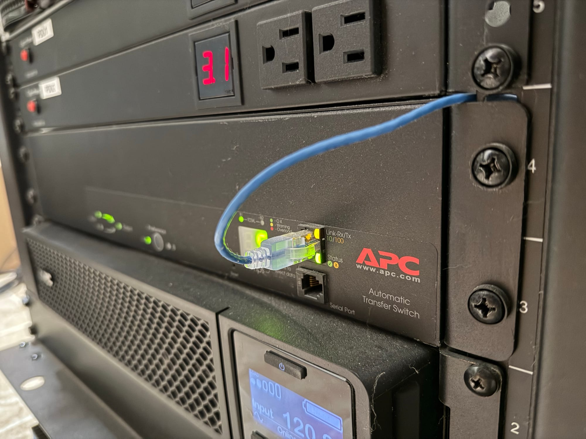

TL;DR? No.

Back in February of 2024 I found a great deal on an APC AP7753 ATS PDU. These PDU&apos;s take 2 power inputs, and can switch between them like a UPS switches between grid and battery. Its a really cool device and I had high hopes it would take my already resilient power setup to the next level. Sadly, it appears that it may cause more problems than it solves in my setup. The upside is that I learned a lot about power, and these ATS devices. Despite all I have learned, there is still a lot to more to learn.

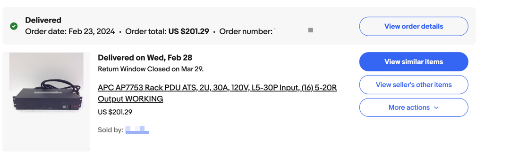

This specific PDU takes a 30a 120v input, which my APC SRT3000RMXLA has an output for. They have a built in network card, and a lot of 20a 120v outputs, perfect for my needs. If you read my old posts you will see that I make great use of my 3000VA double conversion UPS to power pretty much every piece of electronics in my house. Because of this, the UPS is a very large single point of failure, if the UPS drops the output, a lot of devices will get turned off. Its not life or death, but its not something I want to have to deal with. While the UPS is a very dependable device, with its own mechanisms to bypass faults and keep providing power, I wanted the ability to potentially completely replace the UPS in the future with zero downtime.

Redundant PSU&apos;s in servers fix this issue, however not every device I have is capable of using redundant power supplies. Going forward I try to make sure every piece of equipment can, however for some things i am powering like a TV, its obviously not possible. 

When I got this PDU, I repurposed my old 2 regular PDU&apos;s and separated one for grid power, and one for UPS power. This lets me plug in redundant PSU devices without using up space and capacity on the ATS PDU. I also got some new power cords to better identify redundancy. Red means you cannot unplug it without the equipment powering off, and Blue means its going into a redundant PSU, so you can unplug if needed to organize them, etc.

My hope were that if I plug the ATS PDU Source A into my UPS, and Source B directly into house power, I would essentially never lose power to my devices.

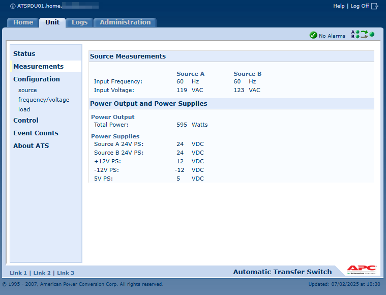

I plugged the PDU in to test, and sure enough I could freely switch between power inputs without dropping the load. Very cool! I did not realize at this point just how much nuance there is to these complex devices, but I went ahead and plugged A into the UPS and B into the grid.

Right away I ran into an issue where it was complaining that Source A and Source B were unsynchronized. It had not occurred to me that the ATS is looking for power from A phase and B phase which it can synchronize, not just any 120v input. When I ran the power to my server closet, I paid no attention to the phasing of the power I brought in, and as it turns out, the secondary circuit I was using was on Phase A, which is the same as where the UPS is plugged into. 

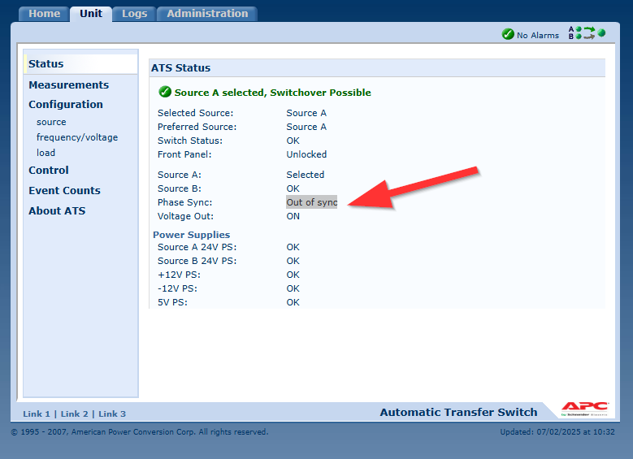

With some reconfiguration, I got the ATS fed by the UPS on phase A, and grid power from phase B. The ATS PDU was happy!

If the phases are not in sync, the ATS PDU cannot perform a seamless switch, and instead must perform a slower "break-before-make transfer" where there is a brief drop in power. Switching directly between 2 unsynced power sources *could* cause equipment damage which the PDU accounts for. 

One day I tested the PDU fully loaded with my network equipment and switched the source with the selection button on the front, and sure enough, it switched from UPS power to grid power with a big kachunk, and everything stayed powered on. Very cool. I had assumed this project was over with, and I added it to the long backlog of things I should write a post about.

Then, Hurricane Beryl hit Houston TX in July of 2024.

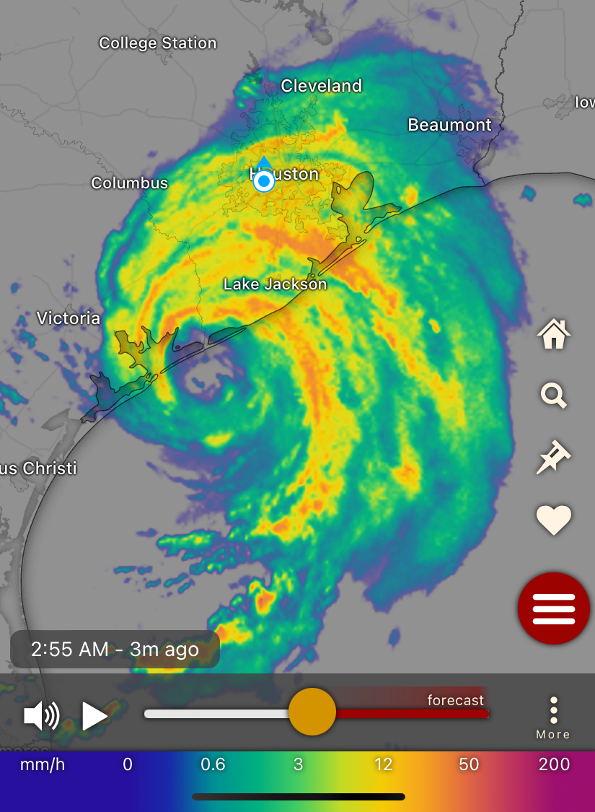

As soon as the wind picked up from the hurricane, the power to our entire neighborhood went out. Soon, power to the majority of the city would be out.

My 27kw liquid cooled backup generator fired right up, and in around 10 seconds the large generator ATS flipped, and we had power to the house again. The UPS&apos;s did their job and bridged the 10 second gap, and kept all network devices online without interruption. The APC ATS emailed me to say that Source B went offline, and then came back, just as expected. 

We did not know at the time we would spend over 6 days running on generator power, while many in Houston would spend much longer without power, and without the luxury of power. 

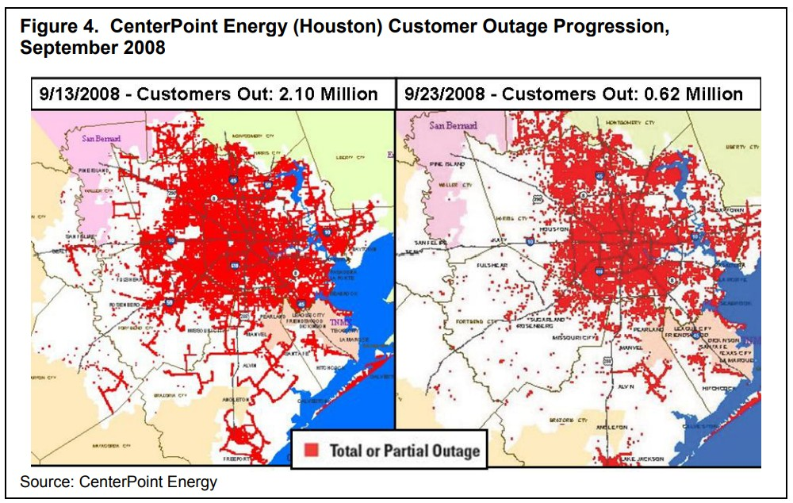

We have run on generator before, but never this long. The longest I&apos;ve had to date was 24 hours in the Derecho that hit Houston just a month and a half earlier. During this time, everything worked as expected. My generator started, the UPS&apos;s all worked fine, and of course the ATS PDU was just sat there doing nothing, because source A, the UPS power, is always up. Double conversion UPS&apos;s convert incoming AC power to DC, and then back to AC again. This means the power is always correct no matter the input, and there is no switchover time.

However, this fact is assumes you fully understand your UPS and configure it correctly, which I thought i had. The default configuration enables a "Green" mode, which turns your nice fancy double conversion UPS, effectively into a line interactive UPS. It passes grid power directly to your devices which defeats the entire point of a double conversion UPS in the name of increased efficiency. I knew this, and turned that feature off as soon as I got my UPS online.

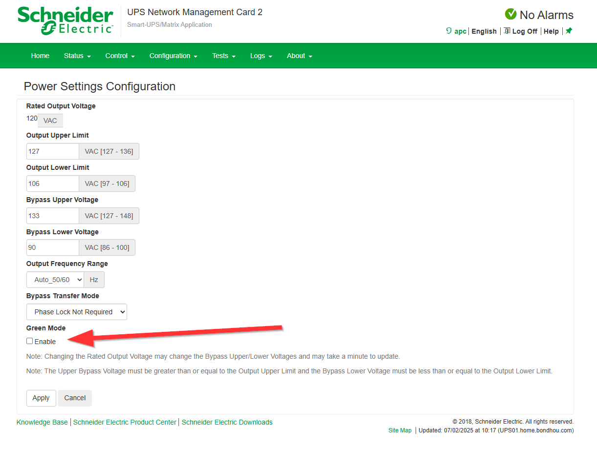

What I did not realize however, is that also by default, the UPS frequency tracks the input powers frequency. The grid is always very very close to 60hz, and if its not there is a big problem going on. The UPS syncs its output with this, despite not being directly connected. You can leave this "Auto" setting on, or you can tell it to output internally derived frequency of 60hz +/- 3hz, or 60hz +/- 0.1 which is very accurate. You can also select 50hz, which we don&apos;t use here in the USA.

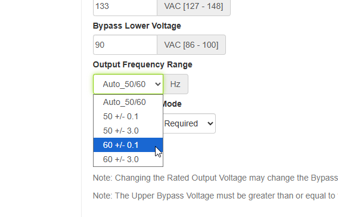

The benefit to the Auto setting is that there is no user configuration required between 50 and 60hz, reducing the risk of damage to equipment from an incorrect UPS setting, and, there is more possibility for bypass operation in case of a UPS fault. With the auto setting, it will pass through a very wide range of frequencies, to keep your devices online. If you select one of the much tighter options, and the incoming power is not within spec while there is a UPS fault such as a failed inverter, the UPS will drop the output, turning off all of your devices! 

My large generator does a very very good job at keeping at 60hz, even with large loads coming online. I had done many tests in the past turning on large loads like my AC unit, and saw almost no frequency drop. Later I added a soft start to the unit to aid running on a smaller generator if needed, so that large inrush was reduced and I would have even less of an issue with this.

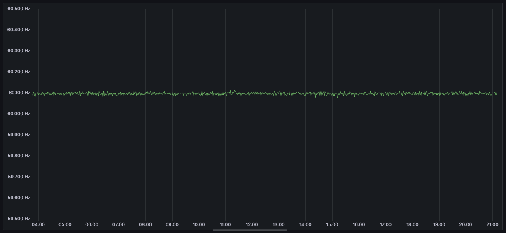

*Frequency during actual generator run during Hurricane*

Having the power out for over 6 days gives you a much better test of your backup power, as you will end up using virtually every device in your house, even things you may not use every day like washing machines and dryers, and you will experience more combination of devices. Throughout this entire outage the generator did great, and we lived life as we usually would, running the AC, doing laundry, cooking food, etc.

Something I learned during this was that despite my clothes dryer being powered by natural gas, it still has a very large inrush current from the drum motor starting. In my opinion they should figure this out and reduce that, but hey, they saved some money and got some extra profit just ignoring it. 

I experienced what I would say is the perfect storm, and an ultimate test of my generator during this outage. We were cooking good in the oven, heating a pan on the range, using the microwave to heat some sauce, the main 4 ton AC running, and the dryer was running, along with all my other loads.

It just so happens that the dryer changed directions and started the motor, just at the same time the AC kicked back on, AND the infrared cooktop started heating again. The generator handled this massive spike of power very well, and there was just a very small, very short dimming of the lights.

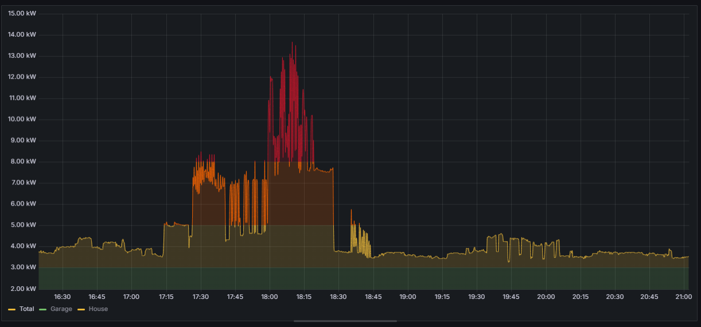

However, I noticed that my whole network was out of whack and nothing worked right.

I looked in my server closet and saw everything powered on, but 2 of my switches were booting, and one of my hypervisors was starting up. This is not normal. Why did that happen? They are all on UPS power, so I thought. 

They are, but they are also plugged into the ATS PDU. All of the devices with redundant power supplies were running without issue, only the PDU powered devices had a problem.

What happened was that the frequency dipped enough to cause the UPS to not like the input frequency and stop syncing the input power and instead move to its own 60hz clock. The change from the now "bad" frequency input to the "good" internally derived frequency was enough of a change to cause the ***extremely*** sensitive ATS PDU to deem this input bad, and it performed a switch to source B, raw generator power, which is now NOT IN SYNC with the internally derived 60hz. Then, source A which is preferred was now stable again, and it again switched back. These rapid switches were just not fast enough for some of the devices in my rack, and it caused the outage. 

The ATS PDU is much, much more sensitive than even most UPS&apos;s, due to needing to synchronize 2 power input. Without the ATS PDU, there would have been no issue, the very small frequency change is no problem for any devices it powers. So in this case, the ATS PDU was actually causing me power interruptions, which is the exact opposite of what I wanted.

There is a document from APC that outlines some of these issues. The article is called "undefined" for some reason...[

undefined

Impact-Company-Logo-English Black-01-177x54

](https://www.apc.com/us/en/faqs/FA156201/?ref=blog.networkprofile.org)

It did not help that I had the sensitivity of my UPS set very high, and the ATS PDU sensitivity very high. I have since changed the sensitivity of the PDU to be much lower, and changed the configuration of the UPS to ALWAYS use its internally derived frequency, meaning it would never have had the frequency switch when the generator frequency dipped.

However, now I have another problem. Source A and B are now NEVER synchronized, because the UPS is using internally derived frequency and has no idea what the grid is doing. This means, yet again, I will not have seamless ATS transfer, and its a dice roll if equipment stays up during the ATS switch.

You could get a second double conversion UPS for source B, however, despite these UPS&apos;s costing thousands of dollars, they are still too small to feature the mechanism to frequency sync with a second UPS. You have to move up to much larger datacenter UPS&apos;s to get these features, with APC at least. I have not researched other brands, as I have no desire to purchase 2 even more expensive UPS&apos;s all for a very small edge case.

If I simply reduced the sensitivity of the ATS PDU, it may have resolved the problem on its own, however testing this is very difficult, and I don&apos;t like the risk of possible power interruptions. So for now, the ATS PDU is effectively just in place in case of total UPS failure, and I must accept there will likely be a short interruption in the extremely unlikely even of that happening

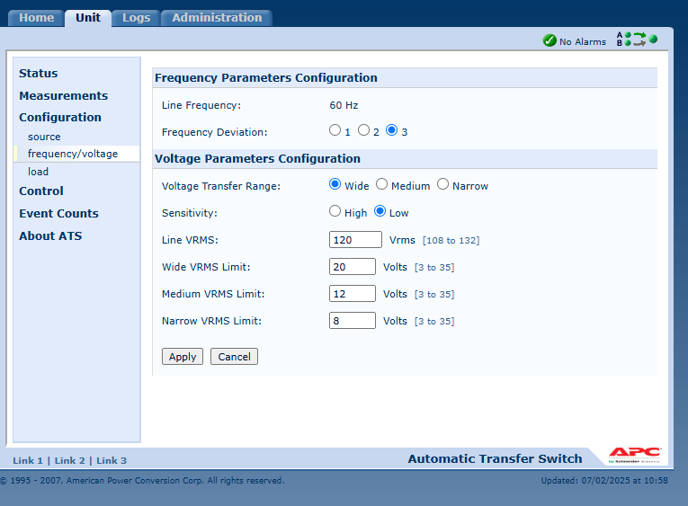

With all that being said, I do not think I would have purchased an ATS PDU had I known these limitations. It may work for you if you are only using grid input, but then you have much bigger possible interruptions 

---

*Originally published at: [https://blog.networkprofile.org/automatic-transfer-switch-pdu-in-the-homelab-does-it-make-sense/](https://blog.networkprofile.org/automatic-transfer-switch-pdu-in-the-homelab-does-it-make-sense/)*