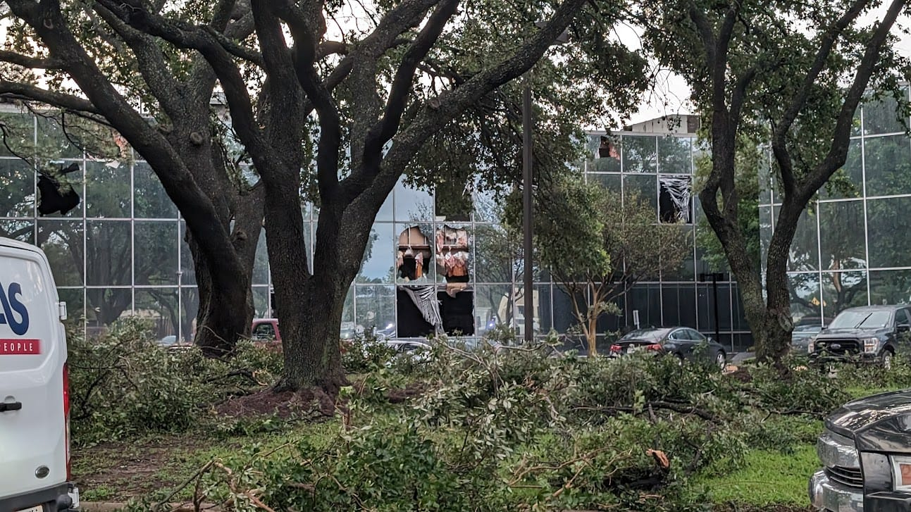
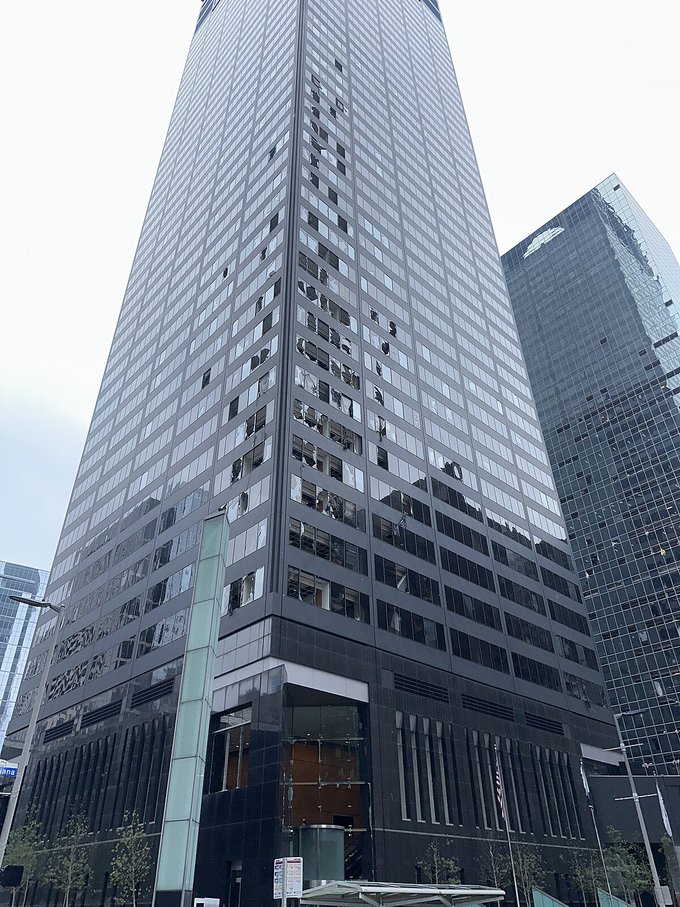
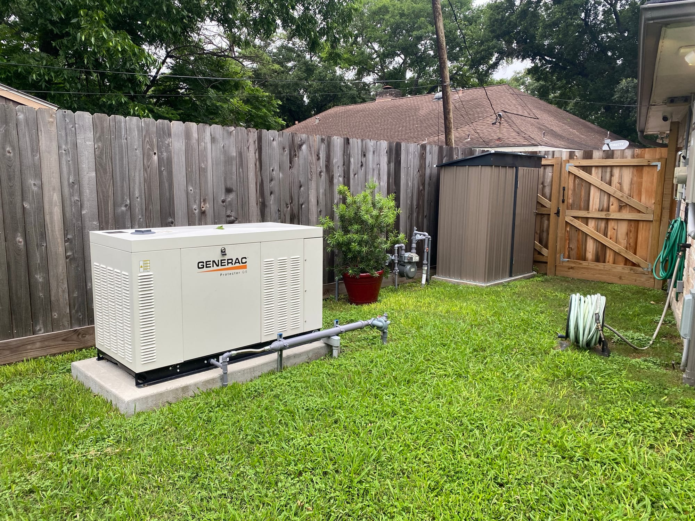
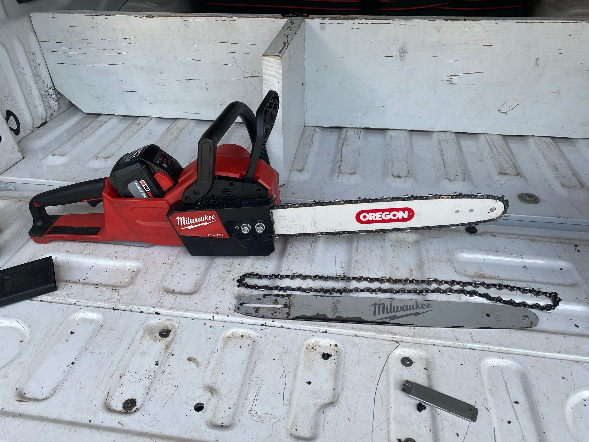
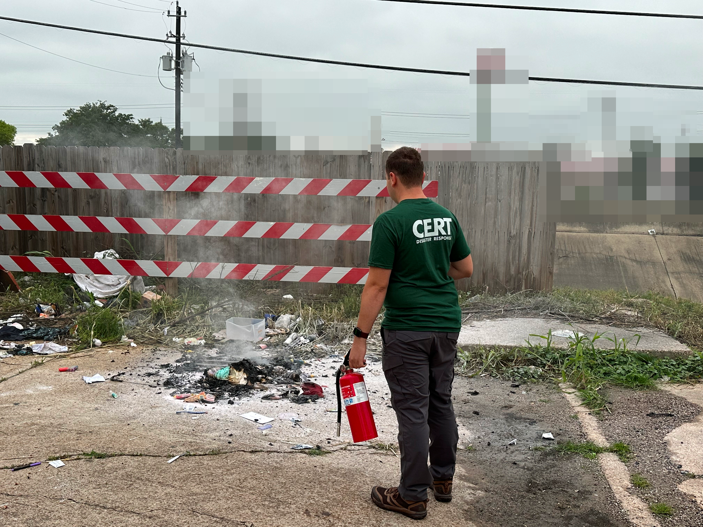
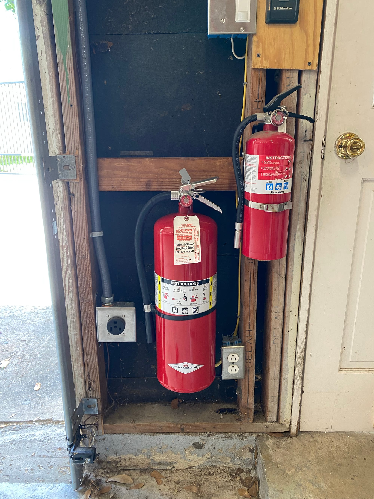

# Lessons Learned - The 2024 Houston Derecho

> **Source:** [NetworkProfile.org](https://blog.networkprofile.org/lessons-learned-the-2024-houston-derecho/)  
> **Date:** October 28, 2024  
> **Author:** spookyghost  
> **Tag:** `networking`

---

2024 is not even over yet, but so we have already endured two massive storms that caused widespread destruction. This posts goes through the lessons I learned in the first of those 2 storms

### 2024 Houston Derecho

On May 16th 2024, a Derecho hit the Houston area which had very strong winds and caused destruction and utility outages for large portions of the Houston and surrounding areas.

Per the [NWS](https://www.weather.gov/lmk/derecho?ref=blog.networkprofile.org), a Derecho is> A derecho (pronounced similar to "deh-REY-cho") is a widespread, long-lived wind storm that is associated with a band of rapidly moving showers or thunderstorms. Although a derecho can produce destruction similar to the strength of tornadoes, the damage typically is directed in one direction along a relatively straight swath. As a result, the term "straight-line wind damage" sometimes is used to describe derecho damage. By definition, if the wind damage swath extends more than 240 miles (about 400 kilometers) and includes wind gusts of at least 58 mph (93 km/h) or greater along most of its length, then the event may be classified as a derecho.

 You can read more about the one that hit Houston in the Wikipedia article[

2024 Houston derecho - Wikipedia

Wikimedia Foundation, Inc.Contributors to Wikimedia projects

](https://en.wikipedia.org/wiki/2024_Houston_derecho?ref=blog.networkprofile.org)

We did not have any damage, however our utility power was out for over 24 hours (24 hours and 17 mins, to be exact). This was the first real test of my generator and other backup plans, and the worst wind storm I have experienced to date. 

Our power went out just as the storm rolled through, and that was really the only thing that happened to us. Our house sustained no damage, our fences were fine, our trees were fine and our internet stayed up. At the time of our power going out, the Utility Companies outage tracker showed over 1 millions customers without power, before the tracker itself got pulled offline. At this point we did not know how long we would be without power so we were expecting a long outage. In the end, it came back after just 24 hours, however large areas were without power for over a week. This, paired with extreme heat and humidity caused many people to seek refuge at family and friends houses or cooling centers. Many of those cooling centers did not have power. Explain how that works? It doesn&apos;t. 8 People in the greater Houston Area died as a result of this storm according to official figures at the time of writing this post.

Here are all of the lessons learned during and after that storm. 

#### #1 - Backup Power - 100% worth it

After I spent tens of thousands of dollars on a generator, many people told me I was crazy. This event solidified my opinion that if you live in the gulf coast area, and have the money and own a home, you should have some kind of backup power. Many High-tension transmission lines were knocked down, so the fact we just lost power for 24 hours was pure luck. There was every chance we could have lost power for weeks, or even longer in the brutal Houston heat, like many did. The fact that you have backup power not only means you don&apos;t have to endure the disaster and recovery without power, but it completely eliminates the anxiety before and after the storm, which I would argue has even greater value than just having power for 24 hours.

#### #2 - Backup Power - Needs some refinement

When the power went out, it was clearly the result of a tree hitting the line. The power went off, my generator came on and the ATS switched to generator power. However, then the grid power came back on for 20-30 seconds, which caused the ATS to flip back to grid power. But, then the power went of again, the ATS again flipped back to generator. This flipping back and forth is annoying, and I don&apos;t like it. I need to look for a solution to where once I am on generator power, I run on generator power for at least 20 or 30 minutes, to let whatever issues are at play, work themselves out.

#### #3 - Weather Forecast - Lacking, or wrong

The weather forecast was completely wrong for this storm, and we never expected a strong storm. Many people were caught off guard or driving home when it hit. My lesson here is that I should just assume we are always going to be hit by a storm, and plan accordingly. Keep everything ready at all times. This storm caused hurricane levels of damage, but with no warning.

#### #4 - Supplies - Keep them stocked

This ties in with the above point, that we will have no notice for a storm, so you better not need to run to the store for anything. When the Derecho hit, I just ran out of my favorite Deodorant. No running to the store to get some more! It wasn&apos;t really that much of a problem, as we were able to get to the store the next day, however I would like to be prepared for that. So, after that I ordered a 10 pack to rotate through, so I&apos;ll never run out again. I will apply this to just about everything, and keep a few spares of every consumable item I use so I am never in need during a disaster or shortage.

#### #5 - Tools - Keep my Chainsaw sharp

At the time of the storm, my chainsaw was not sharp and I did not have the right files to sharpen it. This was a real pain, as clearing tree limbs was much harder than It needed to be. If I had a big tree down, this could have caused me some real pain! I solved this by upgrading the bar and chain on my saw, and purchasing extra chains as well as all the tools needed to sharpen it. I also attended a Chainsaw class through CERT.

#### #6 - Emergency Services - Unresponsive and Unreliable

The day after the Derecho hit, I was just walking around the neighborhood in hopes to maybe see what could have caused the power to be out. While walking, I noticed that the whole area smelled like smoke. I came across a fire in the middle of the road, near a wooden fence. The fire was a suitcase full of clothes, outside a trashy apartment building. There were multiple people filming the fire, but no one doing anything. I immediately dialed 911 and started jogging home to grab a fire extinguisher. To my surprise, no one answered 911, and I was listening to hold music. I got home, grabbed an extinguisher and put the fire out, while still on hold for 911. Eventually they picked up and I told them the situation and they said they would dispatch a fire truck, which arrived in 12 minutes. They confirmed no one else called 911. 

I had actually just finished the CERT training a few weeks earlier, which included a lot of fire safety training.

Once the fire department arrived, the sprayed the entire area down with water and removed multiple aerosol cans from the fire. I heard apartment residents commenting on the amount of time it took the fire department to arrive. However, I was the only one to call them, as confirmed by the fire department. I&apos;m not sure how they expect the fire department to put out fires they don&apos;t know about.

After this, I purchased more fire extinguisher of much higher quality, and much larger size. As if there is even a small fire, a cheap 5lb extinguisher does not go far, and you cannot rely on the emergency services to arrive in time. I also realized that my garage fire extinguisher was now used up, so if I have a fire of my own, I am less prepared. 

I replaced the $25 First Alert one at the same time, so I can help others if needed, without using up my good supplies.

I also took further medical classes, included CPR/EAD, which was just $25. If you were on the floor half way dead, a 15 minute hold to talk to someone at 911 isn&apos;t ideal. 

#### #7 - Helping Others

While the power was out in our area, I loaned portable power banks to multiple people, mainly elderly residents. Because I didn&apos;t have an excess of power banks, I ended up loaning out some of my best stuff, which in hindsight is a bad idea, as I may need it (This goes for the fire extinguisher too!) I think it would be a good idea to purchase multiple cheaper power banks and other emergency supplies to help others, as to not deplete my own stocks of good equipment. Many people suggest to just not loan stuff out, however when a disaster strikes and you&apos;re actually there, you probably will end up helping others. Its hard to turn someone down something to charge their phone when its all they have to communicate, and you&apos;re sitting in your air conditioned house with power. 

Thats all for this post, get ready for a very similar post coming up for Hurricane Beryl! 

### 

---

*Originally published at: [https://blog.networkprofile.org/lessons-learned-the-2024-houston-derecho/](https://blog.networkprofile.org/lessons-learned-the-2024-houston-derecho/)*