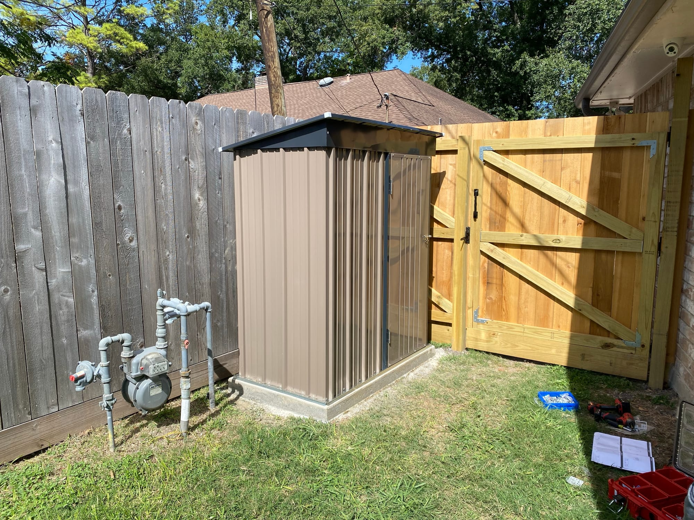
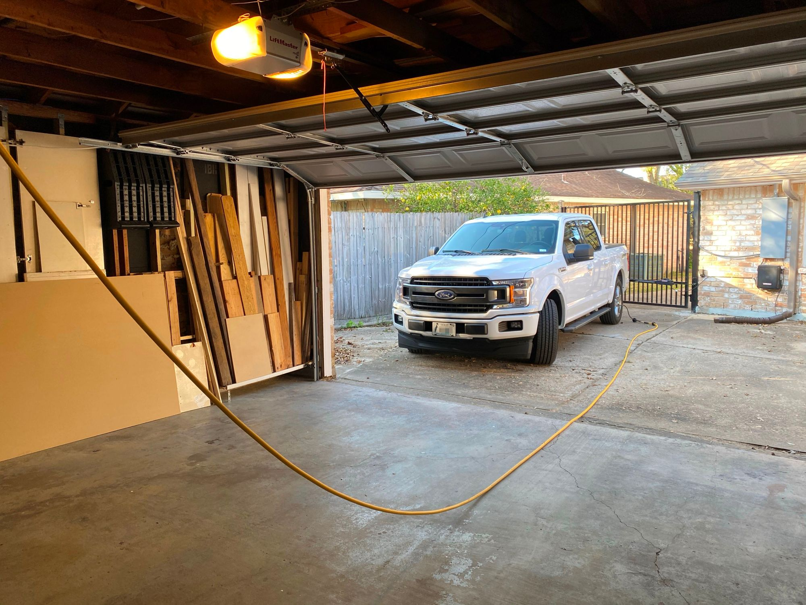
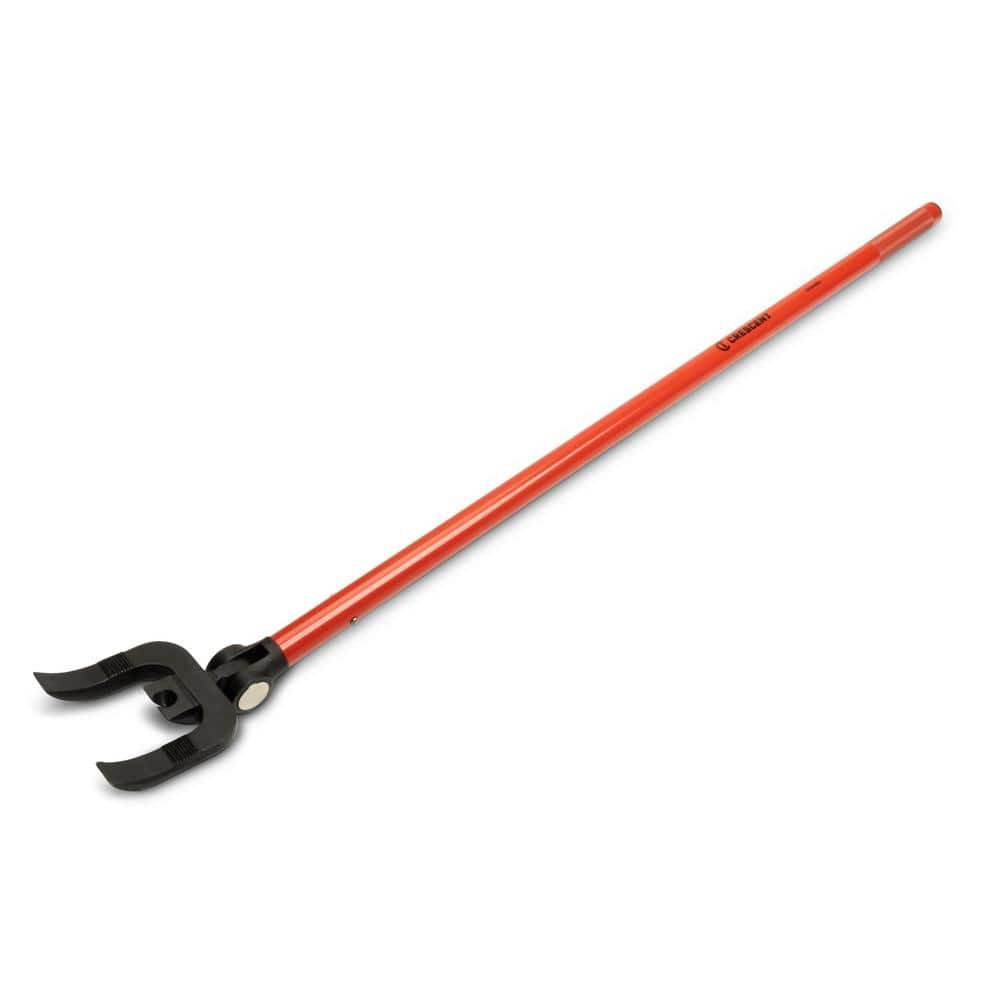
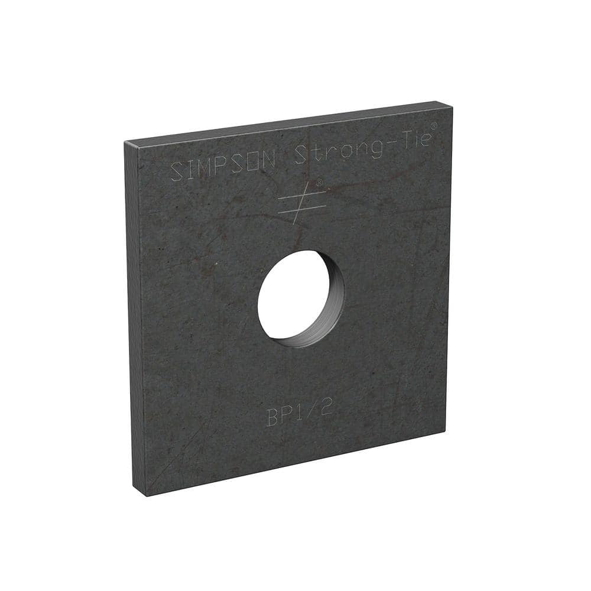
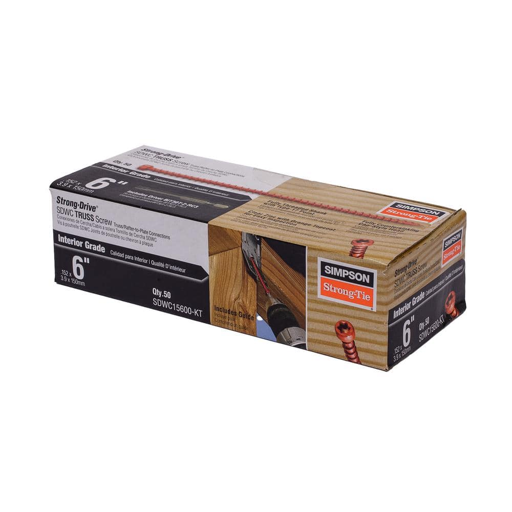
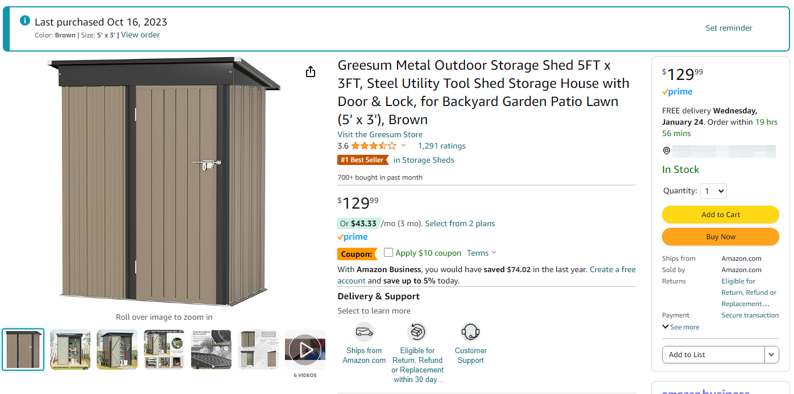
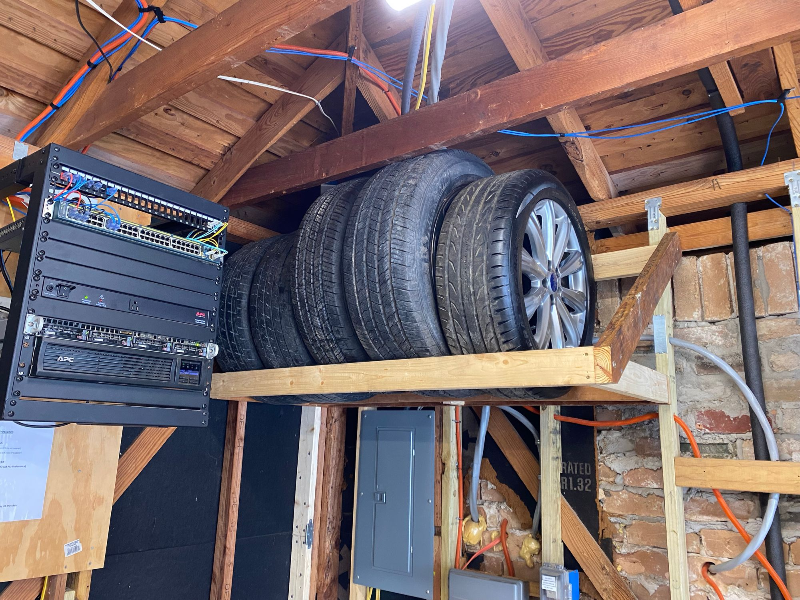
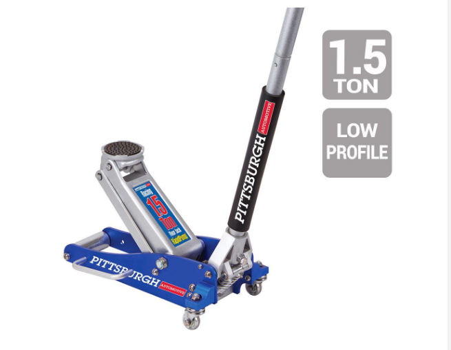

# Misc Projects and Updates

> **Source:** [NetworkProfile.org](https://blog.networkprofile.org/misc-projects-and-updates/)  
> **Date:** January 17, 2024  
> **Author:** spookyghost  
> **Tag:** `networking`

---

This post is just some small updates to past projects, and some smaller projects that don&apos;t really warrant their own full post.

### Garage Compressed Air Setup Updates

Original post:[

Garage Compressed Air Setup

I find myself needing compressed air for nail and staple guns, filling up tires, blowing out dust and other stuff, and I was sick of using my small and loud Pancake compressor each time. Here is my solution to this issue, it involves a 50ft auto-retracting air hose reel mounted

NetworkProfile.orgspookyghost

](https://blog.networkprofile.org/garage-compressed-air-setup/)

The hose reel project was great, and I use it often. Its handy to just have compressed air on hand at any time, anywhere in the area of the garage. The hose itself on the DeWalt reel wasn&apos;t perfect, and in winter it would get quite stiff, but for the price it was great, and I figured I could just replace it later.

Well, later happened. One day I went to unreel the hose while it was cold out, and in about 20 different places the hose split and leaked. 

While I do use it a few times a month, I&apos;m not using it day in and day out, and its not sat in the sun, so this is a pretty poor lifespan of the (Made in China) hose.

So, the only way forward is to replace the hose, easy right? Nope. I unreeled it and found that they attach the hose to the reel with a **proprietary **flare fitting!

I tried my best to find this fitting and could not. I called DeWalt who told me they don&apos;t make the reel, and a company called MAT Holdings does. I called them, and they confirmed a few things

- They don&apos;t know the name of the fitting
- They don&apos;t sell new hoses
- They won&apos;t replace the whole reel under warranty

So this pretty much means that unless you want to figure out a solution yourself, the DeWalt hose reel is a throw-away product. It should be expected that the hose would need to be replaced at some point.

I figured I need to do something, so I ordered a (Made in USA) Goodyear rubber hose for $40

The best solution I could come up with was carefully cutting off the old fitting, and then using 1/2 PEX clamps which I had on hand to connect to the new hose

I didn&apos;t know how much pressure it could take, so I didn&apos;t clamp them down all the way. I tested it at 120PSI, and no leaks.

I put it back on the reel, and good as new! No thanks to DeWalt. This new rubber hose is MUCH better in the cold too.

I also used this opportunity to support the inlet hose a bit better, with these nice rubber coated stainless pipe clamps I got for another project. Here is a link

[https://www.amazon.com/gp/product/B07QPY499J/](https://www.amazon.com/gp/product/B07QPY499J/ref=ppx_yo_dt_b_search_asin_title?ie=UTF8&th=1&ref=blog.networkprofile.org)

Here you can see where I put them, which protects the hose much better than my old solution of sharp metal strapping...

Moral of the story, DeWalt does not stand behind their products.

### Crescent Bull Bar

But, a company that DOES stand behind their products is Crescent/APEX Tools. My view of Crescent is that its yet another American tool company that was bought by a big conglomerate so they could suck all the profit they could while decreasing quality, but I am wrong!

Years and years ago I got a Bull Bar from Home Depot, it was this one[

Crescent Bull Bar 44 in. Indexing Head Deck Removal Demo Wrecking Bar DKB446X - The Home Depot

Everyone can count on the Bull Bar from Crescent for all of their deck projects. Unlike similar tools, the innovative 180&#xB0; indexing head changes positions, allowing the user to easily select the best angle for maximum leverage and access. The Bull Bar has a double fork design with teeth that grip the edge of the board, decreasing slippage and providing a balanced lift on both sides of the nail. Closed positions offer fast action for shorter pulls while open positions allow for powerful downward force on large planks and are an ideal solution for ground-level work. Additionally, a robust center nail puller will remove ring shank nails and stubborn long nails with better balance and increased leverage.

The Home DepotCrescent

](https://www.homedepot.com/p/Crescent-Bull-Bar-44-in-Indexing-Head-Deck-Removal-Demo-Wrecking-Bar-DKB446X/313794870?ref=blog.networkprofile.org)

I used it for EVERYTHING and removed about 10 concrete posts set in the ground. I pretty much abused it, and in the end, I ended up bending it right where the head meets the handle. I got my $60 worth out of it, so I just never thought much about it.

But one day when walking through Home Depot, I noticed they had the same Bull Bar, but with an updated design that looked less likely to bend, and I noticed it said it had a lifetime warranty

So, I emailed them telling them I had one and it bent. I never heard back, but about a week later a brand new one just showed up in the mail

Overall, I am very pleased. I threw the old one in my truck just incase I ever get into a bind and it comes in handy.

### Garage Foundation Connection and Hurricane Ties

Back in 2022 Houston, TX got an outbreak of tornados which destroyed many houses. A structural engineer I was working with assisted in the investigation of these homes. So, I asked him what low hanging fruit I could easily address in my house to protect from high winds, and 2 things came up. The connection of the rafters to the top plate of your house, and the connection between the bottom plate and the foundation.

My garage is completely unfinished, so I figured I would start there. I found that the in both areas, it was severely deficient.

The bottom plate was connected in just 4 places with duplex nails to the foundation

I fixed this by using 1/2" x 7" concrete wedge anchors and 2x2 bearing plates 12" from each corner and 48" apart otherwise. 

Here is what I bought

- 1/2" x 7" concrete wedge anchors

[https://www.amazon.com/gp/product/B0711XRTQF/](https://www.amazon.com/gp/product/B0711XRTQF/?ref=blog.networkprofile.org)

- And some 2 x 2 bearing plates
[

Simpson Strong-Tie BP 2 in. x 2 in. Bearing Plate with 1/2 in. Bolt Diameter BP 1/2-R - The Home Depot

Bearing plates give greater bearing surface than standard cut washers. They are designed to help strengthen and distribute the load at these critical connections. Bearing plates are typically used on foundation anchor bolts in place of cut washers.

The Home DepotSimpson Strong-Tie

](https://www.homedepot.com/p/Simpson-Strong-Tie-BP-2-in-x-2-in-Bearing-Plate-with-1-2-in-Bolt-Diameter-BP-1-2-R/100375361?ref=blog.networkprofile.org)

I tried using my M12 rotary hammer, but the concrete foundation was too hard, and I had to use my SDS-Max rotary hammer. I had to get creative in some areas to get to the bottom plate.

For attaching the top plate to the rafters, I found that installing traditional hurricane ties would be challenging and take a while. But then I found a product that I could use in place of them, and would take just 5 seconds to install

These screws are rated to be used in place of hurricane ties, and can installed in seconds with an impact driver[

Simpson Strong-Tie 0.152 in. x 6 in. T30 6-Lobe, Cap Head, Strong-Drive SDWC Truss Screw, Orange (50-Pack) SDWC15600-KT - The Home Depot

The Strong-Drive SDWC provides a time-saving and reliable option to fastening trusses and rafters to wall top plates. This high-strength structural wood screw is designed with a shorter thread length to fasten multi-ply members such as plated trusses, engineered-lumber products and solid-sawn lumber. The fully-threaded shank engages the entire length of the fastener, providing a secure connection between the roof and wall framing members.

The Home DepotSimpson Strong-Tie

](https://www.homedepot.com/p/Simpson-Strong-Tie-0-152-in-x-6-in-T30-6-Lobe-Cap-Head-Strong-Drive-SDWC-Truss-Screw-Orange-50-Pack-SDWC15600-KT/204704812?ref=blog.networkprofile.org)

When I got up to install them, I saw just how poorly my rafters were connected to the top plate. They were just badly toenailed with 2 nails, and often the wood had split.

I went and installed a screw into every rafter I could access, and it didn&apos;t take more than an hour to do the entire garage.

Here you can see the screw 

If there is a stud in the way, you just install at an angle from the front. 

### AC Surge Protectors

Another project I did that was fairly easy to do, was install surge protectors on all my HVAC equipment. You can get HVAC specific surge protectors for $66

[https://www.amazon.com/gp/product/B008VM6MXI](https://www.amazon.com/gp/product/B008VM6MXI?ref=blog.networkprofile.org)

If you search the internet, its a toss up if they are actually beneficial if you already have surge protection on your main panel, but for $66 its not exactly a big gamble. It could save you thousands of dollars. What made me pull the trigger was an HVAC installer saying that they saw a steel drop in warranty claims when they started installing them when doing Mini Split installs. So I bit the bullet and got 3 and installed them

Wiring them up was very easy, and I just used some 10AWG WAGO&apos;s

If they get "used up" from surges, the light no longer illuminates Green. So you can easily tell when you need to replace them

I have no idea if these will help or have helped, but it was a fun project anyway.

### Small Tool Shed

I needed to move my ever growing collection of yard hand tools out of the garage and somewhere else, and I have nowhere until I finish building my big shed in the back yard. That&apos;s when I saw these $120 steel shed on Amazon

[https://www.amazon.com/gp/product/B09Y94FGBC](https://www.amazon.com/gp/product/B09Y94FGBC?ref=blog.networkprofile.org)

I figured, for $120 I can&apos;t really get too disappointed and its worth a shot. 

First I assembled the base and found a space in the yard that was unused anyway, and it fit perfectly

I have some bagged concrete spare, so I figured I should pour a base for it. I used some scrap wood to make forms

I also found some scrap rebar, so I thew that in too

I did not excavate the dirt, as it was EXTREMELY yard, and the shed is not heavy. 

The concrete actually didn&apos;t come well at all! Something was up with these very old bags in my garage, as they didn&apos;t really seem to set up well at all. I probably used a touch too much water too. But, in the end it looks alright, and it will be covered.

The shed went together well. Its a 2 person job for sure, and there is high risk of cutting yourself! We also bent the header above the door by accident, but you can&apos;t really notice it now its all together

You can see that this space was a complete waste anyway, so this makes it very useful

Here are some more shots of it completed

I drilled into the slab and attached the shed to the concrete with anchors

It fits a fair amount of junk

I used some spare dirt I had from another project to grade around it

This also hides my poor concrete work

It has rained a LOT since installing this shed, and its never gotten wet inside.

### Tire Storage Rack / Discount Tire

A few months ago I made a spare tire storage rack. The post can be found here[

Building a $0 Tire Rack for spare wheels

A while ago I bought a utility trailer to tow around my motorcycles, and the original goal for it was to be able to take them to remote places like Big Bend National Park, and ride them there without having to endure the long drive on the bikes themselves with

NetworkProfile.orgspookyghost

](https://blog.networkprofile.org/building-a-0-tire-rack-for-spare-wheels/)

Another reason I decided to get spare wheels and store them at home which I didn&apos;t mention at the time, is that Discount Tire completely destroyed every single lug nut on my wife&apos;s car the last time she took it there. Having spare wheels at home means that if we get a flat, I can swap the wheel to the spare and have a place patch it, and never have to touch my lug nuts.

After my wife got her car back from Discount Tire for a flat repair, every single lug nut looked like this. We realized that the time before when she got all new tires, they damaged all the nuts and we never noticed.

This left us in a situation where we could become stranded on the side of the road, as the stock lug nut wrench no longer fits this mangled nut! If I didn&apos;t spot it and replace all the lug nuts that is. I complained to them, and as usual, they blamed Fords lug nuts.

If you don&apos;t know, Ford and some other manufacturers do not use solid lug nuts, they use lug nuts that have a "Protective" cover over the top, and that cover can get damaged leading to an odd size nut. If you remove the cover completely, there is a solid, slightly smaller nut, underneath. 

Its my opinion that yes, these lug nuts are not ideal, however the reason they all get beat up is because tire shops are careless, lazy and take no pride in their work. They use the wrong size sockets, which lead to this issue. But a new set of lug nuts cost me just $40, so I replace them and went on with my life. I also now owned a cool 18.5mm / 19.5mm socket, which is perfect for taking off damaged lug nuts. While buying that, I bought the size up for my truck, a 21mm/21.5mm socket. If you own a Ford, or any car really, these are handy to have. 

[https://www.amazon.com/gp/product/B01D4QBH7Q/](https://www.amazon.com/gp/product/B01D4QBH7Q/?ref=blog.networkprofile.org)

[https://www.amazon.com/gp/product/B077T8RXSL/](https://www.amazon.com/gp/product/B077T8RXSL/?ref=blog.networkprofile.org)

Fast forward a few months, and I need the tires on my truck rotated. I got my F150 in 2019, but due to working from home and the pandemic, it doesn&apos;t have many miles on it. So I took it for its very first tire rotation, and I took it to Discount Tire. I would have avoided Discount Tire, however we have been a customer of theirs for years and only had that one single bad experience, so it should be alright? Right?

They can&apos;t blame the lug nuts this time, as they have literally never been touched apart from when they went on at the factory. The lug nuts are 13/16ths in size, and my 13/16ths socket fit over every single one perfectly.

Again, they destroyed EVERY SINGLE LUG NUT

So I drove right back to Discount Tire. This is where I had a heated discussion with them, and learned that they don&apos;t use the correct size socket, they use a 21mm socket (Wrong) or even a 22mm socket (Even more wrong). They told me that F150 lug nuts were 21mm, not 13/16, despite the owners manual stating other wise.

They argued that 21mm and 13/16th are the same size (Hint, they are not) and that they use the larger sockets (Confirming they are not the same?) because the Ford lug nuts are always beat up, and those sockets fit better on the beat up socket.

This of course ignores the fact that mine were brand new, and they are just fulfilling their own prophecy by using the wrong sized sockets and destroying every single car they come across. 

I walked out with a free set of lug nuts for my truck, which say 13/16th HEX, go figure. 

At this point I realized that Discount Tire is damaging every single Ford vehicle that goes in, and leaving the owner with a car that cannot have a tire easily swapped on the side of the road. I complained and never heard anything back. I will never go back to Discount Tire again.

I swapped the rest of my lug nuts with my fancy oversized socket. It was even a struggle with that though!

Shortly after all this, my wife got a new car, a Mustang Mach-E

This uses the 13/16 lug nuts identical to the F150, so I now keep that flip socket in my tuck at all times, in case I need to go help her change a tire. I also keep the 18.5/19.5mm one in there too in case I need to help another stranded Discount Tire customer...

The Mustang Mach-E actually comes with no spare, and no jack! So the first thing I did was find a wheel on eBay. I snagged a virtually brand new wheel off a flood car for $350. For a spare, a little expensive, but now we also have a good condition rim if we ever scuff one. OEM, these cost almost $1500 each.

I got a brand new tire mounted, so if she ever gets a flat, she could drive around for as long as she needs. I keep the wheel at home, and I can just grab it and drive to her if/when she needs it.

The Mustang also is very heavy, around 5500lb, and has very specific jack points. We followed the path of other people online and got some Aluminum pucks that mount to the car to easily identify the jack points, and give you some clearance of the plastic around them

These are actually designed for Corvettes, and can be found here

[https://www.amazon.com/gp/product/B0978J5BSW](https://www.amazon.com/gp/product/B0978J5BSW?ref=blog.networkprofile.org)

Another thing I did, was get a lightweight jack to keep in my truck. The included F150 scissor jack would work, but it just doesn&apos;t fit the Mach-E very well, and its very slow.

I got the PITTSBURGH AUTOMOTIVE 1.5 Ton Low-Profile Aluminum Racing Floor Jack on sale for $70. It lifts the Mach-E easily.

It also lifts my truck very easily, so this is a good tool to have on-hand. I wasn&apos;t sure where I would put it, and then I found out about the BuiltRight Industries Rear Seat Release for the F150. This $30 item lets you now easily fold forward the rear seats on the F150, revealing a massive space to store more crap!

Behind here I keep the jack, the jack handle and the old Bull Bar from earlier!

You just fold the seats back up like normal

Must have for any F150 owner. That space is completely wasted usually.

Thats all!

---

*Originally published at: [https://blog.networkprofile.org/misc-projects-and-updates/](https://blog.networkprofile.org/misc-projects-and-updates/)*