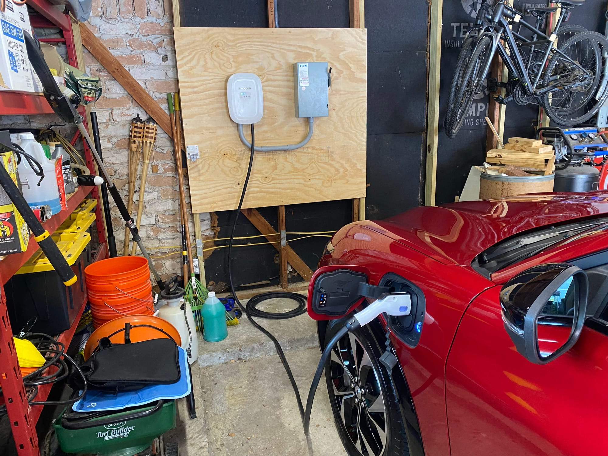
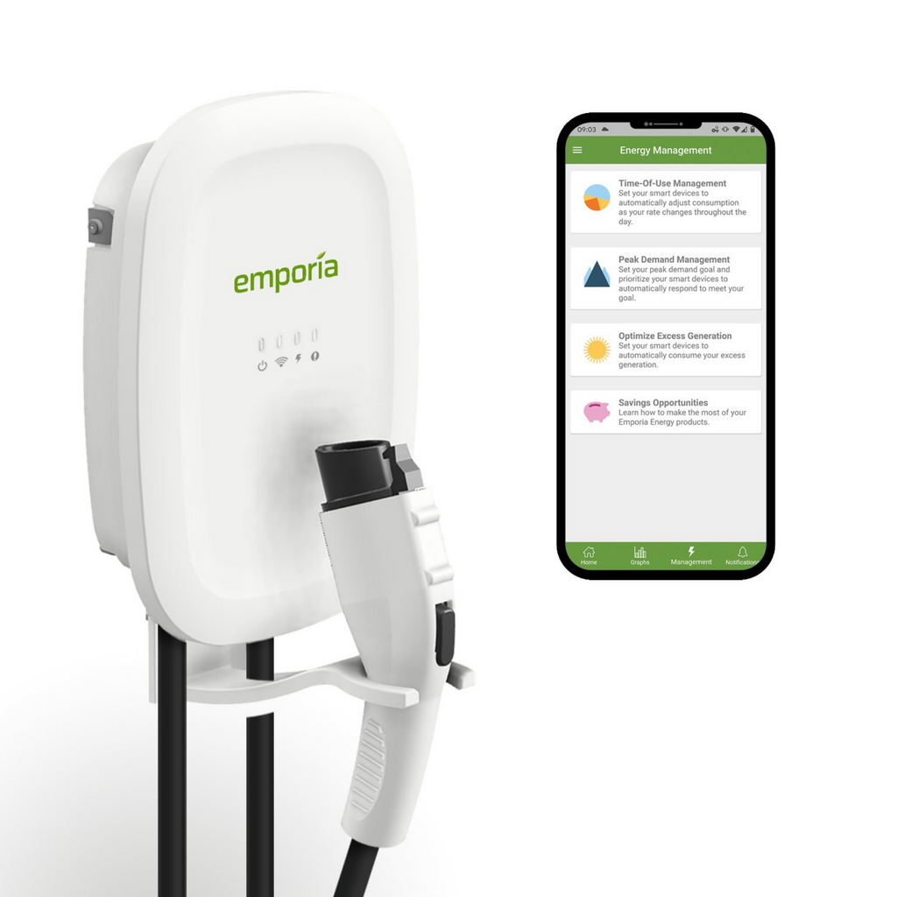

# Emporia EVSE Install

> **Source:** [NetworkProfile.org](https://blog.networkprofile.org/emporia-evse-install/)  
> **Date:** January 17, 2024  
> **Author:** spookyghost  
> **Tag:** `networking`

---

At the end of last year we got an EV. This post details the install of an Emporia EVSE in my garage. It won&apos;t be very long, but it may give you an idea of how you might install yours.

At first I was just charging it with the included travel charger plugged into my welder receptacle. I found an NEMA 6-50P to 14-50R adapter so I could do this, but its not a permanent solution. The adapter was very good quality though

[https://www.amazon.com/gp/product/B09P1BP4ZQ/](https://www.amazon.com/gp/product/B09P1BP4ZQ/?ref=blog.networkprofile.org)

But, I wanted a hard wired EVSE capable of charging at 11.5kw. There are a lot of choices out there though, and you need to decide if you want to truly hard wire the EVSE or use a NEMA 14-50. Watching this video though, it sold me on hard wiring.

Someone was actually kind enough to send me a free Emporia EV that they didn&apos;t use, brand new in the box! 

The Emporia EVSE lacks local control which I would like, however you can control it via their app. I was having a very hard time finding an *in stock* EVSE that has full local control, so the Emporia was great for me, and free is the best price.

Right away I went online to look at other installs, and I noticed some challenges. 

- There is no LEGAL way to have wires enter from the rear. If you drill a hole, you void the UL listing and violate code. Lots of people do this, but I wanted to avoid it as it is quite permanent. 
- Even if you do, there is not enough room to properly get 6AWG THHN at a 90 degree angle into the connectors.
- Power comes in on the left, and can&apos;t be switched to the right side without voiding the UL listing and possibly having to strip more wire out of the VERY thick cord insulation (I didn&apos;t want to attempt this)
- The pre-attached cord with a plug is VERY thick, meaning the hole is 1-1/4". This is a very large size, and if you are hard wiring, probably too large meaning you will have to use reducing bushings or reducers for your conduit, or go with MASSIVE 1-1/4" conduit which would be silly. a 3/4" hole would have made much more sense for hard wiring, or at least 1".
- Minor, but to remove the front you must remove 8 HEX screws from the REAR. Very tough! Not a big deal, but why not put them on the front?

Here is an image, with the 1-1/4" PVC fitting inserted. You can see there is a lack of space in this EVSE. No real way to coil up some spare wire for future serviceability. 

I am wiring this with THHN and conduit instead of Romex, as 6/3 Romex is only rated for 55a, not the full 60a. Anyone installing 6/3 Romex with a 60a breaker, is violating code.

So now I need to figure out the neatest and smartest way to get 3 x 6 AWG THHN conductors into this thing. I wanted the conduit in the wall, so I need a way to come out of the wall and into the bottom, all while being easy to install and service in the future. This EVSE will probably not be my "Forever" EVSE, as I&apos;m sure smarter ones will come out. For these reasons, I decided I needed to run the power inside the wall to a junction box of some kind, and then into the EVSE. This will allow me to easily bring the wire out of the wall, make the install easy and make swapping to a new EVSE in the future easy. 

First, I installed a new 60a breaker in the top spot to limit the distance to the main lugs. This installed in my 120a garage sub panel. 

Here is what I ended up with on initial install. I will detail everything as we go and show you the final product. 

First I mounted some 19/32 plywood to the studs. This plywood is thick enough that I can mount the EVSE and anything else, anywhere, with screws. No need to find a stud since the plywood is thick.

Then, I ran 3/4" Liquid Tight PVC Conduit in the wall from the panel containing 3 x THHN wires, into the back of a nice heavy duty lever disconnect. The reason for a disconnect is that it makes installing, changing and troubleshooting the EVSE very easy, I don&apos;t need to go all the way to the panel to flip the breaker. It also gets the cable out of the wall as a bonus. I chose one with lots of room inside, and hex lugs so I could easily tighten them to the proper, listed torque values.

The model I got was the Eaton DG322UGB and I do NOT recommend you purchase it. Not only because they didn&apos;t put the sticker on straight, but the main problem is that the lugs are aluminum, and you must be INCREDIBLY careful to not strip them while tightening to the listed torque values on the instructions. I actually stripped the middle lug which you may be able to see below, and thankfully was able to just swap it with the one next to it since this disconnect.

The reason the wires look a little bit messy is because I was going to re-terminate it after getting everything situated, but after struggling so much to not strip the lugs, I decided to leave it be. If I do it again, I will get one with STEEL lugs, or larger lugs overall. Either I got a dud, or no one installing these is using a torque wrench to validate. 

Also yes, I know I&apos;m not allowed to re-identify 6AWG wire, it must be 4AWG or larger to be allowed to be re-identified. But, I&apos;m not going to purchase more red and green THHN for no real reason. The rule is stupid.

Here you can see the 3/4" PVC Liquid tight going up into the ceiling

I used 1 inch conduit out of the disconnect into the EVSE with 2 x 90&apos;s. T

he reason I did not go with 3/4, is that it would be very far off the wall due to how the EVSE has the hole placement, and 3/4 almost looks too thin in this install and didn&apos;t have the "Beefy" look I wanted. So I decided to go with 1 inch. I used a 1-1/4" threaded fitting in the EVSE and then a 1 inch reducer.

Overall I am pleased with the look, but finding a method to attach the PVC to the wall is tough, as the gap is just a little but too small for thin strut, but too large for a simple clamp. In the end I cut down a piece of plywood of the correct thickness to act as a washer of sorts for a regular PVC clamp. 

Here is the end result which I am very pleased with.

We&apos;ve used it many times since installing, and it works perfectly

Hopefully this post gives you inspiration for your own install. 

---

*Originally published at: [https://blog.networkprofile.org/emporia-evse-install/](https://blog.networkprofile.org/emporia-evse-install/)*