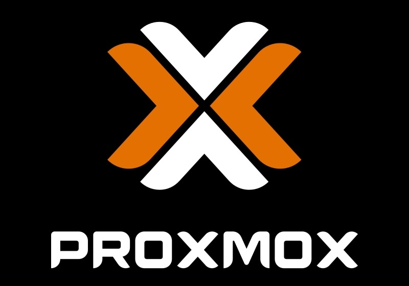
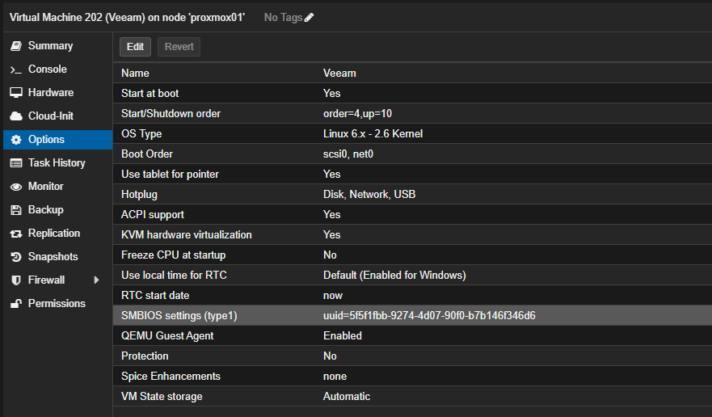
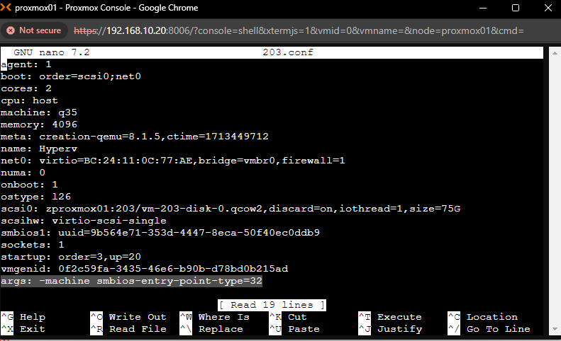

# Proxmox Windows VM looses UUID

> **Source:** [Spencer's Blog](https://blog.filegarden.net/2024/05/18/proxmox-windows-vm-looses-uuid/)  
> **Date:** May 18, 2024  
> **Author:** Spencer LeB  
> **Tag:** `selfhosted`

---

I’ve encountered an issue a few times when Proxmox updates Machine types with updates.My Windows machines sometimes present errors as after updates no UUID is present. Some software’s don’t like this. You can test this on Windows by inputting wmic path win32_computersystemproduct get uuid Likely you may see “No Instance(s) Available.” A quick fix I’ve found is to have a UUID set in the VM config Going into your VM Config fileroot@proxmox01:/etc/pve/qemu-serverSet the following arguments args: -machine smbios-entry-point-type=32

---

*Originally published at: [https://blog.filegarden.net/2024/05/18/proxmox-windows-vm-looses-uuid/](https://blog.filegarden.net/2024/05/18/proxmox-windows-vm-looses-uuid/)*