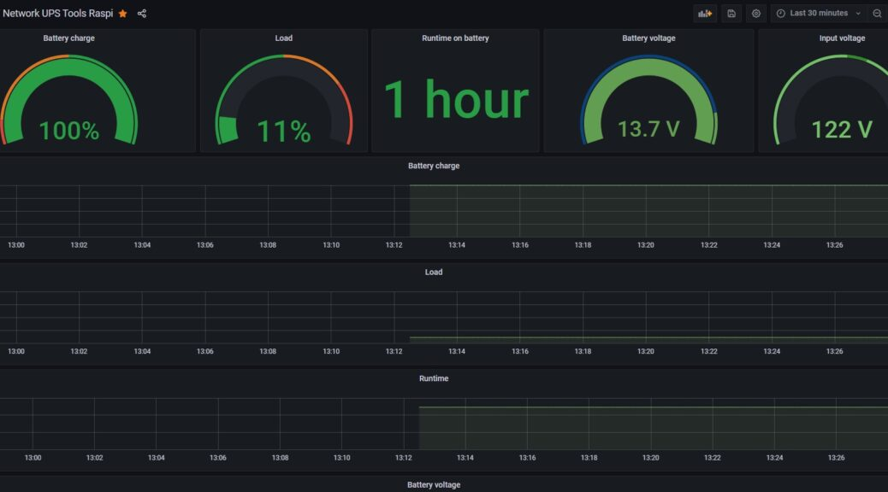

# Monitoring Systemd Services / Automatic Cron Restart

> **Source:** [Spencer's Blog](https://blog.filegarden.net/2023/09/11/monitoring-systemd-services-automatic-cron-restart/)  
> **Date:** September 11, 2023  
> **Author:** Spencer LeB  
> **Tag:** `selfhosted`

---



 
 
 
 
 Monitoring Systemd Services / Automatic Cron Restart
 

## Monitoring Systemd Services / Automatic Cron Restart


 
 


 

##### ** [September 11, 2023 ](https://blog.filegarden.net/2023/09/11/monitoring-systemd-services-automatic-cron-restart/)**
[Spencer LeB](https://blog.filegarden.net/author/sleblanc/)


 
 

 


 
I got a raspberry pi acting as a NUT SERVER, and it keeps flaking out. I keep having to restart nut-server all the time. Lets automate checking if the service is running and restart it if its not.


The Issue. Every so often it just stops. See the graph below


Lets create a bash script for checking the service


```
`#!/bin/bash

SERVICE="nut-server"
STATUS="$(systemctl is-active $SERVICE)"

if &#91; "$STATUS" != "active" ]; then
    echo "Service $SERVICE is not running"
    systemctl restart $SERVICE
    echo "Service $SERVICE has been restarted"
    # Send notification here
else
    echo "Service $SERVICE is running"
fi`
```


Lets save the script and make it executable


```
`chmod +x check_nutserver_status.sh `
```


Lets edit crontab by typing “crontab -e” into the shell and add the following line.


```
`*/5 * * * * /home/pi/Documents/nut-server-status/check_nutserver_status.sh`
```


Then bob’s your uncle.

 

 
 

**
 [Linux](https://blog.filegarden.net/category/linux/)

---

*Originally published at: [https://blog.filegarden.net/2023/09/11/monitoring-systemd-services-automatic-cron-restart/](https://blog.filegarden.net/2023/09/11/monitoring-systemd-services-automatic-cron-restart/)*