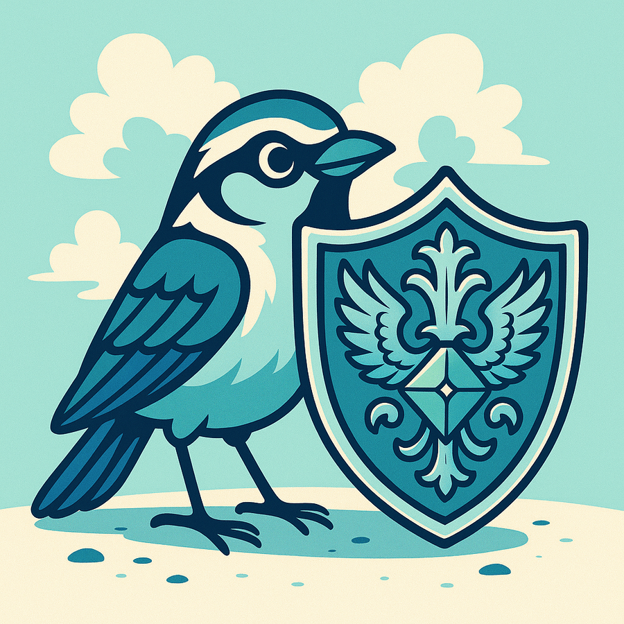

# Wagtail's new Security Announcements Channel

> **Source:** [TheOrangeOne](https://wagtail.org/blog/new-security-announcements-channel/?utm_source=theorangeone.net&utm_medium=rss)  
> **Date:** January 27, 2026  
> **Tag:** `selfhosted`

---

Security

 
 

27 Jan 2026
 
 

 

## Wagtail&#x27;s new Security Announcements Channel

 
 

### Get notified of security releases for your favorite CMS

 

 

 
 

 
 
 Jake Howard
 
 Wagtail Core & Security Team
 
 

 

 
 

 

 
 

 
 

 

 
 We take the security of Wagtail **very** seriously. Wagtail is used by [a number of high-profile companies and sites](/who-uses-wagtail/), where the security of applications is paramount. Since 2022, the Wagtail Security Team have received incoming security reports from our community, triaged them, developed a fix, and published them.Starting today, Wagtail CMS now has a dedicated [Security Announcements](https://github.com/wagtail/wagtail/discussions/categories/security-announcements) discussion category on GitHub. This serves as a space for the Security Team to notify developers of upcoming security releases. We’ve been doing this for a while in the main Announcements category, but separating them out brings a few benefits.

### Why notifications?

As per our [security policy](https://docs.wagtail.org/en/stable/contributing/security.html), we send out early notifications for upcoming security releases. The purpose of the early notifications is to prepare development teams for when the vulnerability is released. If your Wagtail project is on an affected version, you may want to ensure a developer is on hand to review the vulnerability as soon as it’s released, determine whether you’re impacted, and work on getting your site(s) updated as quickly as possible.Once vulnerabilities are made public, it’s sadly not uncommon for malicious users to attempt to reverse engineer the release notes and develop an exploit in an attempt to compromise or otherwise damage websites. That’s why it’s important to upgrade as early as possible. To date, we are not aware of Wagtail sites being compromised from recently released vulnerabilities.

### What to expect

The Security Announcements category will only be used for important notifications about security releases.Early notifications for upcoming vulnerabilities are published approximately 1 week before the public release. These notifications will include the affected versions, the expected release date and time, and the severity of the vulnerability, following [Django’s severity levels](https://docs.djangoproject.com/en/dev/internals/security/#security-issue-severity-levels). A single release may address multiple vulnerabilities, in which case the notification will include how many are addressed and the different severities. Specific details about the vulnerability are intentionally omitted, to prevent the vulnerability from being disclosed early.Once the security release has been published and is ready to install, another announcement will be sent. This one will contain the details about the vulnerability, including the release notes and a link to the [Security Advisory](https://github.com/wagtail/wagtail/security/advisories?state=published). Wagtail uses GitHub’s Security Advisories to review, triage and track details of vulnerabilities. Here you’ll find further technical details of the vulnerability, potential workarounds for those who cannot update immediately, as well as credit to whoever reported the vulnerability to us. This release will also include details of the [CVE ID](https://en.wikipedia.org/wiki/Common_Vulnerabilities_and_Exposures), which can be used to uniquely identify the released vulnerabilities.This may sound like a lot of information, but it won’t happen very often. Wagtail does not release security updates frequently, so we expect the category to be very low noise.

### How to subscribe

GitHub’s discussions are public, and don’t require an account to view, so you can check the page as often as you like to see for new updates. However, if you’re like me, you’d rather be told about releases rather than need to go looking for them.You can subscribe to the discussion category using RSS. GitHub’s discussions have an RSS feed, which can be subscribed to in many applications such as [Slack](https://slack.com/intl/en-gb/help/articles/218688467-Add-RSS-feeds-to-Slack), [Microsoft Teams](https://techcommunity.microsoft.com/discussions/microsoftteams/how-to-create-an-rss-status-pages-command-center-in-microsoft-teams/3534330) or wherever your team communicates. Just add the following URL: [https://github.com/wagtail/wagtail/discussions/categories/security-announcements.atom](https://github.com/wagtail/wagtail/discussions/categories/security-announcements.atom)Now, whenever there’s a security release or early notification, you’ll receive a message where you already are, without needing to keep an eye out for it by regularly visiting the discussion page. If you are an active GitHub user, you can also [“watch” the discussions for the repository](https://docs.github.com/en/subscriptions-and-notifications/get-started/configuring-notifications#configuring-your-watch-settings-for-an-individual-repository), but note that this includes **all** discussions, rather than just security announcements.You can also subscribe to the feed for the [main Announcements category](https://github.com/wagtail/wagtail/discussions/categories/announcements.atom), or any other, and even our [blog posts](/blog/feed/). Django, the framework Wagtail is built on, has an [email list](https://docs.djangoproject.com/en/dev/internals/mailing-lists/#django-announce-mailing-list) for similar announcements.

### What’s next?

We're hoping that this new process will make it easier for users to get notified about our security updates. As usual though, we are open to feedback on the process. You're welcome to share any ideas or questions you have in our new [discussion category as well](https://github.com/wagtail/wagtail/discussions/categories/announcements).Also, if you believe you or your organization should receive advanced notification of vulnerability details, please contact the [Security Team](https://github.com/wagtail/wagtail/wiki/Security-team). We will follow [Django’s policy](https://docs.djangoproject.com/en/dev/internals/security/#who-receives-advance-notification) for who may receive these notifications.
 

 

 [
 
 

### Have questions or thoughts?

 Share them in our GitHub discussion on our new announcement category
 
 
 ](https://github.com/wagtail/wagtail/discussions/13804)

---

*Originally published at: [https://wagtail.org/blog/new-security-announcements-channel/?utm_source=theorangeone.net&utm_medium=rss](https://wagtail.org/blog/new-security-announcements-channel/?utm_source=theorangeone.net&utm_medium=rss)*