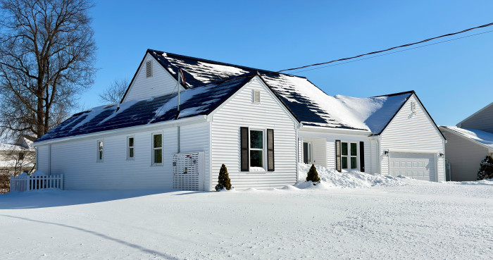

# Geothermal vs Air Source Heat Pump: Which is Worth It?

> **Source:** [TinkerTry](https://tinkertry.com/articles/geothermal-vs-air-source-heat-pumps-feat-undecided-and-tinkertry)  
> **Date:** February 24, 2026  
> **Tag:** `homelab`

---

I'm happy Matt asked me to help out with our second apples-to-apples(ish) comparison between our two all-electric, heat pump-ified homes. This one focuses on the source of heat, and it's a follow-up to Matt's popular video from a year ago that compared our solar setups [here](https://tinkertry.com/tesla-solar-roof-compared-with-solar-panels#video-1-16-minutes-solar-comparison).

I really hope you get a lot out of this one too. Your thoughts, stories, and feedback are always appreciated here. Feel free to drop a comment [below](https://tinkertry.com/geothermal-vs-air-source-heat-pumps-feat-undecided-and-tinkertry#comments-section), no login required.

As a small and independent part-time content creator, it's hard to overstate just how grateful I am to have contributed to Matt's videos. The [one about our solar rigs](https://youtu.be/glgsGjvxvz8?si=tn0tiV_H_5_jD7Ez) has been viewed by more folks in one year than any of my 700+ videos I've published over the last 14 years.

### Video

### See also at TinkerTry

This article is closely-related to the above article, hopefully you'll find it to be very helpful!

- **[Insights That'll Help You and Your Contractor Plan for Comfort: After 4 New England Winters Living With Just Heat Pumps](https://tinkertry.com/planning-for-heat-pump-comfort)**

Feb 23 2026

One 200-amp electrical service line, one fiber-optic line, and one 1" municipal water service line. That's it. No gas lines, no oil tanks. Photo taken January 27 2026, with the deepest snow accumulation since moving in 3 and a half years ago.

### Coming soon

Click/tap here to view Matt's latest videos. The Still To Be Determined Podcast TBD Podcast episode is planned for release on March 4, 20226. You can see a portion of it in the screenshot above.

### About the author

Paul Braren on LinkedIn. Technology Operations Engineer at Travelers. Formerly Systems Engineer at Pure Storage, Dell Technologies, VMware, and IBM. TinkerTry.com, LLC Owner/Founder. EV Club of Connecticut Co-Leader. Sustainability Advocate.

*Paul Braren is an* [*IT professional*](https://www.linkedin.com/in/paulbraren/) *and* [*tech blogger*](https://tinkertry.com) *who covers PCs, EVs, home tech, efficiency, and more. Paul has authored over 1,200 long-term technical articles and [500 videos](https://www.youtube.com/TinkerTry) since founding TinkerTry.com over the past 14.5 years, most recently increasing his focus on sustainability and creating* [*EV articles*](https://TinkerTry.com/EVs) *and* [*videos*](https://www.youtube.com/playlist?list=PLCuu-J0IWcS4yzNJ0DQkJfJEeSzso9obg)*, along with helping the* [*EV Club of Connecticut*](https://evclubct.com/leadership-team-bios/) *since purchasing his first EV in 2018.*

***Disclosure:*** *I hold no stocks and never held stocks in any of the tech companies mentioned at TinkerTry, including any company mentioned in this article whose products were purchased from public sources at listed prices.*

If you happen to also be interested in a series of technical articles and more videos about all the challenges that went into ripping out our baseboard heat and natural gas lines and going all-electric, while also upgrading the windows and insulation and air-tightness (AeroBarrier), consider using the Follow links listed below.

#### Follow

My all-electric home's utility entrance panel.

Read more about me [here](https://tinkertry.com/about#about-me).

Follow my work at:

- Bluesky [@paulbraren.bsky.social](https://bsky.app/profile/paulbraren.bsky.social)

- Mastodon [vmst.io/@paulbraren](https://vmst.io/@paulbraren)

- X - Inactive, with my Twitter archive [@paulbraren](https://twitter.com/paulbraren)

- Founder of [TinkerTry.com](https://tinkertry.com) - PCs, EVs, home tech, efficiency and more

- [TinkerTry.com/EVarticles](https://tinkertry.com/EVarticles) | [TinkerTry.com/EVvideos](https://tinkertry.com/EVvideos) | [Weekly Email](https://list-manage.us2.list-manage.com/subscribe/post?u=0321e0e2cda1cb28cdf66b4ef&id=2232124c16) | [RSS](https://tinkertry.com/rss)

- Member of [EV Club of CT Leadership Team](https://evclubct.com/leadership-team-bios/), Manager of [@evclubct.bsky.social](https://bsky.app/profile/evclubct.bsky.social)

If you're interested in following my biggest sustainability project ever that details my (mostly) successful effort to go all-electric at my home using heat pumps, solar, and batteries, consider [subscribing to the TinkerTry YouTube Channel](https://youtube.com/TinkerTry?sub_confirmation=1), then click on the alarm icon to get notified of new videos. Also consider showing your support on my [Patreon](https://www.patreon.com/tinkertry) page.

### See also at TinkerTry

- Paul Braren's [podcast guest appearances](https://tinkertry.com/category:Podcasts)

- EV articles at [TinkerTry.com/EVs](https://tinkertry.com/EVs)

- EV videos at [TinkerTry.com/EVvideos](https://tinkertry.com/EVvideos)

#### 

- **[Solar Roof vs Solar Panels: Which is Worth It? - TinkerTry's home featured in Matt Ferrell's video and podcast](https://tinkertry.com/tesla-solar-roof-compared-with-solar-panels)**

Mar 19 2024

#### 

- **[Tesla Solar Roof - 33 yr. old Connecticut home successfully renovated & electrified. No more gas!](https://tinkertry.com/tesla-solar-roof-before-and-after-video)**

Oct 29 2023

#### 

- **[EV Club of CT's smart electrical panel discussion featuring SPAN, electrician, & homeowner](https://tinkertry.com/span-smart-panel-discussion)**

Jan 09 2023

---

*Originally published at: [https://tinkertry.com/articles/geothermal-vs-air-source-heat-pumps-feat-undecided-and-tinkertry](https://tinkertry.com/articles/geothermal-vs-air-source-heat-pumps-feat-undecided-and-tinkertry)*