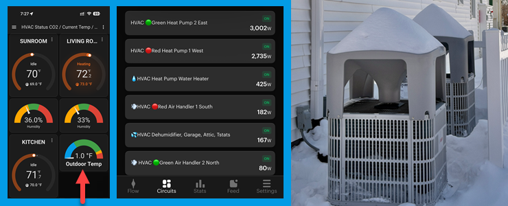
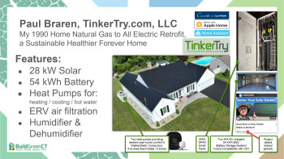
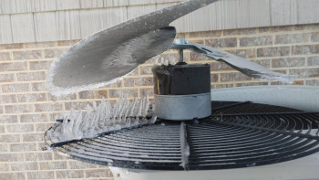
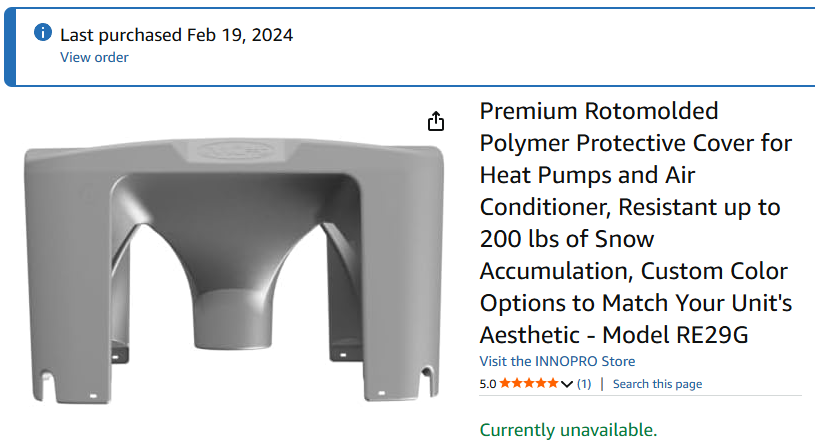
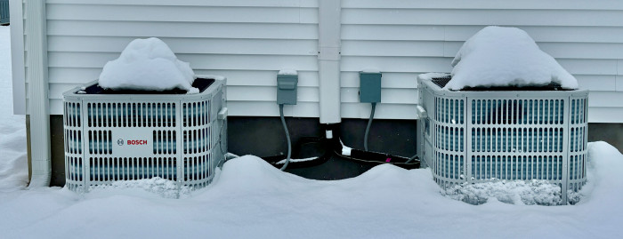
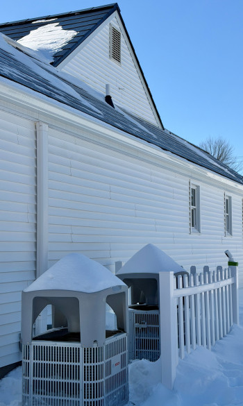
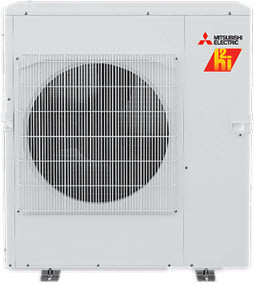
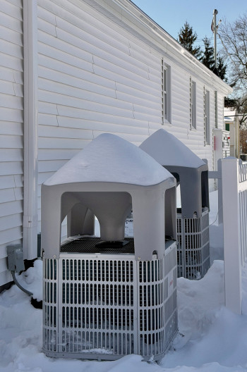
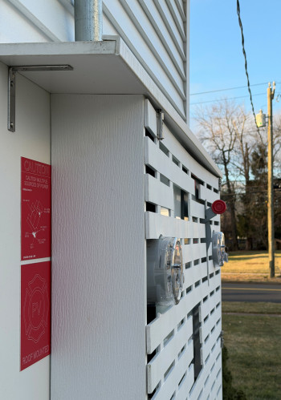

# Insights That'll Help You and Your Contractor Plan for Comfort

> **Source:** [TinkerTry](https://tinkertry.com/articles/planning-for-heat-pump-comfort)  
> **Date:** February 23, 2026  
> **Tag:** `homelab`

---

*This article is currently in draft form, revisions will be frequent these first few days.*

### Video

This closely-related video covers some of the considerations to consider when looking into heat pump based heating and cooling systems.

### Introduction

My wife and I took on the task of converting from gas to electric for our just-purchased "forever home" back in 2022. It was a 32-year-old, 1,856 sq. ft. house in need of a new roof, some remodeling, and major energy-efficiency upgrades including new windows. The massive supply chain and labor shortages at that time made the HVAC portion a much bigger challenge than it should have been. The impediments were plentiful during our mission to have net-zero annual energy costs for our daily living and transportation needs, but by winter #4 here, we got there.

The list of [considerations](#tinkertrys-list-of-heat-pump-considerations) below should be helpful in making your heat pump ambitions a reality by advancing your understanding of what living in an all-electric, forced-air heated and cooled home is *actually* like. There are so many things to look out for, but once you know them, your odds of successfully achieving comfort are greatly improved.
If you happen to also be interested in a series of technical articles and more videos about all the challenges that went into ripping out our baseboard heat and natural gas lines and going all-electric, while also upgrading the windows and insulation and air-tightness using AeroBarrier, consider using the Follow links listed below.

*Editor's note - this winter in Connecticut has featured many record-setting single-digit Fahrenheit days and nights so far, and I'm writing this in the midst of our second big snowstorm this winter. I'm electric snowblowing frequently to barely keep on top of this 2" to 3" of wet snow per hour. Breaks consist of warming up, drying off, and recharging my Ego batteries in my comfy heat-pump-heated, battery-backed-up home. In times like this, I'm glad I've taken great efforts to reduce the chances of frozen pipes and flooding, even if I'm not home, and even if the internet goes down.*

**Table of Contents**

- [Introduction](#introduction)

- [Backstory](#backstory)

- [TinkerTry's List of Heat Pump Considerations](#tinkertrys-list-of-heat-pump-considerations)

- [Specify a Cold Weather Heat Pump](#specify-a-cold-weather-heat-pump)

- [Ductwork & Retrofit Challenges](#ductwork--retrofit-challenges)

- [Ductwork Location](#ductwork-location)

- [Installer & Contractor Realities](#installer--contractor-realities)

- [Noise & Comfort](#noise--comfort)

- [Defrost Cycles & Resistive Heat](#defrost-cycles--resistive-heat)

- [Sizing, Efficiency & Humidity](#sizing-efficiency--humidity)

- [Equipment Lifespan & Replacement](#equipment-lifespan--replacement)

- [Outdoor Unit Considerations](#outdoor-unit-considerations)

- [Cold Weather Comfort & Staging](#cold-weather-comfort--staging)

- [Refrigerants & Future-Proofing](#refrigerants--future-proofing)

- [System Tuning & Optimization](#system-tuning--optimization)

- [Home Envelope & Insulation](#home-envelope--insulation)

- [Energy Use & Cost Realities](#energy-use--cost-realities)

- [Cost Breakdown & Payback](#cost-breakdown--payback)

- [Heat Pump Water Heaters](#heat-pump-water-heaters)

- [Regional Observations](#regional-observations)

- [Policy, Grid & the Bigger Picture](#policy-grid--the-bigger-picture)

- [Data & Monitoring](#data--monitoring)

- [Other](#other)

- [Video](#video)

- [About the Author](#about-the-author)

- [Follow](#follow)

- [See also at TinkerTry](#see-also-at-tinkertry)

### Backstory

Click/tap here to view Matt's latest videos, with our full conversation as seen above planned for release in early March.

We were transforming the home from a gas-fired hydronic heating system with baseboard water heat, over to all-electric. It was a daunting task — our contractor had just three weeks before we moved in to get it right, and there was no going back. The plan was to rip out all baseboards and all natural gas lines, and even the gas meter. By the way, "natural gas" is methane, aka dino gas, and part of the goal was to stop burning stuff for 

I've learned a lot through acting as both project planner and project manager for this electrification process, and I learned a whole lot more living with heat pump-based heating and cooling in the four winters since making the switch away from burning stuff.

This article is intended to be a list of things to be aware of, things I wish I knew about back in the summer of 2022 when our offer on the house was accepted, with planning for the September 15 closing and October 1st move-in really began. This necessitated a speedy search for the best options and long-term economic viability for going all-electric in our New England climate. Back then, web searches for this kind of real-world information turned up nothing — it was crickets — and the few articles or videos I could find would have maybe a handful of considerations, tips, and gotchas at most.

This article hopefully remedies that, and these firsthand learnings are most applicable to others in cold climates looking to do the same sort of renovation. It will be particularly relevant if you have objectives similar to ours, which were:

- 

Non-proprietary thermostats in each room that needed individual temperature control (we went with 5 Ecobee Smart Thermostat Premiums)

- 

Good efficiency, especially in the coldest of winter cold spells

- 

Good comfort, with ceiling ducts that allowed much more flexibility with furniture placement than baseboards ever did

- 

Forced air that would allow proper humidification and dehumidification — we were tired of filling and maintaining console humidifiers every day in the winter

- Proper "stuffy-ness" mitigation - an Energy Recover Ventilator for air that feels fresh and is fresh (and filtered) all year long

For us, the [Bosch IDS 2.0](https://www.bosch-homecomfort.com/us/en/ocs/residential/ids-premium-inverter-ducted-split-heat-pump-20150268-p/) system was the best (and only viable and available) option at the time. How bad were things? A Mitsubishi heat pump was on a 10-month order backlog. Since 2022, a lot has changed for the better as far as cold weather heat pump technology. For example, newer Bosch system designed for even colder climates is the [IDS Ultra - Inverter Ducted Split Cold Climate Heat Pump](https://www.bosch-homecomfort.com/us/en/ocs/residential/ids-ultra-inverter-ducted-split-cold-climate-heat-pump-20831889-p/), So no, don't buy an IDS 2.0 system today — that's just a contractor trying to offload old inventory of an older system that uses the old refrigerant they're used to. It will cost you in the end, not them, in as little as just one winter.

This article is focused on air source heat pumps, the kind most people are referring to when they just say "heat pumps." These HVAC systems consist of an outdoor unit that looks a lot like an AC unit (but the heat pump inside can cool or heat). It's paired with a matching indoor blower (air handler).

Note, there are also ground source heat pumps (aka geothermal) that get their energy from the ground, and Matt Ferrell and I spent some time recently comparing and contrasting these types in a (soon to be published) video on [Undecided with Matt Ferrell](https://www.youtube.com/@UndecidedTechnology/videos). Some heat pumps output hot water instead of hot air — those are called air-to-water heat pumps.

My wife and I wanted centralized control of humidity year-round, so that ruled out any kind of air-to-water heat pump that could have heated the water in our existing hydronic/baseboards instead of the ancient gas furnace — and that would have been a lot simpler to install. But losing whole-home humidification/dehumidification/filtration capabilities ruled that type out quickly for us, as did our desire for individual room temperature controls.

With that quick overview of the types of heat pumps used for homes, you can now better understand that most of this list of items below applies to both air source and ground source heat pump systems.

### TINKERTRY'S HEAT PUMP THINGS TO KNOW

**Before You Go Choose the Best Solution for You**

Think of this as a DeMuro-esque quirks and features rundown, but for heat pumps. First-hand lessons meant to boost your knowledge and ease your trepidation.

Feedback or ideas are always appreciated, so please feel free to comment below — it's easy, with no login required!

#### Specify a Cold Weather Heat Pump

The #1 thing to know first and foremost is this:
> 
> 

**If the part of the US you live in gets below freezing and this will be your only source of heat, don't let anybody sell you on a system not designed for cold climates.**
> 

- 

Even if you live in a part of the US that doesn't get too cold that often. They've played their hand already - they clearly have their interests in mind, not yours, and you don't want to continue with them if that's their mindset.

- If your contractor gives you a quote for a system that will work but relies on resistive heat for anything below 40°F outside to actually keep the house comfy, any savings on that non-cold-climate heat pump can quickly be burned away. Ask me how I know. ;)

#### Ductwork & Retrofit Challenges

- 

If the home's ductwork was designed for AC only, it's likely very undersized for heating (~25°F delta in summer vs ~75°F in winter) unless the home's efficiency has also been dramatically improved.

- 

In my region of the country, AC-only ductwork is unlikely to have supply registers in outside-wall walk-in closets or bathrooms — unlike with AC, if you're also heating with forced air, those supplies are often required by code, and a good idea to help avoid frozen pipes.

- 

Best to have both supplies (vents) and a return (grill) in each inhabited room, so that temperature can be maintained whether the door is undercut or not. This way, you can be assured that the room will stay comfortable whether or not you leave the door opened or closed. Having returns in each room may also be required to meet code, especially if the system is handling both heating and cooling.

- If the home lacks returns in each bedroom and living space, you're now looking at a complete rip-and-replace duct design which can be extremely difficult on existing homes (especially multi-level, or without full basements/attics). Lucky for my situation, we're in a one story with a full basement and easily accessible attic, but it was a lot of labor cost to have all new ductwork installed, replacing some tiny AC-only ductwork consisting of supply vents only, and one centralized return.

#### Ductwork Location

- 

** If at all possible, locate all your ductwork and air handlers inside your conditioned space.** If your contractor seems uncomfortable or surprised by this request, you may want to run away. If it's simply not possible, the contractor must add a lot of insulation material and labor to cover all plenums, ducts, returns, and air handlers with at least R12. I'm finding my R8 flex insufficient, so I'll be working around this using foam board and extra blown-in insulation above the flex.

- 

For retrofits, converting unconditioned space into conditioned space for the new equipement isn't always viable. It requires considerable extra cost and expertise to transform an existing New England attic — typically unconditioned — into conditioned space. You need absolute assurance that the transformation won't lead to trapped moisture under closed cell foam for example, a scenario that can cause extensive roof decking rot before you're even aware of it. That significant prep work would need to be completed before your HVAC contractor gets started, and it may involve passive ventilation changes as well, with changing to soffit vents, gable vents, and/or ridge vents.

- 

Getting this unconditioned-to-conditioned ventilation right will save you tens of thousands over the years, getting it wrong could cost you dearly. Note that many cold-climate air handler manufacturers state that the unit must be insulated if installed in unconditioned space, same goes for humidifiers and dehumidifiers.

- 

I didn't have much choice in my circumstance for a variety of logistical reasons. I've ocme up with freeze-proof condensate lines that I don't need to winterize to get around this, along with blankets to increase insulation around units that need periodic service such as the air handler. My attic ranges from roughly 35°F to 100°F for 99% of the year, which was and continues to be a huge challenge. During more extreme conditions, I can measure between 7°F and 15°F of temperature loss from my air handler to my registers — that's a lot of energy wasted heating the outdoors. Remediating that has been a multi-year, ongoing effort, and when no air is blowing through the ducts for a while, it's not great to have a purge of cold air felt at the start of every heating cycle.

- We had significant personal circumstances that tightened our timeframe for finding an experienced contractor, compounded by the severe labor shortage at that time. All construction needed to be completed in just three weeks after our home purchase closed, since that's when our prior home's sale closed. Other factors were at play too — the cost and risk of drilling through irreplaceable original floor tile to install a lot of new supply vents coming up from our unconditioned basement was a big barrier. We also had some very tight budget constraints as well. So, we went with installing in unconditioned attic space that our particular contractor was most comfortable with. We have a long term plan to mitigate the effects over time, using a lot of my own labor. It's unfortunate, but at least you're reading that and hopefully are now more aware of how important this ductwork decision truly is.

#### Installer & Contractor Realities

- 

More qualified installers exist than for geothermal, at least in Connecticut — but most are experienced with traditional refrigerants (R-410A, R-22) being phased out. New refrigerants (R-32 for Daikin, R-454B for the rest) have lower GWP and significantly better COP for New England winters. Finding someone who's done several of these newer installs may be harder for a while, and HVAC contractors who design systems from scratch (including ductwork) are in short supply.

- 

My HVAC contractor never connected signal wires from heat pumps to air handlers for AUX during defrost — a critical wiring omission discovered years after install.

- 

The US HVAC industry is "ripe for disruption" — in desperate need of bundled solutions (like Octopus Energy) so contractors can profit AND deliver happy customers.

- 

Finding a contractor comfortable designing a system from scratch with homeowner input is rare.

- The NYT Wirecutter article on underqualified installers giving heat pumps a bad name is very relevant.

#### Indoor and Outdoor Units are Usually a Matched Pair

- 

In other words, not only must the brand match, but most likely the two need to be made to work with one another. Keep this in mind when budgeting, and note that when it's time to replace one, you're likely replacing the other as well.

- One nice thing about the Bosch IDS system in particular is that it has a unique ability to vary speeds of the compressor as well as the 2-speed air handler, without a proprietary thermostat requirement that Carrier, Daikin, and others require, and this works out particularly well for multi-zoned homes like mine.

#### The Importance of Proper Installation

- Check out [this Reddit thread](https://www.reddit.com/r/hvacadvice/comments/1aw1ti8/after_2_winters_im_afraid_i_cant_really_recommend/), just one of many such discussions where the happy and the sad Bosch customers all have the same hardware, but are experiencing wildly different ownership experiences. Just like Matt emphasizes in our collab [video](https://youtu.be/CPwQTUaU-jI?si=jULy6-iasS1CVvbp), we both feel very strongly about how crucial the quality of the installation is.

#### Heat Pump Location

Location, location, location, it matters where you place your heat pump. If you have a heat pump that has the fan on top:
This is what can happen if you have a gutter leaking straight into a regular, non-cold-weather heat pump. The top grill assembly of the heat pump is shown here, flipped upside down, revealing thick ice accumulation that was slowing airflow and straining the motor.

- Be sure there aren't any roofing drip edges or leaking gutters above your heat pump.

##### 

- Be sure that any ice or snow that slides off your roof won't cram right into that fan, something I ran into my first winter. This was easily remedied with two [Snow Cover Model RE29G from Innopro](https://innoprohvac.com/en/products/snow-cover-model-re29g/), no longer available from [Amazon's original listing](https://www.amazon.com/dp/B0CLHDN1YG?tag=tinkertryamzn-20), so I'm looking into other sources for US customers for these snow lids / snow caps / snow roofs.
How not to install heat pumps. My first contractor didn't use high enough pedestals, so in this photo you can see at least 25% of the condensor coil is buried. They also didn't consider snow and ice avalanches from my roof when positioning the units, further degrading performance by impeding air flow and placing additional strain on the fan motor. They also didn't properly cover and protect the lineset from UV damage. All of these issues have since been resolved.

My heat pump fans are now protected from avalanches of snow and ice that regularly slide down my roof directly onto my heat pumps.

- Now imagine if your heat pumps are near a two-story-high roof. The potential for damage becomes even more significant. These kinds of issues tend to crop up at the most inconvenient and expensive time of year for emergency repairs. Better to be proactive.

##### 

Click/tap to view Mitsubishi Electric H2i plus models that were released in 2024, and provide 100% heating capacity and year-round comfort even when outdoor temperatures drop to -10&deg;F.

- 

Mitsubishi, Daiken, and many others offer horizontal airflow designs that avoid the need for snow lids.

- Don't let your contractor mount the heat pump directly to your home, there will likely be a resonanance in the nearby room that will be bothersome, especially in the winter when the heat pump has to work much harder, and makes a variety of sounds when handling defrost cycles for 8 to 10 minutes several times a night whenever it's both cold and very humid outside.

#### Noise & Comfort

- 

For the outdoor heat pump, dB measurements from marketing materials may list the average noise annually or during the summer, but during winter, especially during defrost, the noise and vibration can be significantly more (~75°F difference in temps), something to keep in mind for neighbors and nearby bedrooms. Newer designs tend to be quieter. Mine are located 30" from the house, and toward the back edge of the home to avoid reverbaration that would have been evident had I gone with a location between my home and the parallel home next door just 90' away. 

- 

For air handlers with dual or variable speed blowers, the lower speeds may be whisper quiet, but the higher speeds for faster temperature changes can be noisier, especially if it's a zone system where only one room needs heating or cooling.

- Avoiding setbacks is preferred (only 1°F less in 2 bedrooms overnight) because low blower speed is very quiet, and recovery from setbacks triggers louder/costlier high-speed operation.

#### Defrost Cycles & Resistive Heat

Our Bosch IDS 2.0 Heat Pumps got a little too icy at the factory default jumper settings and unusually deep snow. Once snow was cleared and the jumpers were adjusted, they both defrosted just fine.

- 

During cold snaps, it's typical for my Bosch unit to require a defrost cycle 5 or 10 times in a single day, and each of those times requires about 5 to 10 minutes of AUX (resistive heat strip) heating by the air handler to avoid the discomfort of the AC blowing cold air.

- 

The heat pumps control when the defrost cycle is needed, and the homeowner's thermostats have no ability to override that.

- 

A relay installation is needed to signal the air handler to fire AUX during heat-pump-controlled defrost (AC) mode — my contractor never wired this.

- You want both heat pump and resistive heat working simultaneously (the heat pump turns itself off at -15°F to protect itself), a setting found in Ecobee thermostats and zone damper controllers.

#### System Testing Before Final Payment

- 

Many thermostats and zone damper controllers have test modes. Since HVAC is often installed during warmer weather, you should see if your contractor is willing to do a system function before they consider the project done, and before you make final payment. If this seems to cause them worry, you should worry.

- For example, Ecobee thermostats make this pretty easy, see [How to Test Your HVAC System with the ecobee Thermostat](https://support.ecobee.com/s/articles/How-to-Test-Your-HVAC-System-with-ecobee#:~:text=Test%20mode%20allows%20you%20to,so%20please%20use%20with%20caution.) and on the Smart Thermostat Premium model, I'm able to self-test Stage 1, Stage 2, and AUX heating modes quite easily, but caution is warranted as the usual time-out periods between such modes are not enforced. It's far better to have your contractor demonstrate to you that all of these vital functions, giving you some piece of mind hat you won't be in for a surprise your first cold night.

#### Sizing, Efficiency & Humidity

- 

That 3x difference in power use is reflected in energy use, with a properly sized heat pump being chosen for the worst winter cold snap, which also means it'll tend to be oversized for summer, and less able to remove humidity — especially true for high efficiency / high SEER designs.

- This led to spending another $5K on a whole-home, independently ducted dehumidifier.

#### Equipment Lifespan & Replacement

- 

Heat pump compressors generally have a shorter lifespan than their geothermal counterparts.

- When the heat pump is replaced, typically you'll need a new, paired air handler to go with it, and potentially new proprietary thermostat(s).

#### Cold Weather Comfort & Staging

- 

It's inherently trickier to maintain perfect comfort during long cold snaps. It's the winter where the math really matters — avoiding AUX / heat strip resistive heat as much as the system will allow. That's where the real attention is needed the winter after the install, getting the cut-over figured out where you're right at the edge of getting uncomfortable for those coldest nights (drop 1°, stage 1; drop 2°, stage 2 faster blower; drop 3°, AUX).

- 

In reality, our bedroom never drops to AUX and rarely needs stage 2 even in recent extreme weather — it's some of the bigger rooms or windowed sunroom that drop to AUX briefly while we're sleeping. So it worked out fine, mostly, barely.

- Some brands like Carrier handle variable compressor and variable air handler speeds and staging automatically via proprietary communicating thermostats, with less temperature droop — but they're much more expensive (quoted $130K by same contractor in 2022).

#### Refrigerants & Future-Proofing

- 

Insist on the very latest models marketed for extreme cold temps — some contractors will try to sell old R-410A inventory that's no longer manufactured, costing more long-term.

- 

New refrigerants (R-454B, basically propane-based) offer significantly better COP in cold climates than R-410A.

- 

The Bosch IDS 2.0 has higher COP than the newer Bosch Ultra only at warmer temps — winter performance is where the newer unit wins hands-down, which is exactly when it matters most. So when some spec pages says the COP rating, be sure to ask what is the COP at 0°F too. Then you'll have a sense of hard the syset will struggle during single digit or below zero nights.

- Our 2 BOVB-36HDN1-M20G (3 TON) heat pumps are right-sized for winter, but oversized for summer, providing inadequate dehumidification. So I manually kill power, then move a DIP switch in each heat pump electric panel to make both units "pretend" to be 2 Ton during the summer months. While this is not ideal, the lesson here is to be sure your contractor is sizing is appropriate to handle the coldest weather where you live without a lot of resisitive heat strip use. But this could mean you'll also need a supplemental dehumidification for those "shoulder months" in spring and fall where neither heating or cooling is needed very much at all.

#### System Tuning & Optimization

- 

Proper Ecobee threshold settings are critical — TSS Associates developed a guide based on their experience at my house, see all their Bosch guides [here](https://tssassociatesinc.com/applications/). I originally had 2 Honeywell HZ432 Zone Damper Controls, seen in [their wiring diagram](https://tssassociatesinc.com/wp-content/uploads/2024/08/BCC100-IDS-M20-Air-Handler-Hydronic-Coil-Honeywell-HZ432-Panel.pdf).

- 

AI (Claude, Perplexity) helped significantly with tuning the system to minimize resistive heat usage — but AI struggled to read the zone controller manual correctly.

- 

After fixing the AUX+heat pump simultaneous operation bug, the first cold night (5°F) showed under 10 minutes of AUX mode (10,000W) — I expect significantly lower costs next winter.

- The zone controller manual (EWC Controls) is difficult for both humans and AI to interpret.

#### Home Envelope & Insulation

- 

Matt's geothermal system advantage is ~90% attributable to R-value and air tightness — a "one-two combo punch."

- 

My 1990 home went from 8 ACH to 0.8 ACH via AeroBarrier, which then necessitated ERVs.

- Tying ERVs into air handlers is something I regret — worth explaining why.

#### Energy Use & Cost Realities

- 

My 12,571 kWh for HVAC vs Matt's 2,393 kWh geothermal is roughly a 5:1 ratio.

- 

At $0.30/kWh, that's ~$3,771/yr (air source) vs ~$718/yr (geothermal).

- 

New England air source heat pump energy use of 10k–15k kWh/year is the typical range.

- 

The "spark gap" — electricity costs vs gas costs — makes things especially rough in New England for anyone not willing to insulate and add solar.

- 

Every customer who eliminates their gas bill gets a corresponding increase in their electric bill.

- Both solar and battery storage significantly offset actual costs ("free sunshine").

#### Cost Breakdown & Payback

- 

My total HVAC cost was ~$61,542 (HVAC $59,732 + electrician $1,810), later revised to ~$69,000 including the ERV.

- 

Matt's geothermal was ~$100K before incentives, ~$75K after the 30% federal tax rebate.

- 

Stripping out ductwork brings it to roughly $48K (mine) vs $54K (Matt's) for a system-only comparison.

- Matt's payback vs my operating costs works out to ~2 years for the geothermal premium.

#### Heat Pump Water Heaters

- 

I've owned 3 different heat pump water heaters in 6.5 years.

- 

They cool the basement (my unfinished basement is 53°F in winter).

- 

A recirculatory pump reduces efficiency significantly — COP drops to around 2 in winter.

- Alternative designs exist that don't cool basements (see the Ask This Old House segment).

#### Regional Observations

- 

In Tennessee, electric rates around ~11.5¢/kWh make heat pumps very common with plenty of experienced contractors.

- 

Air handlers in unconditioned spaces and uninsulated air handlers are common in the South despite manufacturer recommendations against both.

- Some southern heat pumps lack defrost cycles entirely — the thermostat just calls for resistive heat when temps drop (cheaper upfront, costlier long-term).

#### Policy, Grid & the Bigger Picture

- 

Cheaper off-peak Eversource pricing would be a big step.

- 

Offshore wind power for winter cold snaps is crucial for the energy transition.

- 

Virtual Power Plants (VPPs) via EnergyHub/Eversource are relevant but a separate topic.

- CO₂-based ground-source heat pumps have been validated at 87% efficiency even at -15°F (Dalrada/Oak Ridge National Lab study).

#### Data & Monitoring

- 

The SPAN app only retains ~1 year of data — export regularly.

- 

Home Assistant integration with SPAN had issues and limited data capture.

- Having your spouse on the SPAN app creates accountability during expensive resistive heat sessions.

#### Other

I have my eye on Build Equinox and their CERV2, a combination of an ERV, with a heat pump instead of resisitive heat to provide fully conditioned fresh air handle even during extreme cold conditions:

- [buildequinox.com/cerv/overview/](https://buildequinox.com/cerv/overview/)

- [buildequinox.com/files/CERV2/CERV2_Booklet_012221.pdf](https://buildequinox.com/files/CERV2/CERV2_Booklet_012221.pdf)

I'm hoping to avoid having to add a booster heat to the fresh air that my Carrier ERVCRLHB1200 ERV currently delivers, which can get well below room temperature during below freezing conditions outdoors. If you own a CERV2, please leave a comment below or [email me](https://tinkertry.com/contact#email), I'd love to hear from you!

### Video

Click/tap here to view on Patreon. This video went live on Patreon only on Jan 23 2026, for Matt's Patreon Members Only. It will also be on his Undecided with Matt Ferrell YouTube Channel very soon for all to view and comment upon. I sure to get a lot of grief for the ductwork in the unconditioned attic, a chilly reality for most homes here in Connecticut. I'll be sharing more about what I plan to do about it.

### About the author

Paul Braren on LinkedIn. Technology Operations Engineer at Travelers. Formerly Systems Engineer at Pure Storage, Dell Technologies, VMware, and IBM. TinkerTry.com, LLC Owner/Founder. EV Club of Connecticut Co-Leader. Sustainability Advocate.

*Paul Braren is an* [*IT professional*](https://www.linkedin.com/in/paulbraren/) *and* [*tech blogger*](https://tinkertry.com) *who covers PCs, EVs, home tech, efficiency, and more. Paul has authored over 1,200 long-term technical articles and [500 videos](https://www.youtube.com/TinkerTry) since founding TinkerTry.com over the past 14.5 years, most recently increasing his focus on sustainability and creating* [*EV articles*](https://TinkerTry.com/EVs) *and* [*videos*](https://www.youtube.com/playlist?list=PLCuu-J0IWcS4yzNJ0DQkJfJEeSzso9obg)*, along with helping the* [*EV Club of Connecticut*](https://evclubct.com/leadership-team-bios/) *since purchasing his first EV in 2018.*

***Disclosure:*** *I hold no stocks and never held stocks in any of the tech companies mentioned at TinkerTry, including any company mentioned in this article whose products were purchased from public sources at listed prices.*

If you happen to also be interested in a series of technical articles and more videos about all the challenges that went into ripping out our baseboard heat and natural gas lines and going all-electric, while also upgrading the windows and insulation and air-tightness (AeroBarrier), consider using the Follow links listed below.

#### Follow

My all-electric home's utility entrance panel.

Read more about me [here](https://tinkertry.com/about#about-me).

Follow my work at:

- Bluesky [@paulbraren.bsky.social](https://bsky.app/profile/paulbraren.bsky.social)

- Mastodon [vmst.io/@paulbraren](https://vmst.io/@paulbraren)

- X - Inactive, with my Twitter archive [@paulbraren](https://twitter.com/paulbraren)

- Founder of [TinkerTry.com](https://tinkertry.com) - PCs, EVs, home tech, efficiency and more

- [TinkerTry.com/EVarticles](https://tinkertry.com/EVarticles) | [TinkerTry.com/EVvideos](https://tinkertry.com/EVvideos) | [Weekly Email](https://list-manage.us2.list-manage.com/subscribe/post?u=0321e0e2cda1cb28cdf66b4ef&id=2232124c16) | [RSS](https://tinkertry.com/rss)

- Member of [EV Club of CT Leadership Team](https://evclubct.com/leadership-team-bios/), Manager of [@evclubct.bsky.social](https://bsky.app/profile/evclubct.bsky.social)

If you're interested in following my biggest sustainability project ever that details my (mostly) successful effort to go all-electric at my home using heat pumps, solar, and batteries, consider [subscribing to the TinkerTry YouTube Channel](https://youtube.com/TinkerTry?sub_confirmation=1), then click on the alarm icon to get notified of new videos. Also consider showing your support on my [Patreon](https://www.patreon.com/tinkertry) page.

### See also at TinkerTry

- Paul Braren's [podcast guest appearances](https://tinkertry.com/category:Podcasts)

- EV articles at [TinkerTry.com/EVs](https://tinkertry.com/EVs)

- EV videos at [TinkerTry.com/EVvideos](https://tinkertry.com/EVvideos)

#### 

- **[Solar Roof vs Solar Panels: Which is Worth It? - TinkerTry's home featured in Matt Ferrell's video and podcast](https://tinkertry.com/tesla-solar-roof-compared-with-solar-panels)**

Mar 19 2024

#### 

- **[Tesla Solar Roof - 33 yr. old Connecticut home successfully renovated & electrified. No more gas!](https://tinkertry.com/tesla-solar-roof-before-and-after-video)**

Oct 29 2023

#### 

- **[EV Club of CT's smart electrical panel discussion featuring SPAN, electrician, & homeowner](https://tinkertry.com/span-smart-panel-discussion)**

Jan 09 2023

---

*Originally published at: [https://tinkertry.com/articles/planning-for-heat-pump-comfort](https://tinkertry.com/articles/planning-for-heat-pump-comfort)*