# TinkerTry's 2025 Home Tech Refresh

> **Source:** [TinkerTry](https://tinkertry.com/articles/tinkertry-2025-home-tech-refresh)  
> **Date:** December 31, 2025  
> **Tag:** `homelab`

---

This article summarizes my 2025, both professionally and personally. Please consider leaving a comment with feedback, or just to let me know you're interested in learning more about my installation and configuration of some of these tech items.

With a ton of household-renovation-related work to focus on from 2022 to 2024, all but the most critical tech and home automation acquisitions had to be back-burnered. I needed to patiently wait for some spare time, and a budget. With many aging tech things starting to break in 2025, it turned out to be the year for some major overhauls, including some rip-and-replace and some net new.

### JANUARY

[

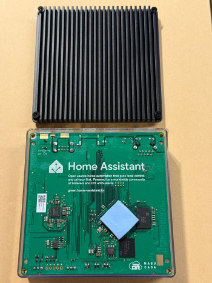

](https://www.home-assistant.io/green/)Home Assistant Green

My 2025 began with leaning in to using AI more and more when trying to solve thorny HVAC woes that were mostly related to a rather poor installation done during 2022 when skills and labor were both in short supply. To extend my skills beyond what I'd normally be able to tackle, Perplexity became my technical advisor. [Home Assistant Green](https://www.home-assistant.io/green/) was another friend of mine, tying all my HVAC components together in novel ways, and supplementing or improving the heating, cooling, humidification, dehumidification, and ventilation of my all-electric home.
[

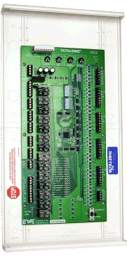

](https://ewccontrols.com/uzc/)EWC UZC4 Zone Damper Controller enables precise temperature control on a room-by-room basis.

Things got especially rough during a January cold snap. I was doing a lot of HVAC ductwork reworking in the attic. During that process, I needed to get some tips on the tuning and wiring of my poorly installed yet new heat pump system. I was fighting off frostbite during some 15 hour days up there. During one stretch of 6 full days of attic work in a row, I was using [Perplexity](https://www.perplexity.ai/) on iOS a whole lot. The goal was to keep the house and its occupants reasonably comfortable during this major re-do of the ductwork, without undue discomfort for the occupants below. Admittedly, I did have a phone-a-friend when absolutely necessary, with a family member in the HVAC business, but he wasn't always available.

By February, this labor-intensive surgical replacement was successful. I reduced the ducts to about 1/3 of their original length for much better efficiency and comfort. I also replaced the basic HZ432 TrueZONE zone dampers with reputable and reliable EWC Controls UZC4 (Universal Zone Control) controllers from SupplyHouse, along with much better transformer that can handle years of attic heat.
[

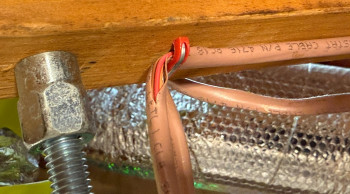

](https://cdn.tinkertry.com/content/articles/1180-tinkertry-2025-home-tech-refresh/thermostat-wire-done-wrong.jpg)What could possibly go wrong? Even though splicing would be faster, I ripped it out and ran all new wiring. Additionally, whenever there were 2 thermostat wires where the second wire was just there because the original wire didn't have enough conductors so the color coded connections were now all messed up, both cables were replaced with the proper 18/10 wire that should have been strung in the first place.

Finally, after much frustration troubleshooting and discovery of sometimes up to 3 splices on brand new runs of improper 6/3 thermostat wiring buried under R40 insulation I had installed, I decided the only right move was to rip-and-replace all of the hundreds of feet of old and new but all unlabeled wiring. Any 6/3 wiring was also limiting my Bosch IDS 2.0 system's multi-stage control abilities. I carefully labelled each of the direct runs of new, proper [18/10 thermostat wire](http://amazon.com/dp/B0D7CG2Z7C?tag=tinkertryamzn-20) to each of my 7 [ecobee Smart Thermostat Premiums](https://www.ecobee.com/en-us/smart-thermostats/smart-thermostat-premium/), then meticulously sealed up every top plate hole that various contractors had left wide open. No more splices waiting to become future points of failure in our "forever" home, renovated to help us age in-place with grace, with less to go wrong, with better comfort and healthy, filtered air.
[

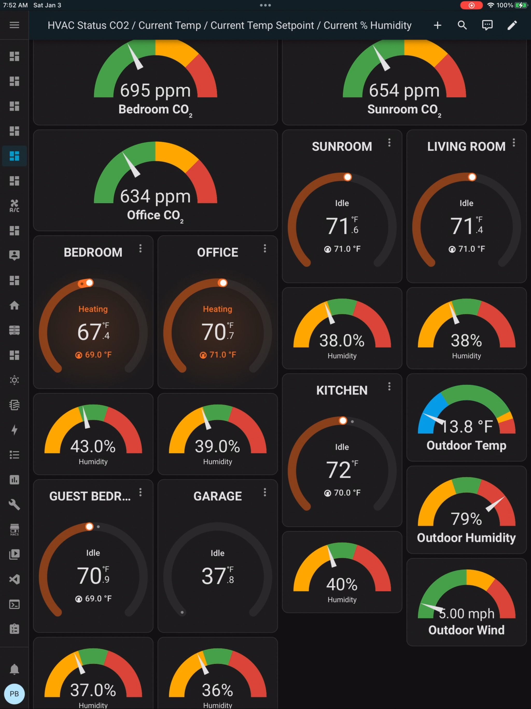

](images/tinkertry-03-img05.webp)Home Assistant can show all ecobee thermostats on one Dashboard, and more!

In the process of all this arduous but necessary manual labor, I easily saved my wife and I many tens of thousands of dollars. I'm glad I was available to tackle much of this work myself, doing far better work than any of the many contractors who rushed things back when we renovated and moved in September of 2022. I was waiting for my new job's start date in February anyway.

Another benefit was that there are no longer any HVAC mysteries to me. I now have a good understanding of *every* aspect of the entire HVAC system, no matter which future contractor helps me with any more serious repairs such as refrigerant leaks or recharges. It's all clearly labeled and easily understood by any professional.

Troubleshooting will be easier too. This helps me sleep better at night. In the end, it was quite gratifying to learn new things that any reasonably skilled DIYer can do better than pretty much any rushed contractor. All the better for me to get in better shape while doing months of attic gymnastics. We can now feel the tangible benefits of my efforts every day, all year long, hopefully for decades to come.

### FEBRUARY to MARCH

[

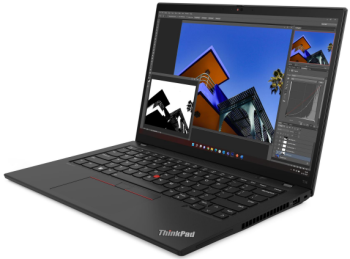

](https://cdn.tinkertry.com/content/articles/1180-tinkertry-2025-home-tech-refresh/ThinkPad.png)

I started a new chapter—in my long and varied IT career—working full time at Travelers in nearby Hartford. I quickly found I have much to learn from the talented group of elite IT professionals I'm working with. We work on some thorny problems together as a team. Coming into this role from the vendor world, I greatly appreciate that they welcomed me in. I was quite relieved to be equipped with a solid and speedy ThinkPad, featuring the TrackPoint that I've been using for nearly 3 decades. It is also my first AMD CPU system ever, and it wouldn't be my last in 2025. Read on.

### APRIL

I gave up waiting for a viable successor to the Intel Xeon D-1500 series that could be suited for home lab use. It's not happening, especially since I really need to be able to suspend/sleep/hibernate my PC when it's not in use. Server class gear generally does not allow this. In addition to this reality, there was also the way that Broadcom was treating home lab enthusiasts since they acquired VMware in 2023, a company that was much loved by hundreds of thousands of IT Professionals, many of whom have frequented TinkerTry in the past.

I did manage to get Broadcom's basic, perpetual, but unsupported and un-upgradeable ESXi 8.0 Update 3e hypervisor running on my existing SuperServer. This was my only viable way to access my most-valued VMs, giving me time to deciding what to do with my tens of terabytes of VMs. This hypervisor re-installation required way more time and effort than I had hoped, necessitating a re-install and re-import of all my VMs. It also means I'm leaving the goodness of vMotion, and all the other benefits of vSphere via VCSA, behind me. Sigh. Well, I'm still thankful for the 25+ years of career growth and joy VMware had given me, along with inspiring me to start this blog almost 15 years ago.

My decade-old, trusty Supermicro SYS-5028D-TN4T mini-tower server is stuck on Windows 11 21H2 and can't run the latest versions, and its modest GPU capabilities can't effective handle a 5K monitor either. So it was time to order a new PC, destined to be my daily driver for the upcoming Windows 11 25H2. After doing a bunch of research, I chose to place my order for the top-end-specs Framework Desktop, with 128GB of RAM soldered in. I then tried not to think about it too much, during the multi-month wait for Framework production to ramp-up. For a while it looked like I'd be lucky if it arrived by year-end.

It is surprising and a bit strange for me to leave Intel CPUs and most of my VMware homelab investments behind me, but adapting to inevitable change is the reality of any IT professional.

### MAY

##### Dell UltraSharp 40 Curved Thunderbolt™ Hub Monitor - U4025QW (5K)

You can check out all the specs on this 5120 x 2160 x 120 Hz beast with a built in KVM at [Dell](https://www.dell.com/en-us/shop/dell-ultrasharp-40-curved-thunderbolt-hub-monitor-u4025qw/apd/210-bmdp/monitors-monitor-accessories). In short, I really like this 5K monitor, and I was finally able to ditch a lot of bulky cables for a single, albeit pricey [Apple Thunderbolt 4 (USB-C) Pro Cable (3 m)](https://www.amazon.com/dp/B09V4923GP?tag=tinkertryamzn-20) ​​​​​​​attached to my ThinkPad in my basement, right below my quiet home office. Finally the dream is alive, one cable for everything, without requiring separate power, display, and ethernet cables or a docking station. That's right, the laptop's AMD Ryzen based USB4 worked well when connected to the Dell monitor's Thunderbolt 4 input. Also, no noise or heat near me. It all works well only with this particular cable, given my need for 3 meter length, quite a bit longer than the 1.5 meter / 4.5 foot cable it came with. No other 3 meter USB4 cables I had tried worked at all.

While Planning ahead for my Framework Desktop, I intended to use a quality DisplayPort cable to the 2nd Dell monitor input for what would become my daily-driver, my new Windows 11 workstation. This is also a challenge beyond 6 feet, but this particular [StarTech.com 7.6m (25ft) Active DisplayPort 1.4 Cable, 8K DP Cable with HBR3, HDR10,8K 60Hz, 4K 120Hz - M/M DP Cord](https://www.amazon.com/dp/B0CG9VMZ1T?tag=tinkertryamzn-20) actually worked out perfectly, handling those 5K of pixels without issue. Yay!

Finally, it was pretty fast and easy to switch back-and-forth between my work laptop and my personal PC, with no need for a pricey and clumsy separate 5K capable KVM switch. I also added two [Plugable 4K DisplayPort and HDMI Dual Monitor Adapters](https://www.amazon.com/dp/B08F2SZQYX?tag=tinkertryamzn-20) connected to the Dell Monitor's front USB C ports for maximum bandwidth (that AI also helped me research). Now I was able to have 2 additional 1920x1080 Dell monitors flanking this 5K display. I use Dell Display Manager to handle color adjustments on all 3 monitors, and all 3 monitors are usable by either system. Yay!

##### Net zero energy cost objective achieved!

My wife and I finally received our very first VPP (Virtual Power Plant) participation reimbursement check for our participation in the summer of 2024. The check was for $3,207.51!

It was a long struggle, with a superstar at Eversource to thank for going to bat on my household's behalf. She smoothed out some major wrinkles with the enrollment process, and ultimately came out victorious for us and for many other Connecticut customers caught up in late 2024 enrollment process snafus. Subsequent years are expected to be much smoother, with payments expected to arrive much sooner.

So the cost of heating can spike during cold snaps in an all-electric home when living in New England, but this VPP reimbursement contributes to offsetting that. We have 2 EVs, so when I say net zero energy cost, I'm also talking about both our living and our transportation needs, especially as we frequently visit family in New York and Boston. The total of those costs minus this rebate check means we come out a little ahead per year. This is the ultimate vindication - the math for the huge risk we took placing our order for solar + battery storage way back in summer of 2022 finally paid off.

All our home's energy comes largely from the sky now, instead of domestic or foreign dinosaur juice. We disconnected the natural gas line, reducing our risk. We don't have to be nearly as concerned with rising energy prices (electric or gas) as our neighbors. Speaking of neighbors, they benefit from less strain on the grid due to our near-daily exports of excess daytime solar during about 7 months of the year.

### JUNE

Silly Nano Banana Pro AI-generated cartoonish image of a lap choly, highlighting the modern use of glue instead of staples or sutures. For me, glue sped up healing and avoided my usual reaction to sutures.

Suddenly my gall bladder decided it no longer wanted to be with me, in a most painful and urgent way. Hasty weekend [lap choly](https://muschealth.org/medical-services/digestive/gi-procedures/laparoscopic-surgery/laparoscopic-cholecystectomy) removal was needed, laying me up for a while just as the weather was getting better. Afterward, the surgeon told me how full of stones and sludge my gall bladder was, so good riddance to that organ! Only later did I realize the issues it had been causing me for well over a decade.

The recovery also meant a restriction on lifting. Unfortunately, I hadn't quite finished installing insulation on an exposed section of attic duct-work, so when the weather got unusually toasty in Connecticut for this early in the year (around 100F), the condensation on that bare metal went crazy. It soaked a section of ceiling right in our living room. Awesome! To reduce the annoyance, we had to ask for a bit of help. This mishap was really bad timing, and a reminder that even warmer summers are likely in our future. I'm glad we are now better prepared.

### JULY to NOVEMBER

My old [Ubiquiti EdgeRouter 4](https://tinkertry.com/eero-pro-6-review#:~:text=Ubiquiti%20EdgeRouter%204) and my old Netgear unmanaged switches were running into trouble, suddenly taking my network down at random times. Not good when your new IT job involves some time working from home. My 2019 [Eero Pro APs](https://tinkertry.com/eero-pro-6-review) were designed for a wireless mesh, but they were never great at behaving in bridged mode when using my wired back-hauls. Time for a major network refresh and true WiFi 7 APs, so during my recuperation the rip-and-replace of every important electronic item that was older than 8 years began, starting with the network. All of the network except the 10 Gig ready Cat6a cabling I had already run.

##### Network

[

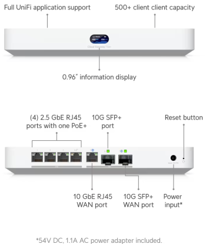

](https://store.ui.com/us/en/category/all-cloud-gateways/collections/cloud-gateway-fiber/products/ucg-fiber)UCG-Fiber

1 Ubiquiti [Cloud Gateway Fiber](https://store.ui.com/us/en/category/all-cloud-gateways/collections/cloud-gateway-fiber/products/ucg-fiber) (UCG-Fiber)

1 Ubiquiti [Pro Max 48](https://store.ui.com/us/en/category/all-switching/products/usw-pro-max-48) (USW-Pro-Max-48)

2 Ubiquiti [U7 Pro XGS](https://store.ui.com/us/en/category/all-wifi/products/u7-pro-xgs) (U7-Pro-XGS)

Awesome to finally be in the UniFi world that so many have raved about for years, and great timing that this fast and affordable router (Cloud Gateway Fiber) came out just as my EdgeRouter 4 was flaking out. It wasn't easy to find in stock, but a bit of persistence (along with stock alerts) paid off in the end.
[

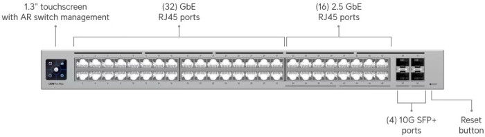

](https://store.ui.com/us/en/category/all-switching/products/usw-pro-max-48)Ubiquiti Pro Max 48 Layer 3 Switch, featuring 1 GbE / 2.5 GbE / 10 GbE / 4 10G SFP+

##### UPS conversion from Lead Acid to LFP

All 9 of my [CyberPower PFCLCD UPSs](https://tinkertry.com/superguide-cyberpower-pfclcd-ups-mini-towers-protect-your-homes-computers-and-entertainment) (Uninterruptable Power Supplies) from CyberPower were past their service life. My whole home is now on battery backup anyway, and I was never a fan of old-fashioned lead acid batteries needing to be replaced every 3-5 years. I also wasn't thrilled with stories online about possible smoke and fire risks, as described in [this Neowin article about aging yellow glue](https://www.neowin.net/news/beware-your-cyberpower-ups-with-yellow-glue-inside-could-burn-up/). I also wasn't thrilled with CyberPower's response to my inquiry about this potential hazard.

I removed them all from service, then removed the lead acid batteries. I took additional steps to prevent re-use by cutting the cords and removing/breaking the circuit boards. Then I brought this pile of sorted ewaste to my nearest recycling center, placing each component in the appropriate bin.

Which (roughly 8 year life) LFP based modern battery backup has a fast cut-over time? Fast enough for my PC & networking devices, so that they can endure the brief interval of time before my battery storage system kicks in during power blips or outages? There was really only one LFP option that currently meets this need. It's the [EcoFlow RIVER 3 Plus Portable Power Station](https://us.ecoflow.com/products/river-3-plus-portable-power-station) that features a USB port to signal my Windows 11 system that an AC power outage has occurred, and for power monitoring. During my normal everyday use, the EcoFlow's fan doesn't turn on, another plus. Once I start using more local LLMs, that may change.
[

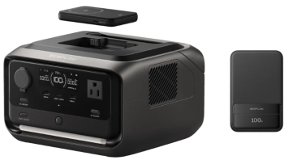

](https://www.costco.com/p/-/ecoflow-river-3-plus-wireless-boost-combo/4000358863)

EcoFlow's [website clearly states this key spec](https://us.ecoflow.com/products/river-3-plus-portable-power-station):
> 
> 

> 
- **<10 ms pro-grade UPS for precision devices**
> 
- 600W rated output and 1200W X-Boost
> 
- Up to 2× runtime for light-wattage appliances
> 
- Expandable up to 858Wh with a wire-free connection
> 
- Compact and lightweight
> 

> 

From Costco - [EcoFlow River 3 Plus Wireless Boost Combo](https://www.costco.com/p/-/ecoflow-river-3-plus-wireless-boost-combo/4000358863), the Costco-exclusive bundle that adds a 2nd portable battery bank for travel, and was listed for $80 off when I ordered mine.

Also available from Amazon - [EF ECOFLOW Portable Power Station RIVER 3 Plus, 286Wh LiFePO4 Battery, 3 Up to 1200W AC Outlets, <10 MS UPS, Expandable to 858Wh, <30 dB Quiet, 1Hr Fast Charging Solar Generator for Outdoor Camping/RV](https://www.amazon.com/dp/B0DCCB657J?tag=tinkertryamzn-20).

##### First Alert Interconnected Smoke/Fire/CO Alarms

[

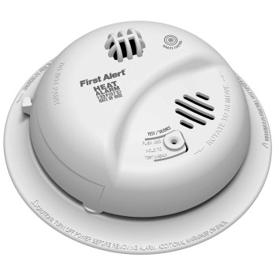

](https://www.firstalertstore.com/store/products/brk-brands-hardwire-heat-alarm-with-battery-backup-hd6135fb.htm)

There have been changes in the First Alert ONELINK product family since my 2013 article [My home's First Alert ONELINK system for smoke and carbon monoxide detection includes voiced warnings, with optional smartphone alerts](https://tinkertry.com/first-alert-onelink), and their incompatible replacements are much more expensive. Covering this properly will require a separate article, if there's interest. Finding a solution suitable for our battery-storage-system-equipped-garage that also meets local code is a challenge. Testing what deep AI research came up with as a solution will take me into 2026. Yes, I carefully checked AI's sources, and I sometimes pit one AI against another for who has the better answer.

##### Framework Desktop

[

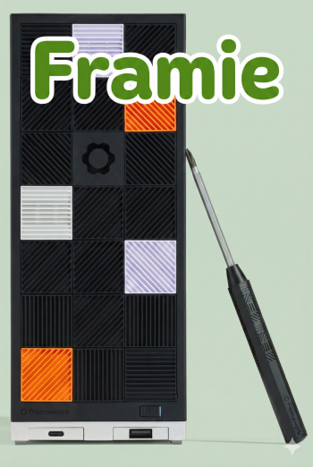

](https://frame.work/desktop)

My [Framework Desktop](https://frame.work/desktop) featuring:

- [AMD Ryzen™ AI Max+ 395](https://www.amd.com/en/products/processors/laptop/ryzen/ai-300-series/amd-ryzen-ai-max-plus-395.html) (soldered) with 16-cores/32-threads, 64MB L3 Cache, and up to 5.1GHz max boost (16x Zen 5, codename Strix Halo)

- [AMD Radeon 8060S iGPU](https://www.amd.com/en/products/processors/laptop/ryzen/ai-300-series/amd-ryzen-ai-max-plus-395.html#:~:text=Radeon%208060S%20Graphics%C2%A0) with up to 2.9GHz and 40 Compute Units

- 50 [TOPS](https://en.wikipedia.org/wiki/Floating_point_operations_per_second) [NPU](https://en.wikipedia.org/wiki/Neural_processing_unit), 32 [Tiles](https://en.wikipedia.org/wiki/AMD_XDNA#:~:text=AI%20Engine%20(AIE)-,tiles,-process%20data%20in)

finally arrived on September 29 2025. So far, so good! I hope to provide more details soon. I really like this thing. It sure is nice to have a system that can actually suspend and resume quickly and reliably, something my always-on for 8 to 10 years Supermicro Superservers couldn't ever do, so there are some serious watt-burn savings right there. Then there's the much lower watt burn at idle. Measuring everything is kind of my thing.

Oh yeah, I've dubbed this powerful but mini PC with a cutesy and unforgettable name. It's called **Framie**, of course.

I also added a motor to my old [ergotron WorkFit-S](https://www.ergotron.com/en-us/products/product-details/33-341#?color=black) sit-stand desk adapter, to handle the weight of the 3 monitors that go well beyond the weight it was designed for. Now I just push a button for up or down, very handy for longer meetings.

Despite occasional mistakes, AI for problem solving feels too good to be true, especially at $20 per month per subscription. I suspect we'll all find out whether this is the case soon enough. Meanwhile, having some local LLMs to run that are mine to keep could help provide some protection against price hikes and eventual [enshittification](https://en.wikipedia.org/wiki/Enshittification).

##### Home Assistant Upgrades

- **Yolink Temperature, Humidity, and Leak Detectors**

I have installed 20 [Yolink Sensors](https://shop.yosmart.com/) featuring [LoRa](https://shop.yosmart.com/pages/explore-home-page) (Long Range / Short Range) for extremely long range and multi-year battery life. These devices have helped me tune my HVAC by measuring temperatures at the air handler and registers, along with measuring outdoor temperatures locally, avoiding cloud reliance for HVAC automation. Finally, they offer inexpensive devices to watch for leeks, beeping loudly and alerting you via phone for leaks. The dread of many homeowners is a major leak when you're away. These Yolink devices can be connected to whole-home water main shut-off devices like my [Flo by Moen](https://shop.moen.com/pages/flo-smart-water-monitor) using Home Assistant. This is one of many solutions to try to reduce the chances of serious home flooding, even when you're not home. Implementing the Flo wasn't without issues, issues I plan to detail in the future.

[

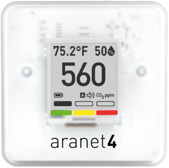

](https://aranet.com/en/home/products/aranet4-home)

- **1 External Thread Antenna**

[Home Assistant Connect ZBT-2](https://www.home-assistant.io/connect/zbt-2/) adds an OpenThread Border Router for Matter devices

- 

**1 [ESP32-C3 Module](https://www.amazon.com/dp/B0D63DRLGG?tag=tinkertryamzn-20)**

to enable centralized placement of a Bluetooth antenna for my Bluetooth-based CO2 Detectors

- **3 [Aranet 4 CO2 Detectors](https://www.amazon.com/dp/B07YY7BH2W?tag=tinkertryamzn-20)**

used to successfully create smart ERV control automations, since my 7 ecobee Smart Thermostat Premium devices' CO2 detection was inadequate

- **3 AIs - [Perplexity](https://www.perplexity.ai/), [ChatGPT](https://chatgpt.com/), and [Claude](https://claude.ai/)**

for tweaking my YAML code for my HVAC automations, which all help me extend my capabilities well beyond my own skillset. Vibe coding is a thing. Vibe troubleshooting is a thing too, at least to me.

### DECEMBER

#### Internet

[

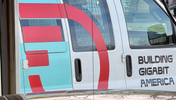

](https://cdn.tinkertry.com/content/articles/1180-tinkertry-2025-home-tech-refresh/Frontier-Van-with-Building-Gigabit-America.jpg)

There's a multi-year backstory here. In 2024, GoNetSpeed visited to have a look at my neighborhood, finding that their fiber made it to within 1/3 mile of my home, but they didn't have any plans to extend it. In other words, a dead-end, a no go.
[

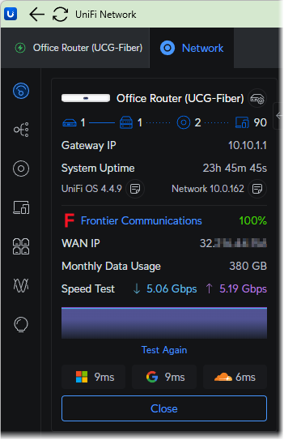

](images/tinkertry-03-img17.webp)UniFi Dashboard view on iOS, showing I'm getting my 5 Gig service I paid for, even in the middle of a business day. Also, very low latency to cloud services from Microsoft, Google, and AWS. Some days it's just 5 to 6 ms for all 3!

I then learned that only about 3% of my home town of Wethersfield still somehow had no wired competitor to Cox Communications, an internet service provider based on DOCSIS 3.1 for 1 Gbps down and 100 Mbps up for my street, and good for 2 Gbps on other streets. A bigger problem was that I found myself with frequent VPN and SSH disconnects, along with glitches in web meeting sound quality due to latency spikes and jitter, along with increasingly frequent random and unexplained internet outages.

As soon as [Frontier Fiber](https://frontier.com/ftr-buy?user_id=100651&affiliateKey=c75de3d7-1f0b-4d0d-8603-02aa8517357f&utm_campaign=customerreferral&utm_term=frontier-cart&utm_medium=click-to-copy&utm_source=web) internet became available on my street, I placed my order and the installation was booked for just 3 days later. It's a good thing I had already prepared with the Ubiquiti Cloud Gateway Fiber I had installed earlier this year. After a simple 2 hour install, I was finally enjoying 5 Gig service (5 Gbps up / 5 Gbps down, symmetrical) internet based on (previously unused) "dark" fiber. Something I've been wanting for decades. Frontier leverages the latest [XGS-PON](https://en.wikipedia.org/wiki/10G-PON) tech, which stands for 10 Gigabit-capable Passive Optical Network. Perhaps good things do come to those who wait.

Frontier also supports 7G symmetrical internet to my home if I choose to upgrade some day, using the same ONT that's already installed in my home. Verizon stopped their older, slower FiOS expansion to small portions of Connecticut a very long time ago, a service based on GPON (Gigabit Passive Optical Network) tech from 2003, maxing out at 2.488 Gbps down and 1.244 Gbps up.

Gee, do ya think that Frontier's newer, faster underlying technology could have something to do with why [Verizon is buying Frontier](https://newsroom.frontier.com/press-release/frontier-stockholders-approve-acquisition-by-verizon/) in a deal that's expected to close sometime in early 2026?
[

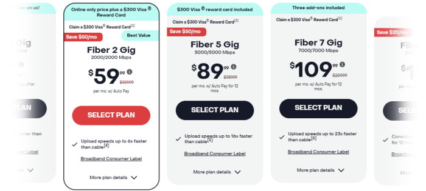

](https://frontier.com/ftr-buy?user_id=100651&affiliateKey=c75de3d7-1f0b-4d0d-8603-02aa8517357f&utm_campaign=customerreferral&utm_term=frontier-cart&utm_medium=click-to-copy&utm_source=web)Disclosure - this is a referral link.

### About the author

[

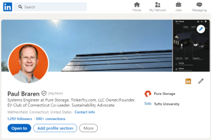

](https://www.linkedin.com/in/paulbraren/)Paul Braren on LinkedIn. Technology Operations Engineer at Travelers. Formerly Systems Engineer at Pure Storage, Dell Technologies, VMware, and IBM. TinkerTry.com, LLC Owner/Founder. EV Club of Connecticut Co-Leader. Sustainability Advocate.

*Paul Braren is an* [*IT professional*](https://www.linkedin.com/in/paulbraren/) *and* [*tech blogger*](https://tinkertry.com) *who covers PCs, EVs, home tech, efficiency, and more. Paul has authored over 1,200 long-term technical articles and [500 videos](https://www.youtube.com/TinkerTry) since founding TinkerTry.com over the past 14.5 years, most recently increasing his focus on sustainability and creating* [*EV articles*](https://TinkerTry.com/EVs) *and* [*videos*](https://www.youtube.com/playlist?list=PLCuu-J0IWcS4yzNJ0DQkJfJEeSzso9obg)*, along with helping the* [*EV Club of Connecticut*](https://evclubct.com/leadership-team-bios/) *since purchasing his first EV in 2018.*

***Disclosure:*** *I hold no stocks and never held stocks in any of the tech companies mentioned at TinkerTry, including any company mentioned in this article whose products were purchased from public sources at listed prices.*

[

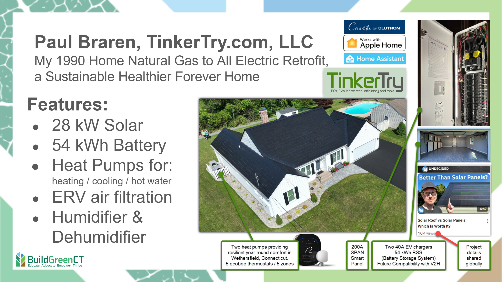

](images/tinkertry-03-img20.webp)If you happen to also be interested in a series of technical articles and more videos about all the challenges that went into ripping out our baseboard heat and natural gas lines and going all-electric, while also upgrading the windows and insulation and air-tightness using AeroBarrier, consider using the Follow links listed below.

If you happen to also be interested in a series of technical articles and more videos about all the challenges that went into ripping out our baseboard heat and natural gas lines and going all-electric, while also upgrading the windows and insulation and air-tightness (AeroBarrier), consider using the Follow links listed below.

#### Follow

[

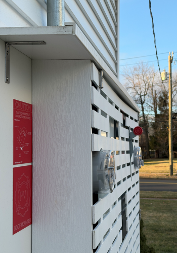

](https://cdn.tinkertry.com/content/articles/1180-tinkertry-2025-home-tech-refresh/2026-01-01_02-32-14.png)My all-electric home's utility entrance panel.

Read more about me [here](https://tinkertry.com/about#about-me).

Follow my work at:

- Bluesky [@paulbraren.bsky.social](https://bsky.app/profile/paulbraren.bsky.social)

- Mastodon [vmst.io/@paulbraren](https://vmst.io/@paulbraren)

- X - Inactive, with my Twitter archive [@paulbraren](https://twitter.com/paulbraren)

- Founder of [TinkerTry.com](https://tinkertry.com) - PCs, EVs, home tech, efficiency and more

- [TinkerTry.com/EVarticles](https://tinkertry.com/EVarticles) | [TinkerTry.com/EVvideos](https://tinkertry.com/EVvideos) | [Weekly Email](https://list-manage.us2.list-manage.com/subscribe/post?u=0321e0e2cda1cb28cdf66b4ef&id=2232124c16) | [RSS](https://tinkertry.com/rss)

- Member of [EV Club of CT Leadership Team](https://evclubct.com/leadership-team-bios/), Manager of [@EVClubCT](https://twitter.com/EVClubCT) & [EVClubCT Channel](https://youtube.com/EVClubCT?sub_confirmation=1)

If you're interested in following my biggest sustainability project ever that details my (mostly) successful effort to go all-electric at my home using heat pumps, solar, and batteries, consider [subscribing to the TinkerTry YouTube Channel](https://youtube.com/TinkerTry?sub_confirmation=1), then click on the alarm icon to get notified of new videos. Also consider showing your support on my [Patreon](https://www.patreon.com/tinkertry) page.

### See also at TinkerTry

- Paul Braren's [podcast guest appearances](https://tinkertry.com/category:Podcasts)

- EV articles at [TinkerTry.com/EVs](https://tinkertry.com/EVs)

- EV videos at [TinkerTry.com/EVvideos](https://tinkertry.com/EVvideos)

---

*Originally published at: [https://tinkertry.com/articles/tinkertry-2025-home-tech-refresh](https://tinkertry.com/articles/tinkertry-2025-home-tech-refresh)*