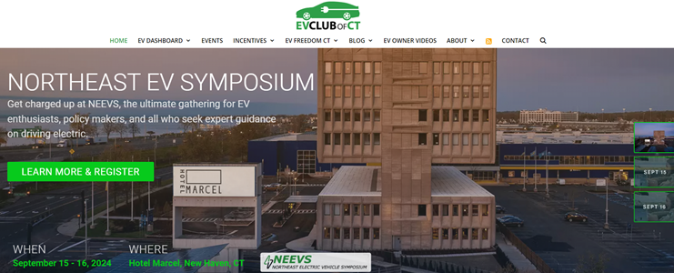
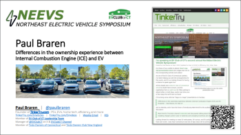
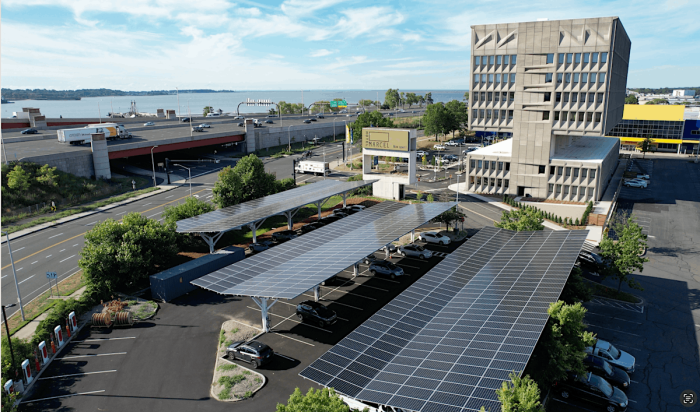
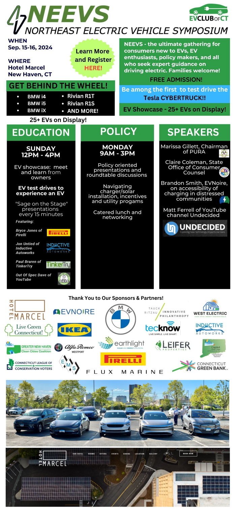
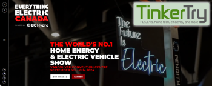
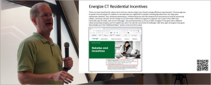
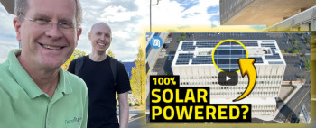

# Presented at the 2nd NorthEast Electric Vehicle Symposium

> **Source:** [TinkerTry](https://tinkertry.com/articles/speaking-at-neevs-2024)  
> **Date:** September 4, 2024  
> **Tag:** `homelab`

---

Tap/click the thumbnail image above to view my presentation "Differences in the ownership experience between
Internal Combustion Engine [ICE] and EV"

*For those of you unable to attend,* ***[here's my full presentation deck](https://tinkertry.com/files/Paul_Braren_NEEVS_Preso_Sep_14_2024_1043pm.pdf)*** *with images that link to the corresponding articles and videos! Original article appears [below the videos](https://tinkertry.com/speaking-at-neevs-2024#original-article).*

### Video

### Original Article

As one of the EV Club of Connecticut Leaders, I've been helping out with the arrangements for this event. I'm very much looking forward to having a chance to speak this year again too.

All the details are in [this EV Club of Connecticut article](https://evclubct.com/event/neevs-2024/) by leader Barry Kresch, with the registration form [right here](https://www.eventbrite.com/e/northeast-electric-vehicle-symposium-neevs-2024-tickets-922359190167?aff=oddtdtcreator) for folks wishing to attend either or both days, and/or test drive one of the many EVs we'll have on-hand.

I'll be doing some informal "Sage on a Sage" presentations on Sunday:
> 
> 

Differences in the ownership experience between Internal Combustion Engine (ICE) and EV. Presenter – Paul Braren, EV Club CT
> 

and on Monday, and I have the honor of introducing Matt Ferrell to the audience for the panel discussion:
> 
> 

Matt Ferrell of YouTube channel [Undecided](https://www.youtube.com/@UndecidedMF) and discussants talking about their experiences in installing chargers and/or solar or batteries and wrangling incentives and utilities.
> 

Looking forward to meeting so many EV enthusiasts, EV-curious, and EV policy makers at this bigger-than-ever event. I also hear Connecticut local [Out of Spec Dave](https://www.youtube.com/@outofspecdave1554) will be joining us too, a Connecticut/Florida snowbird widely known for his wealth of experience road tripping in impressively wide variety of EVs he and his wife have owned.

### Update Mar 16 2025

Here's the [NorthEast Electric Vehicle Symposium Playlist](https://www.youtube.com/playlist?list=PLCuu-J0IWcS6-zH5pLDhaTX6Jt1Ic4PLx), and here's the list of discussion panelists:

- 

Matt Ferrell – Panel Discussion Moderator

YouTube creator specializing in sustainable and renewable technologies

- 

Sharon Huttner

Speech/Language Pathologist at Language and Speech Therapy

- 

Ilene Mirkine

Independent Marketing and Advertising Professional

Participated in our EV Charging Incentive meeting.

- 

Michael Frisbie

Owner at Noble Energy Real Estate Holdings

Noble + EV

[https://noblemarketsusa.com](https://noblemarketsusa.com)

- Stephan Hartmann

Director of Commercial Sales at Earthlight Technologies

[https://www.earthlighttech.com/Matt](https://www.earthlighttech.com/Matt) Ferrell – Panel Discussion Moderator

YouTube creator specializing in sustainable and renewable technologies

### About the author

#OpenToWork. Formerly Systems Engineer at Pure Storage, Dell Technologies, VMware, and IBM. TinkerTry.com, LLC Owner/Founder. EV Club of Connecticut Co-Leader. Sustainability Advocate.

*Paul Braren is an* [*IT professional*](https://www.linkedin.com/in/paulbraren/) *and* [*tech blogger*](https://tinkertry.com) *who covers PCs, EVs, home tech, efficiency, and more. Paul has authored over 1,200 long-term technical articles and [500 videos](https://www.youtube.com/TinkerTry) since founding TinkerTry.com over the past 13.75 years, increasing his focus lately on creating* [*EV articles*](https://TinkerTry.com/EVs) *and* [*videos*](https://www.youtube.com/playlist?list=PLCuu-J0IWcS4yzNJ0DQkJfJEeSzso9obg)*, along with helping the* [*EV Club of Connecticut*](https://evclubct.com/leadership-team-bios/) *since purchasing his first EV in 2018 - a Tesla Model 3 Long Range - replacing his 2006 Honda Civic Hybrid.*

***Disclosure:*** *I hold no stocks and never held stocks in any of the tech companies mentioned at TinkerTry, including Tesla and any other company mentioned in this article.*

If you happen to also be interested in a series of deeply technical articles and more videos about all the challenges that went into ripping out our baseboard heat and natural gas lines and going all-electric, while also upgrading the windows and insulation and air-tightness (AeroBarrier), consider using the Follow links listed below.

#### Follow

Read more about me [here](https://tinkertry.com/about#about-me).

Follow my work at:

- X (Twitter) [@paulbraren](https://twitter.com/paulbraren)

- Mastodon [vmst.io/@paulbraren](https://vmst.io/@paulbraren)

- Founder of [TinkerTry.com](https://tinkertry.com) - PCs, EVs, home tech, efficiency and more

- [TinkerTry.com/EVarticles](https://tinkertry.com/EVarticles) | [TinkerTry.com/EVvideos](https://tinkertry.com/EVvideos) | [Weekly Email](https://list-manage.us2.list-manage.com/subscribe/post?u=0321e0e2cda1cb28cdf66b4ef&id=2232124c16) | [RSS](https://tinkertry.com/rss)

- Member of [EV Club of CT Leadership Team](https://evclubct.com/leadership-team-bios/), Manager of [@EVClubCT](https://twitter.com/EVClubCT) & [EVClubCT Channel](https://youtube.com/EVClubCT?sub_confirmation=1)

- Member of [Tesla Owners - Connecticut](https://teslaownersct.com/) and [Tesla Owners Club New England](https://teslaownersnewengland.club/)

If you're interested in following my biggest sustainability project ever that details my (mostly) successful effort to go all-electric at my home using heat pumps, solar, and batteries, consider [subscribing to the TinkerTry YouTube Channel](https://youtube.com/TinkerTry?sub_confirmation=1), then click on the alarm icon to get notified of new videos. Also consider showing your support on my [Patreon](https://www.patreon.com/tinkertry) page.

### See also at TinkerTry

- Paul Braren's [podcast guest appearances](https://tinkertry.com/category:Podcasts)

- EV articles at [TinkerTry.com/EVs](https://tinkertry.com/EVs)

- EV videos at [TinkerTry.com/EVvideos](https://tinkertry.com/EVvideos) 

- [**I'm going to Everything Electric CANADA - World's #1 Home Energy & Electric Vehicle Show!**](https://tinkertry.com/going-to-everything-electric-canada)

Sep 2 by Paul Braren

#### 

- [**Tesla Solar Roof vs Solar Panels: Which is Worth It? - TinkerTry's home featured in Matt Ferrell's video and podcast**](https://tinkertry.com/tesla-solar-roof-compared-with-solar-panels)

Mar 19 2024

#### 

- [**Tesla Solar Roof - 33 yr. old Connecticut home successfully renovated & electrified. No more gas!**](https://tinkertry.com/tesla-solar-roof-before-and-after-video)

Oct 29 2023

#### 

- [**NEEVS Full Presentation Replay - Connecticut's vehicle & home electrification incentives - windows, insulation, heat pumps and solar**](https://tinkertry.com/home-electrification-incentives)

Sep 16 2023

#### 

- [**Featured on "Home Gadget Geeks" Episode #584 "Paul Braren and Lots of Stuff to Catch Up on! – HGG584"**](https://tinkertry.com/hgg584)

Sep 16 2023

#### 

- [**Featured on Gigacast 48 | TinkerHeldstab with Paul Braren and Matt Heldstab**](https://tinkertry.com/gigacast48)

Aug 10 2023

#### 

- [**EV Club of CT's smart electrical panel discussion featuring SPAN, electrician, & homeowner**](https://tinkertry.com/span-smart-panel-discussion)

Jan 09 2023

#### 

- [**Hotel Marcel in New Haven Connecticut, the world's biggest Passive House? Our tech tour featured on Undecided with Matt Ferrell!**](https://tinkertry.com/hotel-marcel-techology-tour)

Nov 01 2022

#### 

- [Rivian R1T EV pickup truck overview at Northeast Rivian Club event in Bridgeport Connecticut, owner Jazzy Jeff has 5,300 miles already!](https://tinkertry.com/northeast-rivian-club-event-in-bridgeport-connecticut)

May 15 2022

#### 

- [**Featured on Tech Breakfast Podcast 243 | EVs with Paul Braren | Aaron, Tyler**](https://tinkertry.com/tbp243)

Mar 25 2022

#### 

- [**Tesla Model 3 Boston and New York City Road Trip Tips - safely handle rain, snow, and heavy traffic with ease and efficiency**](https://tinkertry.com/tesla-tips-boston-snow-nyc-traffic)

Mar 24 2022

#### 

- [**Little House Brewing Company in Chester Connecticut, built in 1836, now has a Tesla Solar Roof!**](https://tinkertry.com/an-1836-brewery-gets-tesla-solar-roof)

Feb 02 2022

#### 

- [**Michelin CrossClimate 2 All Weather Tires Review - a safe year-round choice in rain/snow, hot/cold**](https://tinkertry.com/crossclimate2)

Dec 10 2021

> 

and waiting for test drives of various EVs (Cybertruck was a static display) [pic.twitter.com/X9wsYF6tGo](https://t.co/X9wsYF6tGo)&mdash; Paul Braren, TinkerTry.com ☀️🏠💻🔋🚗 (@paulbraren) [February 18, 2024](https://twitter.com/paulbraren/status/1759305578227146847?ref_src=twsrc%5Etfw)

---

*Originally published at: [https://tinkertry.com/articles/speaking-at-neevs-2024](https://tinkertry.com/articles/speaking-at-neevs-2024)*