# I Went to Everything Electric CANADA 2024

> **Source:** [TinkerTry](https://tinkertry.com/articles/going-to-everything-electric-canada)  
> **Date:** September 2, 2024  
> **Tag:** `homelab`

---

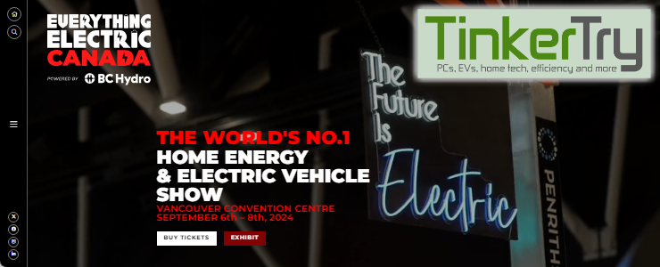

This article summarizes my experience with a podcast, a list of videos, and some stories. Enjoy!

### Podcast

Clicking/tapping above to listen requires you to be logged in to a Google account

Interested in an AI-generated podcast version of this article? Have a listen [here](https://notebooklm.google.com/notebook/ac3b76df-421f-4806-bd58-38d81d59f2f6/audio), it's generated by NotebookLM. Freaks me about a bit, how about you? Please feel free to leave your comments about this "podcast" or anything else about this article right at the bottom, no login required!

If you don't care to log in to your Google account to hear it, here's a shorter clip below:

 
Your browser does not support the audio element.

### Videos

Alternatively, you can autoplay the entire [playlist](https://www.youtube.com/playlist?list=PLCuu-J0IWcS6Aa_4BGcWczh_uZts9k17x).

While the Rivian [R2 was a no-show](https://www.reddit.com/r/Rivian/comments/1f6l4kw/comment/llcbrax/), I got a good look at the R3 by the best person to explain that lovely interior!

### Original Article Below

It's time I try something new. Between jobs is an excellent time for stretching beyond the comfort zones of the many IT-related conferences I usually attend like VMworld. The last time I truly ventured out beyond the world of IT was when I took vacation days to [attend CES in 2012](https://tinkertry.com/category:CES). I had a press badge there too, and that sure was a lot of fun. Attending this event sounds fun and even more purposeful to me.

*Disclosure: This is not a sponsored post, and all travel costs for this trip are at my own expense. I was provided a press pass for all 3 days at no charge, but there were no stipulations about what I would do while there or the content I create.*

### Home Energy

[

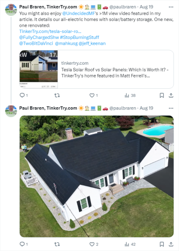

](https://x.com/paulbraren/status/1825711052748640613)Our renovated, all-electric smart home in Connecticut featuring solar, batteries and heat pumps for heating, cooling, and hot water. Our natural gas line has been disconnected.

I'm excited to announce that I'm going to Vancouver, Canada, from Friday, September 6, to Sunday, September 8, to examine the future of sustainability technology. It's great timing for me, and it's been a relief to finally see a growing portion of the world's population realize that moving away from relying on fossil fuels is the logical path forward, especially as climate change begins to affect them personally.

Other geopolitical issues come into play when it comes to energy, things we have no control over. Or do we? Here in Connecticut, our electric rates temporarily doubled recently, which sure was a wake-up call to my wife and I. So we took action and did something about it. Over the past few years, I'm seeing more and more IT folks I know personally taking similar actions. Meeting non-IT folks who are of similar mindsets at this event will undoubtedly be good for me, and the excitement I feel for this event reminds me of my glory days at VMware, talking to others about VMware & vSAN all over the US.
[

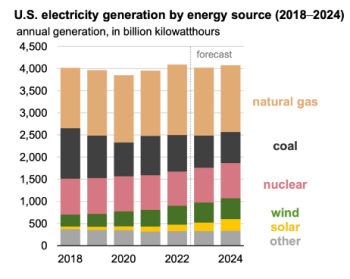

](https://www.ewg.org/news-insights/news-release/2023/01/2024-one-fourth-us-electricity-will-come-renewables-eia)

The transition toward finding ways to use much less energy to move around and get things made is happening. With each passing year, our grid is generally moving toward carbon-free ways of generating power. Naturally, the sources includes wind, solar, and battery storage systems. Climate change is becoming more evident to more people. We can do better with both transportation and manufacturing, and that transition is largely what this conference is all about.
[

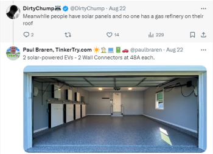

](https://x.com/paulbraren/status/1826733358174687459)Our home's "gas station" for our two EVs that are solar powered three of the four seasons. We have convenient 48A charging speeds capable of filling us both back up, even from empty, overnight. Grid power is needed for winter charging, using credits earned from 3 seasons of daily export and summer's Virtual Power Plant program.

This transition happening in both the production of energy and the new uses for it is huge, and not without its challenges. It touches so many industries. Sustainability technologies, or more specifically, all that goes into the process of the electrification of everything, is the area of technology that I've been focusing more of my time on lately, reflected in my content here at TinkerTry. I'm also testing VPP (Virtual Power Plant) and connected solution incentives, and following various V2H/V2G (Vehicle to Home, Vehicle to Grid) technologies.
[

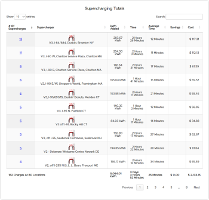

](https://cdn.tinkertry.com/content/articles/1178-going-to-everything-electric-canada/all-DC-Fast-Charging-Aug-31-2024.png)I've DC fast charged 182 times at 80 locations these past 5.75 years and 93,000 miles of Tesla Model 3 ownership 

What better place to go to meet a wide variety of companies that are in the sustainability space. I know I'm going to have a really good time talking to [the various exhibitors](https://ca.everythingelectric.show/exhibitors?&azletter=G&searchgroup=00000001-exhibitors) from all over the world.

I've been tinkering with my new [Virtual Power Plant](https://x.com/paulbraren/status/1829531633659330962) all summer long with my new, fully operational [27.6 kW solar and 54 kWh energy storage system](https://tinkertry.com/tesla-solar-roof-compared-with-solar-panels#specifications) at home. Topics like Vehicle to Grid, Vehicle to Home, and charge on solar all interest me greatly. I've also been closely following the challenges associated with AC and DC charging of EVs of all brands, as a guy who has Supercharged 182 times at 80 different locations in the US and Canada, and with family living in both Boston and New York City. Those 105 to 115 mile trips each way stretch my range in winter, or even in the summer if I use [tires with higher rolling resistance](https://tinkertry.com/crossclimate2), so the tracking of the real-world use of EVs & charging is very personal to me.

The Fully charged Show has long touted the [#StopBurningStuff](https://x.com/search?q=%23StopBurningStuff&src=typed_query) hashtag, and that's exactly what my wife and I did when we moved to our forever home 2 years ago, ditching "natural" gas and going all-electric, with the solar and battery storage aspects of this renovation featured in [this >1M video that Matt Ferrell kindly produced](https://tinkertry.com/tesla-solar-roof-compared-with-solar-panels#video-1-16-minutes-solar-comparison) earlier this year.

### Electric Vehicles

[

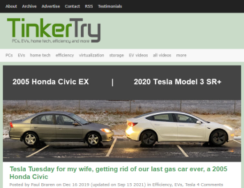

](https://tinkertry.com/tesla-tuesday)Tesla Tuesday for my wife, getting rid of our last gas car ever, a 2005 Honda Civic

After 30 years of mostly Honda Civics in our household, my wife and I went all EV, getting our [Tesla Model 3 EVs back in 2018 and 2019](https://tinkertry.com/tesla-tuesday). This decision turned out to be financially wise long-term, especially when I look back at how much business and personal travel I did in those years. This successful move to electric transport sparked my interest in the then-nascent electric vehicle industry as a whole, and led to some fun on the podcast rounds including the honor of being dubbed the electric vehicle correspondent at [Tech Breakfast Podcast](https://podcasts.apple.com/us/podcast/tech-breakfast-podcast/id1509842352). This interest also led to me becoming [one of the leaders](https://evclubct.com/leadership-team-bios/) of the EV Club of Connecticut.
[

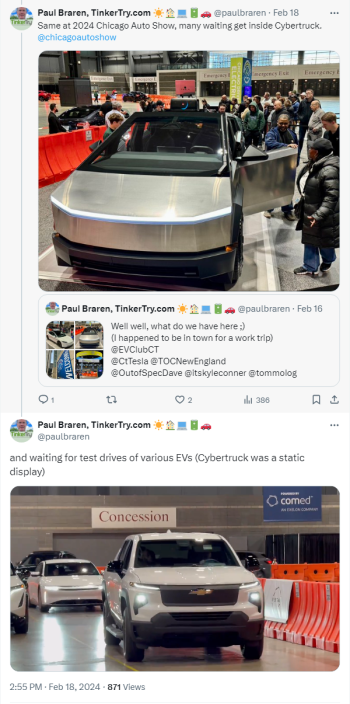

](https://x.com/paulbraren/status/1759305578227146847)

The last big car show I've attended was [Chicago Auto Show - The Nation's Largest Auto Show](https://www.chicagoautoshow.com/vehicles-on-display/electric/). I happened to be in town for a company's IT training, and I only had an hour to run around before my flight out, but what a hoot that was. The video I captured of so many EV makes being test-driven indoors without fumes was a pretty inspiring sight that I won't forget.

In addition to all the expected brands being there with many available for test drives, one of the more prominent, unique opportunities is this one. The [Rivian R2 and R3 will both be there to see](https://riviantrackr.com/news/vancouver-to-host-rivians-latest-ev-lineup-at-everything-electric-canada-2024/)! For me personally, this is a great opportunity to see first-hand the progress they've made since they gave the EV Club of Connecticut a sneak peek at a pre-production Rivian R1T way back in [May of 2021](https://tinkertry.com/i-saw-the-rivian-r1t-in-ct), asking for our feedback, which I loved to provide. I did get reminded that the software wasn't done yet, right as I started to try and use the touch-screen. If you know me, you know I enjoy a peek at leading (and sometimes bleeding) edge of tech, and it's safe to say I'll be seeing plenty more of that at this event.

### Undecided with Matt Ferrell

I've had the chance to meet Matt before. I first met at the world's first passive house certified [hotel tour](https://tinkertry.com/hotel-marcel-techology-tour), and again when his team produced a video of our respective homes. I very much look forward to being in the audience for his [many sessions](https://ca.everythingelectric.show/speakers/matt-ferrell) at this conference.
[

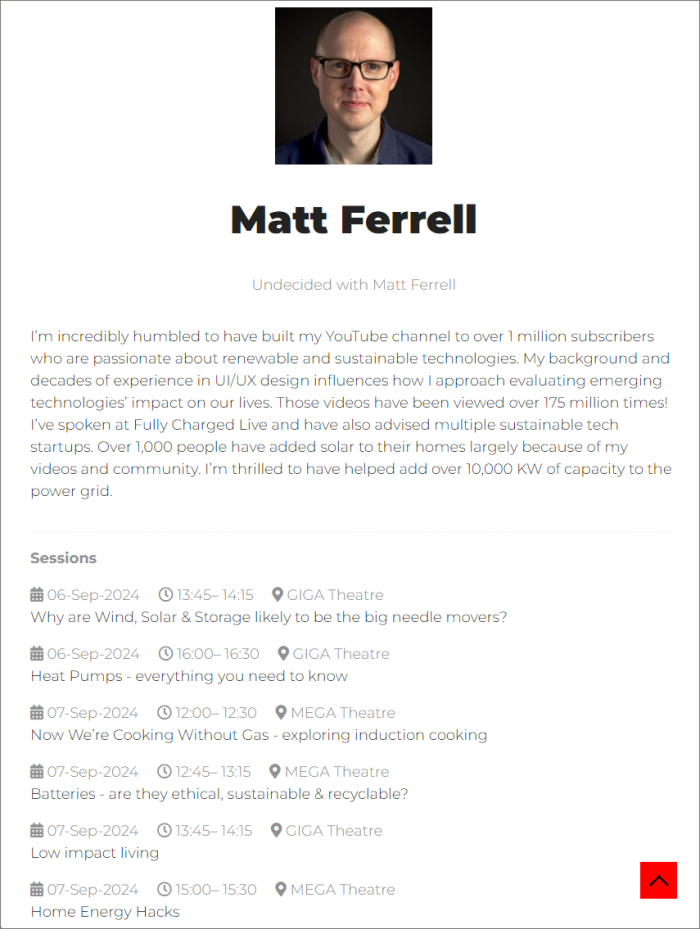

](https://ca.everythingelectric.show/speakers/matt-ferrell)

Matt also kindly agreed to help moderate our upcoming NEEVS (NorthEast Electric Vehicle Symposium) [panel discussion](https://evclubct.com/event/neevs-2024/#:~:text=talking%20about%20their%20experiences%20in%20installing%20chargers%20and/or%20solar%20or%20batteries%20and%20wrangling%20incentives%20and%20utilities) in New Haven Connecticut, and I have the privilege of being the person who gets to introduce him to the crowd.

### Munro & Associates

[

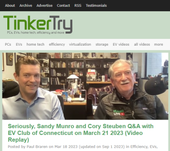

](https://tinkertry.com/sandy-munro-and-cory-steuben-on-ev-club-of-ct)

Sandy was kind enough to record a video with me, and I'm hoping to have a chance to meet him in person after one of his [many presentations](https://ca.everythingelectric.show/speakers/sandy-munro).

### Others

Along with meeting members of the press, I'm hoping to meet some of the content creators like Ricky/[Two Bit da Vinci](https://www.youtube.com/@TwoBitDaVinci), and maybe some of the staff of the UK-based [Fully Charged](https://fullycharged.show/podcasts/) show and podcast.

#### 

[

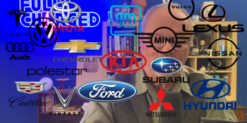

](https://cdn.tinkertry.com/content/articles/1178-going-to-everything-electric-canada/IMG_3514.PNG)

- **[Vancouver to Host Rivian’s Latest EV Lineup at Everything Electric CANADA 2024](https://riviantrackr.com/news/vancouver-to-host-rivians-latest-ev-lineup-at-everything-electric-canada-2024)**

Rivian R1T, R1S, R2, and R3 
> 
> 

Everything Electric CANADA and Rivian have announced that they will be bringing the the Rivian R1T, R1S, R2, and R3 to Vancouver, B.C. for the world’s number 1 home energy and electric vehicle show.
> 

### Closing

Feel free to leave a comment below this article if you have a suggestion for which exhibitor you'd like to see me visit or get some footage or photos of. I've been granted a press pass, which will give me great access, one of the perks of having a blog.

In case a reader of this article will be in attendance too, please [reach out to me](https://tinkertry.com/contact#email) so we can try to meet in person.

In the spirit of appreciating the nature that I've always loved so deeply, what better time for me to rent an EV to explore the area around Vancouver after the conference for a bit. Stay tuned to my travel adventures [here](https://x.com/paulbraren), if you're into photography and/or tech.

### Social

[

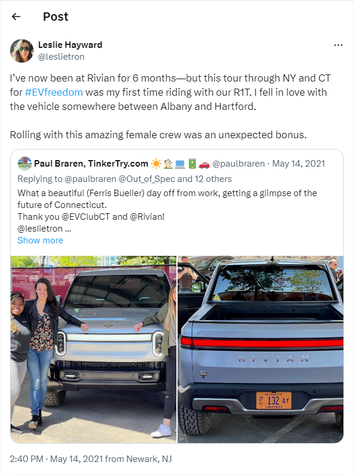

](https://twitter.com/leslietron/status/1393275104017137669)
[

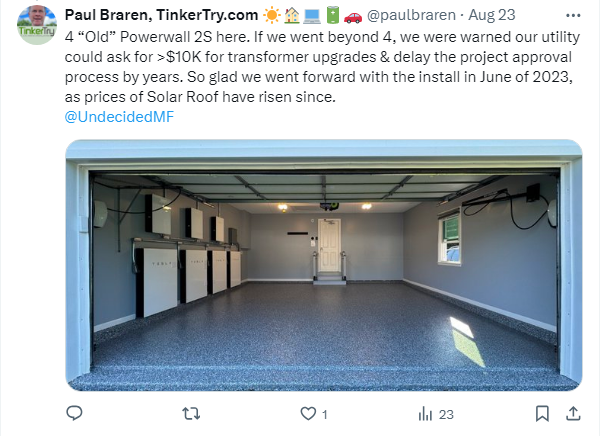

](https://x.com/paulbraren/status/1827073037285368033)

### Sep 14 2024 Update

I've already got some videos for you, in full 4K 60 fps glory. Minimal edits as I only had my iPhone 15 Pro Max and some Comica wireless mics with me, but I think some of these came out pretty well anyway. I've added them to the top of this article.
[

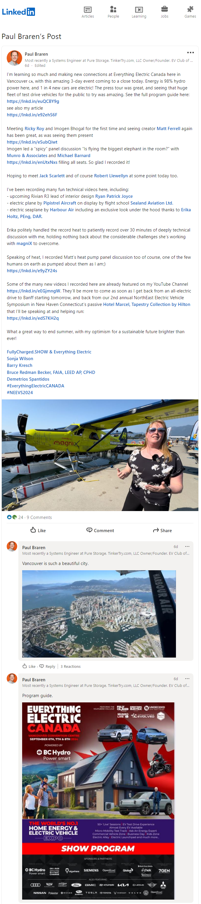

](https://www.linkedin.com/feed/update/urn:li:activity:7238580492718014465)My LinkedIn Post.

### About the author

Paul Braren on LinkedIn, #OpenToWork. Formerly Systems Engineer at Pure Storage, Dell Technologies, VMware, and IBM. TinkerTry.com, LLC Owner/Founder. EV Club of Connecticut Co-Leader. Sustainability Advocate.

*Paul Braren is an* [*IT professional*](https://www.linkedin.com/in/paulbraren/) *and* [*tech blogger*](https://tinkertry.com) *who covers PCs, EVs, home tech, efficiency, and more. Paul has authored over 1,200 long-term technical articles and [500 videos](https://www.youtube.com/TinkerTry) since founding TinkerTry.com over the past 13.75 years, increasing his focus lately on creating* [*EV articles*](https://TinkerTry.com/EVs) *and* [*videos*](https://www.youtube.com/playlist?list=PLCuu-J0IWcS4yzNJ0DQkJfJEeSzso9obg)*, along with helping the* [*EV Club of Connecticut*](https://evclubct.com/leadership-team-bios/) *since purchasing his first EV in 2018 - a Tesla Model 3 Long Range - replacing his 2006 Honda Civic Hybrid.*

***Disclosure:*** *I hold no stocks and never held stocks in any of the tech companies mentioned at TinkerTry, including Tesla and any other company mentioned in this article.*

If you happen to also be interested in a series of deeply technical articles and more videos about all the challenges that went into ripping out our baseboard heat and natural gas lines and going all-electric, while also upgrading the windows and insulation and air-tightness (AeroBarrier), consider using the Follow links listed below.

#### Follow

Read more about me [here](https://tinkertry.com/about#about-me).

Follow my work at:

- X (Twitter) [@paulbraren](https://twitter.com/paulbraren)

- Mastodon [vmst.io/@paulbraren](https://vmst.io/@paulbraren)

- Founder of [TinkerTry.com](https://tinkertry.com) - PCs, EVs, home tech, efficiency and more

- [TinkerTry.com/EVarticles](https://tinkertry.com/EVarticles) | [TinkerTry.com/EVvideos](https://tinkertry.com/EVvideos) | [Weekly Email](https://list-manage.us2.list-manage.com/subscribe/post?u=0321e0e2cda1cb28cdf66b4ef&id=2232124c16) | [RSS](https://tinkertry.com/rss)

- Member of [EV Club of CT Leadership Team](https://evclubct.com/leadership-team-bios/), Manager of [@EVClubCT](https://twitter.com/EVClubCT) & [EVClubCT Channel](https://youtube.com/EVClubCT?sub_confirmation=1)

- Member of [Tesla Owners - Connecticut](https://teslaownersct.com/) and [Tesla Owners Club New England](https://teslaownersnewengland.club/)

If you're interested in following my biggest sustainability project ever that details my (mostly) successful effort to go all-electric at my home using heat pumps, solar, and batteries, consider [subscribing to the TinkerTry YouTube Channel](https://youtube.com/TinkerTry?sub_confirmation=1), then click on the alarm icon to get notified of new videos. Also consider showing your support on my [Patreon](https://www.patreon.com/tinkertry) page.

### See also

[

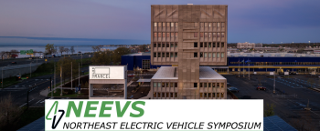

](https://evclubct.com/northeast-electric-vehicle-symposium-neevs/)

- [**Northeast Electric Vehicle Symposium (NEEVS) 2024**](https://evclubct.com/event/neevs-2024/)

Sep 15 2024 by Barry Kresch

> 
> 

NEEVS is back, this year expanded to a 2-day event on Sunday, September 15th and Monday, September 16th at Hotel Marcel, New Haven. [Registration now open](https://www.eventbrite.com/e/northeast-electric-vehicle-symposium-neevs-2024-tickets-922359190167?aff=oddtdtcreator).
> 

### See also at TinkerTry

- Paul Braren's [podcast guest appearances](https://tinkertry.com/category:Podcasts)

- EV articles at [TinkerTry.com/EVs](https://tinkertry.com/EVs)

- EV videos at [TinkerTry.com/EVvideos](https://tinkertry.com/EVvideos)

- 

[

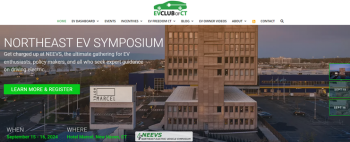

](https://tinkertry.com/speaking-at-neevs-2024)

- [**I'm speaking at EV Club of CT's second annual NorthEast Electric Vehicle Symposium!**](https://tinkertry.com/speaking-at-neevs-2024)

Sep 04 2024

#### 

[

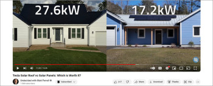

](https://tinkertry.com/tesla-solar-roof-compared-with-solar-panels)

- [**Tesla Solar Roof vs Solar Panels: Which is Worth It? - TinkerTry's home featured in Matt Ferrell's video and podcast**](https://tinkertry.com/tesla-solar-roof-compared-with-solar-panels)

Mar 19 2024

#### 

- [**Tesla Solar Roof - 33 yr. old Connecticut home successfully renovated & electrified. No more gas!**](https://tinkertry.com/tesla-solar-roof-before-and-after-video)

Oct 29 2023

#### 

- [**NEEVS Full Presentation Replay - Connecticut's vehicle & home electrification incentives - windows, insulation, heat pumps and solar**](https://tinkertry.com/home-electrification-incentives)

Sep 16 2023

#### 

[

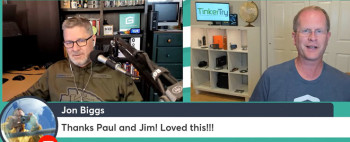

](https://tinkertry.com/hgg584)

- [**Featured on "Home Gadget Geeks" Episode #584 "Paul Braren and Lots of Stuff to Catch Up on! – HGG584"**](https://tinkertry.com/hgg584)

Sep 16 2023

#### 

- [**Featured on Gigacast 48 | TinkerHeldstab with Paul Braren and Matt Heldstab**](https://tinkertry.com/gigacast48)

Aug 10 2023

#### 

- [**EV Club of CT's smart electrical panel discussion featuring SPAN, electrician, & homeowner**](https://tinkertry.com/span-smart-panel-discussion)

Jan 09 2023

#### 

- [**Hotel Marcel in New Haven Connecticut, the world's biggest Passive House? Our tech tour featured on Undecided with Matt Ferrell!**](https://tinkertry.com/hotel-marcel-techology-tour)

Nov 01 2022

#### 

[

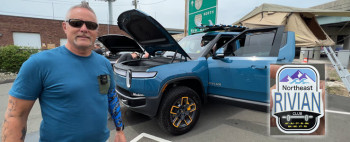

](https://tinkertry.com/northeast-rivian-club-event-in-bridgeport-connecticut)

- [Rivian R1T EV pickup truck overview at Northeast Rivian Club event in Bridgeport Connecticut, owner Jazzy Jeff has 5,300 miles already!]

May 15 2022

#### 

- [**Featured on Tech Breakfast Podcast 243 | EVs with Paul Braren | Aaron, Tyler**](https://tinkertry.com/tbp243)

Mar 25 2022

#### 

[

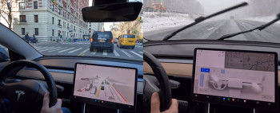

](https://tinkertry.com/tesla-tips-boston-snow-nyc-traffic)

- [**Tesla Model 3 Boston and New York City Road Trip Tips - safely handle rain, snow, and heavy traffic with ease and efficiency**](https://tinkertry.com/tesla-tips-boston-snow-nyc-traffic)

Mar 24 2022

#### 

[

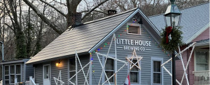

](https://tinkertry.com/an-1836-brewery-gets-tesla-solar-roof)

- [**Little House Brewing Company in Chester Connecticut, built in 1836, now has a Tesla Solar Roof!**](https://tinkertry.com/an-1836-brewery-gets-tesla-solar-roof)

Feb 02 2022

#### 

- [**Michelin CrossClimate 2 All Weather Tires Review - a safe year-round choice in rain/snow, hot/cold**](https://tinkertry.com/crossclimate2)

Dec 10 2021

> 

and waiting for test drives of various EVs (Cybertruck was a static display) [pic.twitter.com/X9wsYF6tGo](https://t.co/X9wsYF6tGo)&mdash; Paul Braren, TinkerTry.com ☀️🏠💻🔋🚗 (@paulbraren) [February 18, 2024](https://twitter.com/paulbraren/status/1759305578227146847?ref_src=twsrc%5Etfw)

---

*Originally published at: [https://tinkertry.com/articles/going-to-everything-electric-canada](https://tinkertry.com/articles/going-to-everything-electric-canada)*