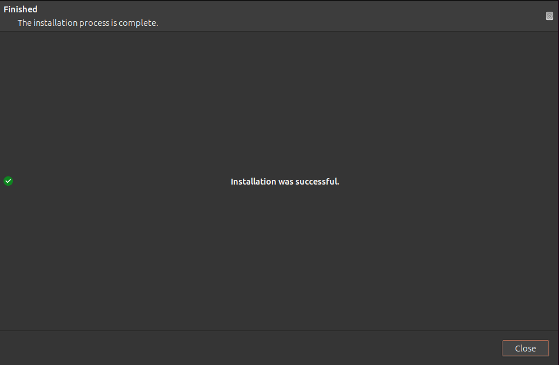

# vSphere Tidbits: Using ovftool on Linux

> **Source:** [Zuthof.nl Blog](https://blog.zuthof.nl/2024/01/15/vsphere-tidbits-using-ovftool-on-linux/)  
> **Date:** January 15, 2024  
> **Author:** Daniël Zuthof  
> **Tag:** `vmware`

---

During re-install of my Cloud Director lab, I noticed that the installation of ovftool (officially named OVF Tool) is not documented. Which seems odd to me, because with 2 variants at hand, it should. In this post I show you how.


It’s good to know that ovftool for Linux is not available in some form of distro specific package (deb, rpm etc.) nor via Snap, Flatpack. Therefore ovftool is not found in any repository. The options for Linux are twofold.


- A VMware based installer


- A ZIP file


From a convenience point of view the installer based variant is preferred. If that one does not work for your favorite distro, the ZIP based one is the alternative.


If you ask yourself what ovftool is, the user guide explains it:


> 
> 

Open Virtualization Format (OVF) is an industry standard to describe metadata about virtual machine images in XML format. VMware OVF Tool is a command-line utility that helps users import and export OVF packages to and from a wide variety of VMware products.
> 
> 
> 
> 


> Source: [OVF Tools User Guide](https://developer.vmware.com/docs/19275/GUID-5F65CBA6-270D-4F19-9AE4-EAAA0FE82E0B.html)


In my case I often use ovftool to deploy OVF based appliances like Cloud Director in an automated and standardized way. By using this tool, I do not have to to through every tedious deployment step compared to the vSphere Web Client.


[


](https://zuthof.nl/wp-content/uploads/2024/01/Screenshot-from-2024-01-15-11-37-15.png)


I’ve described the deployment of VMware Cloud Director using ovftool a while ago, which still applies.


> [Cloud Director tidbits: Deploy VCD appliances with OVF Tool](https://zuthof.nl/2020/04/27/cloud-director-tidbits-deploy-vcd-appliances-with-ovf-tool/)


### Download OVF Tool


As of writing the latest version of ovftool is 4.6.2. The downloads can be found **[here](https://developer.vmware.com/web/tool/4.6.2/ovf-tool/)**. The **[top link](https://customerconnect.vmware.com/downloads/get-download?downloadGroup=OVFTOOL462)** points to the VMware customer connect site where the installer variants can be found for Windows, Linux and MacOS. All the other links point to the ZIP based variants for the same OS’es.


[


](https://zuthof.nl/wp-content/uploads/2024/01/ovftool-download.png)


> 
> 

Per feedback from **[Timo Sugliani](https://www.linkedin.com/in/tsugliani/)** on **[X](https://x.com/DanielZuthof/status/1746898898973569455?s=20)**, he mention an installer for ovftool is available via VMware customer connect, which I was not aware of before. The post is updated based on that info. Thanks for the feedback.
> 


### Option 1: Ovftool installer


The top link in the image above points to the installer based variant. An MSI for Windows, a DMG for MacOS and VMware based “bundle” installer for 32 a 64bit Linux. OS support for ovftool is documented in the **[release notes](https://vdc-download.vmware.com/vmwb-repository/dcr-public/98cd9a6d-8262-4923-a03a-f087d95240a7/fe4d8f81-85a0-4e4c-b022-57046612d5db/ovf-462-releasenotes.html#compat)**.


[


](https://zuthof.nl/2024/01/15/vsphere-tidbits-using-ovftool-on-linux/ovftool-linux-installer/)


#### Installing


After the Linux installer is downloaded, mark it as executable.


```
`user@host:~/Downloads$ chmod +x VMware-ovftool-4.6.2-22220919-lin.x86_64.bundles`
```


#### Start the installation


The command below starts the GTK based graphical installer, which is frankly the first time I saw this for a VMware product. Interesting…


```
`user@host:~/Downloads$ sudo ./VMware-ovftool-4.6.2-22220919-lin.x86_64.bundle`
```


[


](https://zuthof.nl/wp-content/uploads/2024/01/ovftool-install-step-1.png)


[


](https://zuthof.nl/wp-content/uploads/2024/01/ovftool-install-step-2.png)


[


](https://zuthof.nl/wp-content/uploads/2024/01/Screenshot-from-2024-01-15-20-21-53.png)


[



](images/zuthof-02-img07.png)


Let’s check is ovftool is available.


```
`user@host:~$ ovftool --version
VMware ovftool 4.6.2 (build-22220919)`
```


Against may expectations I must say, it worked just fine. No hassle with PATH variables this way. A VMware customer connect account is required to download the bits.


### Option 2: Ovftool ZIP


If for a reason the ovftool installer does not work on your Linux distro, using the ZIP variant should get you started.


#### Extract ZIP file


In my Ubuntu system the default download folder for ZIP file is:


```
`/home/user/Downloads`
```


Extract the ZIP file using *unzip*:


```
`user@host:~/Downloads$ unzip VMware-ovftool-4.6.2-22220919-lin.x86_64.zip`
```


Ovftool is now extracted in the “*ovftool*” subfolder. Next step is to add the folder to the path variable.


#### Modify Path variable


In Ubuntu Linux the the PATH variable can be extended in multiple way. I choose to go for the most easy way, by modifying the the “*.profile*” file which is located in my home folder “*/home/user*“.


I’ve added the line below at the bottom of the “*.profile*” file:


```
`PATH="$PATH:$HOME/Downloads/ovftool"`
```


[


](https://zuthof.nl/wp-content/uploads/2024/01/Screenshot-from-2024-01-15-11-52-35.png)


The last step is to logout and login again to make the changes active. Let’s check.


```
`user@host:~$ pwd
/home/user
user@host:~$ ovftool --version
VMware ovftool 4.6.2 (build-22220919)
user@host:~$ `
```


From within every folder ovftool can now be used without hassle.


### To conclude


For my Ubuntu 23.10 based workstation, both variants (installer and ZIP) worked just fine. It’s strange the documentation does not mention either way of installing ovftool. Kudos to Timo for the hint about the installer variant.


Anyway, have fun automating your work or lab environment.


Cheers, Daniel


### Useful links


**[OVF Tool – Downloads (Installer via Customer Connect)](https://customerconnect.vmware.com/downloads/get-download?downloadGroup=OVFTOOL462)**


**[OVF Tool – Downloads (ZIP)](https://developer.vmware.com/web/tool/4.6.2/ovf-tool/)**


**[OVF Tool – User Guide](https://developer.vmware.com/docs/19275/GUID-5F65CBA6-270D-4F19-9AE4-EAAA0FE82E0B.html)**


**[OVF Tool – Release notes](https://vdc-download.vmware.com/vmwb-repository/dcr-public/98cd9a6d-8262-4923-a03a-f087d95240a7/fe4d8f81-85a0-4e4c-b022-57046612d5db/ovf-462-releasenotes.html#compat)**


**[Blog: Deploy Cloud Director using ovftool](https://zuthof.nl/2020/04/27/cloud-director-tidbits-deploy-vcd-appliances-with-ovf-tool/)**


---

*Originally published at: [https://blog.zuthof.nl/2024/01/15/vsphere-tidbits-using-ovftool-on-linux/](https://blog.zuthof.nl/2024/01/15/vsphere-tidbits-using-ovftool-on-linux/)*